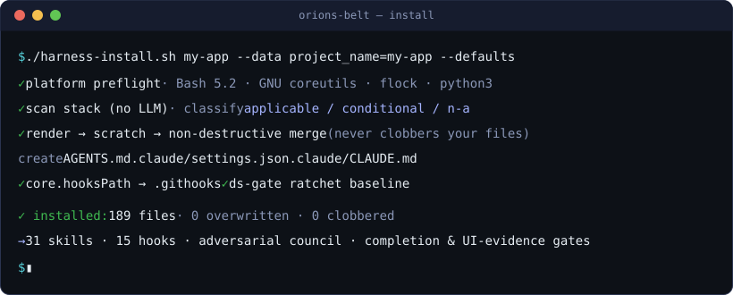
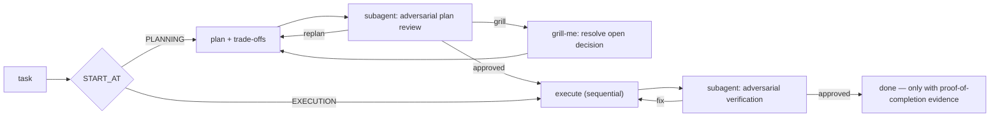
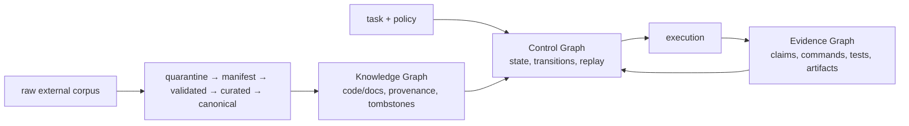

<div align="center">



<p>
  
  
  
  
  
  
</p>

**A portable, self-configuring discipline harness for AI coding agents.**
One `copier` install drops hooks, skills, an adversarial council, verification gates and a
temporal wiki into *any* repo — so an agent stays aligned, verifiable and anti-drift.

[Full manual — 16 chapters](docs/manual/README.md) · [Install](docs/manual/14-instalacao-e-update.md) · [How it works](#how-it-works) · [Why](docs/planning/)

</div>

---

## What is Orion's Belt?

Coding agents are strong but drift: they overclaim "done", report UI from a diff instead of a
pixel, invent facts, and skip verification. Orion's Belt is the **operating discipline** that
keeps them honest — extracted and generalized from a private production harness run for months
on a live software project, then made installable into any codebase. It is built under its own
rules: one agent executes a round, another audits the next, and the council runs of this very
repository materialize control-graph events whose deterministic replay must reproduce the final
state.

It is **not** a wiki (despite its origins) and **not** a prompt pack. It is a parametrized
[Copier](https://copier.readthedocs.io/) template that installs a coherent system of
**deterministic hooks + agent skills + an adversarial delivery council + evidence gates**, all
driven by one central config and serving **Claude Code and Codex through shared core contracts**.
Runtime-specific capabilities remain explicit rather than being presented as full parity.

<div align="center"></div>

## Quickstart

```bash
# into a fresh directory, pinned to a reviewed release tag
ORIONS_BELT_REF=<reviewed-release-tag>
copier copy --trust --vcs-ref "$ORIONS_BELT_REF" gh:gutocarollo/orions-belt my-project

# …or into an existing repo: clone one reviewed release, then run its local installer
git clone --depth 1 --branch "$ORIONS_BELT_REF" \
  https://github.com/gutocarollo/orions-belt.git /tmp/orions-belt-"$ORIONS_BELT_REF"
/tmp/orions-belt-"$ORIONS_BELT_REF"/harness-install.sh . \
  --vcs-ref "$ORIONS_BELT_REF" \
  --data project_name=my-project --data owner_name="Me" --defaults
```

> **Brownfield status:** installation is fail-closed. The renderer computes a complete plan before
> writing, rejects symlinks/escapes and unknown or locally-modified whole-file collisions, records
> ownership hashes in `.harness/install-manifest.json`, and uses a rollback journal for controlled
> failures. Use repeatable `--preserve <exact-path>` only after reviewing a collision. Raw
> `copier update` remains prohibited when managed instruction files are git-ignored; update by
> rerunning `harness-install.sh` from a pinned newer release. See [chapter 14](docs/manual/14-instalacao-e-update.md).
>
> Installs through `harness-install.sh` (the path `harness-init` also uses) emit
> **`.harness/INSTALL-REPORT.md`** — an audit trail of what was installed, what was skipped, and
> the reason for each decision. Evaluated on a real 120 GB brownfield
> (1,647 tracked files): every tracked byte preserved, 3 merge surfaces touched, zero deletions
> ([eval findings](eval/whatsapp-brownfield-2026-07-20/FINDINGS.md)). Living files such as
> `tasks/lessons.md` use a **seed strategy** — harness updates never overwrite what your project
> learned.

The deterministic installer runs a platform preflight, renders to scratch, emits `--dry-run`/
`--plan-json`, and applies a stateful ownership plan. The four shared surfaces (`AGENTS.md`,
`.claude/CLAUDE.md`, `.claude/settings.json`, `.gitignore`) use marked-block/structured merge;
other generated files update only when their current hash proves harness ownership. Stack scanning
and applicability classification belong to the separate, agent-guided `harness-init` flow.

## What you get

| | Component | What it does |
|---|---|---|
| 🧭 | **Delivery council** | Orchestrates a task from `EXECUTION` / `PLANNING` / `PLAN_REVIEW` / `AUTO` with automatic trade-off decisions and adversarial loops. |
| 🔬 | **Adversarial review** | Evidence-based verifier that must confirm or refute each gap with proof — runs in a subagent, never self-review. |
| 🎯 | **Grill-me** | Interviews you on a plan one decision at a time (behavior, ≥2 real good/bad examples, Option C) — before code is written. |
| ✅ | **Completion claim gate** | Blocks plan-level "done" claims unless the sentinel points to a fresh manifest bound to HEAD and the worktree, produced by executed proof commands. Local evidence is not a cryptographic trust boundary; an independent executor is optional and provider-specific. |
| 🖼️ | **UI-evidence** | Playwright before/after full-page PNGs + console + manifest; a Stop hook blocks shipping UI changes seen only as a diff. |
| 📚 | **Karpathy wiki** | Temporal doc indexing with executable orphan/reference lints; a repo-wide stray-doc sweep routes scattered markdown into a curator inbox; pre-commit runs docs policy before reference integrity. |
| 🧠 | **Knowledge provider** | Provider contract for external Understand graphs: stable IDs, typed/provenanced edges, tombstones and incremental-versus-clean parity. Orion deliberately does not duplicate Understand's parser. |
| ♻️ | **Self-improvement loop** | `/loop` maintenance pass: lessons capture → inject → promote, wiki lint, ref-integrity, graph freshness. |
| 🧭 | **[Context decision graph](docs/manual/16-grafo-contexto.md)** | Deterministic routing between a code graph, `grep` and the LSP before a shared symbol changes — measured on a real repo where each layer missed what the others caught. Fork/join topology, four command-shaped predicates, and hookify guards on core-path and DB-write edits. The graph CLI stays an external dependency the installer declares, never installs. |
| 🛡️ | **Deterministic hooks** | 18 hook scripts shipped (14 install by default, 4 are stack-conditional): completion/UI/design-system gates, subagent throttle, leak reaper, git-doctor. |
| 🌐 | **Dual runtime core** | The council and core operational skills share one source across Claude Code and Codex; optional and runtime-native capabilities are tracked as an explicit compatibility matrix. |

## How it works

The core is a **plan → review → execute → verify** pipeline where every stage is gated and every
adversarial review runs in an isolated subagent (self-review isn't adversarial):



The diagram uses plain verbs, but the **actual status tokens** the gates and tests match are a
**fixed contract vocabulary** — `PROVA-DE-CONCLUSAO`, `PLAN-ADVERSARIAL-VERIFICATION: SATISFEITO |
REPLANEJAR | SABATINAR | BLOQUEADO`, `GATE-GRILL`, severities. They are byte-identical in every
language (English *and* Portuguese instructions emit the same tokens), so the deterministic layer
never depends on prose. Think of them as enum values, not words to translate.

## Canonical architecture: three connected graphs

The implemented foundation is not a larger prompt pack. It is a small graph-engineering kernel
whose decisions, knowledge and evidence can be validated independently:



- **Control Graph** makes council state explicit: typed events, legal transitions, checkpoints,
  bounded review budgets, idempotent event dedupe and deterministic replay.
- **Knowledge Graph** keeps stable entity IDs and typed edges, distinguishing deterministic,
  compiler-resolved and inferred relationships. Every inferred edge carries provenance and
  confidence; incremental builds must be equivalent to clean rebuilds.
- **Evidence/Provenance Graph** connects each completion claim to the command, test, artifact and
  source that support it, including hashes, Git revision, schema version and recorded/valid time.

External corpora are untrusted input, never instructions. Promotion follows the explicit pipeline
`raw → manifest → validated → curated → canonical`; raw content stays quarantined, and only reviewed,
traceable facts enter canonical knowledge. Golden datasets, trajectory evals, JSONL traces and one
fail-closed release check — currently 20 gates, all local — measure the system end to end.

The canonical release entry point is local and provider-agnostic:
`python3 engine/release_check.py`. GitHub Actions, Bitbucket Pipelines, GitLab CI,
Jenkins or an isolated local runner may call that command, but none is required by
the graph kernel. Provider adapters are opt-in; no hosted CI is enabled by default.

The first real ingestion pass over `.firecrawl` preserved the raw corpus byte-for-byte and produced
only manifest/validation evidence: 134 records (4,158,372 bytes), 80 validated, 54 quarantined,
118 with an explicit source URL and 16 without one. Nothing was promoted automatically to curated
or canonical knowledge; the machine-readable audit is under `engine/ingest/evidence/`.

The implementation contract, current-versus-target matrix, runtime capability matrix, trust model
and adoption sequence are canonical in
**[docs/architecture/arquitetura-alvo.md](docs/architecture/arquitetura-alvo.md)**.

## English or Portuguese

Instruction prose ships in **English (default) or Portuguese** via the `harness_language`
question. It's a Jinja language selector — only the chosen language renders; the deterministic
contract tokens are identical in both, so gates and hooks are language-independent. You can also
just *use* the harness in any language: the built-in rule "respond in the user's language" covers
output regardless of this choice. See [chapter 14](docs/manual/14-instalacao-e-update.md).

## Install & update

- **Install / adapt:** `harness-install.sh` (deterministic) or the `harness-init` skill
  (agent-guided, resolves conditional components in conversation).
- **Update:** rerun the installer from a pinned newer release; its manifest-based reconciler is
  independent from the target Git index. Native `copier update` is supported only for projects
  created directly by Copier whose managed files participate in Git's merge baseline.

Full procedure, decision trees per component, and gotchas: **[chapter 14](docs/manual/14-instalacao-e-update.md)**.

## Documentation

- **[docs/manual/](docs/manual/README.md)** — the canonical product docs: 16 indexed chapters on
  what the framework installs and how to configure every component, including the
  **[context-tooling Mermaid decision flow](docs/manual/16-grafo-contexto.md)**.
- **[docs/architecture/](docs/architecture/README.md)** — canonical current/target architecture,
  graph contracts, trust boundaries and rollout order.
- **[docs/planning/](docs/planning/)** — why it's built this way (construction archive).
- **[SCHEMA.md](SCHEMA.md)** / **[llms.txt](llms.txt)** — framework-repository organization and
  LLM routing. The root schema takes precedence over the dogfood wiki policy in `docs/SCHEMA.md`.

## Platform

GNU/Linux or macOS with Bash ≥4, GNU coreutils, `flock` and Python ≥3.14 (`python3` must resolve
to that runtime). Run `bash .harness/lib/check-platform.sh` for a preflight. macOS needs Homebrew
`bash`, `coreutils`, `util-linux` and `python@3.14`; keep Homebrew ahead of `/usr/bin` in `PATH`.
Windows needs WSL. See [chapter 15](docs/manual/15-limitacoes-conhecidas.md).

## License & provenance

**CC BY-SA 4.0** — see [`LICENSE`](LICENSE). Component-by-component provenance (upstream repo,
commit, byte-identical vs. modified) is in [`PROVENANCE.json`](PROVENANCE.json) and
[`NOTICE`](NOTICE): ten security skills reproduced verbatim from
[trailofbits/skills](https://github.com/trailofbits/skills), the `diataxis` skill adapted from
[Diátaxis](https://diataxis.fr/), a scanner design credited to
[Understand-Anything](https://github.com/Egonex-AI/Understand-Anything) (MIT), and everything else
original. Every rendered project also receives its own `NOTICE`.
