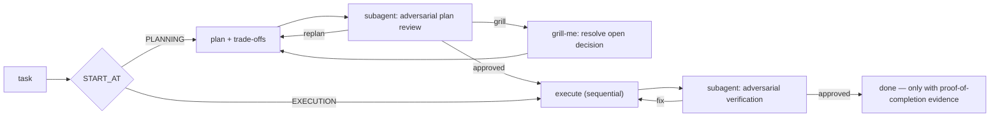

<div align="center">


<p>
  
  
  
  
  
  
</p>

**A portable, self-configuring discipline harness for AI coding agents.**
One `copier` install drops hooks, skills, an adversarial council, verification gates and a
temporal wiki into *any* repo — so an agent stays aligned, verifiable and anti-drift.

[Manual](docs/manual/README.md) · [Install](docs/manual/14-instalacao-e-update.md) · [How it works](#how-it-works) · [Why](docs/planning/)

</div>

---

## What is Orion's Belt?

Coding agents are strong but drift: they overclaim "done", report UI from a diff instead of a
pixel, invent facts, and skip verification. Orion's Belt is the **operating discipline** that
keeps them honest — extracted and generalized from a private production harness run for months
on a live software project, then made installable into any codebase.

It is **not** a wiki (despite its origins) and **not** a prompt pack. It is a parametrized
[Copier](https://copier.readthedocs.io/) template that installs a coherent system of
**deterministic hooks + agent skills + an adversarial delivery council + evidence gates**, all
driven by one central config and serving **Claude Code and Codex from a single source of truth**.

<div align="center"></div>

## Quickstart

```bash
# into a fresh directory
copier copy --trust gh:gutocarollo/orions-belt my-project

# …or into an existing repo — the 4 sensitive files (AGENTS.md, .claude/CLAUDE.md,
# .claude/settings.json, .gitignore) merge additively; review with `git diff` after
curl -fsSL https://raw.githubusercontent.com/gutocarollo/orions-belt/main/harness-install.sh \
  | bash -s -- . --data project_name=my-project --data owner_name="Me" --defaults
```

> **Brownfield status (honest):** the installer merges the 4 sensitive files additively and
> refuses to write outside the target (symlink-guarded), but it does **not yet** have an
> ownership manifest — a framework-shipped path (e.g. a skill name it also ships) that already
> exists in your repo is overwritten. And `copier update` is **not yet proven safe** on a
> brownfield install whose instruction files are git-ignored. Until those land, treat an
> existing-repo install as *review-required* (`git diff`), not "absolute success". See
> [chapter 15](docs/manual/15-limitacoes-conhecidas.md).

The installer runs a platform preflight, scans your stack **with zero LLM**, classifies every
component as applicable / conditional / not-applicable, renders to a scratch dir, and merges
in **additively** — `AGENTS.md`, `.claude/settings.json`, `.gitignore` get a marked block, never
an overwrite. A full install is **189 files · 31 skills · 15 hooks**, and `git status` on your
existing files stays clean.

## What you get

| | Component | What it does |
|---|---|---|
| 🧭 | **Delivery council** | Orchestrates a task from `EXECUTION` / `PLANNING` / `PLAN_REVIEW` / `AUTO` with automatic trade-off decisions and adversarial loops. |
| 🔬 | **Adversarial review** | Evidence-based verifier that must confirm or refute each gap with proof — runs in a subagent, never self-review. |
| 🎯 | **Grill-me** | Interviews you on a plan one decision at a time (behavior, ≥2 real good/bad examples, Option C) — before code is written. |
| ✅ | **Completion gate** | A Stop hook that **blocks any "done" claim** without a proof-of-completion block of this-session evidence (the `PROVA-DE-CONCLUSAO` sentinel). |
| 🖼️ | **UI-evidence** | Playwright before/after full-page PNGs + console + manifest; a Stop hook blocks shipping UI changes seen only as a diff. |
| 📚 | **Karpathy wiki** | Temporal doc indexing; a pre-commit lint fails on orphaned docs or dead references. |
| 🧠 | **Understand graph** | Incremental knowledge-graph refresh, triggered from the maintenance loop by a change threshold. |
| ♻️ | **Self-improvement loop** | `/loop` maintenance pass: lessons capture → inject → promote, wiki lint, ref-integrity, graph freshness. |
| 🛡️ | **Deterministic hooks** | 15 event hooks: completion/UI/design-system gates, subagent throttle, leak reaper, git-doctor. |
| 🌐 | **Dual runtime** | Claude Code (`.claude/`) and Codex (`.agents/`, `.codex/`) generated byte-identically from one source. |

## How it works

The core is a **plan → review → execute → verify** pipeline where every stage is gated and every
adversarial review runs in an isolated subagent (self-review isn't adversarial):



The diagram uses plain verbs, but the **actual status tokens** the gates and tests match are a
**fixed contract vocabulary** — `PROVA-DE-CONCLUSAO`, `PLAN-ADVERSARIAL-VERIFICATION: SATISFEITO |
REPLANEJAR | SABATINAR | BLOQUEADO`, `GATE-GRILL`, severities. They are byte-identical in every
language (English *and* Portuguese instructions emit the same tokens), so the deterministic layer
never depends on prose. Think of them as enum values, not words to translate.

## English or Portuguese

Instruction prose ships in **English (default) or Portuguese** via the `harness_language`
question. It's a Jinja language selector — only the chosen language renders; the deterministic
contract tokens are identical in both, so gates and hooks are language-independent. You can also
just *use* the harness in any language: the built-in rule "respond in the user's language" covers
output regardless of this choice. See [chapter 14](docs/manual/14-instalacao-e-update.md).

## Install & update

- **Install / adapt:** `harness-install.sh` (deterministic) or the `harness-init` skill
  (agent-guided, resolves conditional components in conversation).
- **Update:** `copier update --trust --answers-file .harness/answers.yml` — 3-way merge; your
  customizations survive, real conflicts get markers.

Full procedure, decision trees per component, and gotchas: **[chapter 14](docs/manual/14-instalacao-e-update.md)**.

## Documentation

- **[docs/manual/](docs/manual/README.md)** — the canonical product docs: 15 chapters on what
  the framework installs and how to configure every component.
- **[docs/planning/](docs/planning/)** — why it's built this way (construction archive).
- **[SCHEMA.md](SCHEMA.md)** / **[llms.txt](llms.txt)** — repo organization and LLM routing.

## Platform

GNU/Linux with Bash ≥4, GNU coreutils, `flock` and `python3`. Run
`bash .harness/lib/check-platform.sh` for a preflight. macOS needs Homebrew coreutils/util-linux;
Windows needs WSL. See [chapter 15](docs/manual/15-limitacoes-conhecidas.md).

## License & provenance

**CC BY-SA 4.0** — see [`LICENSE`](LICENSE). Component-by-component provenance (upstream repo,
commit, byte-identical vs. modified) is in [`PROVENANCE.json`](PROVENANCE.json) and
[`NOTICE`](NOTICE): ten security skills reproduced verbatim from
[trailofbits/skills](https://github.com/trailofbits/skills), the `diataxis` skill adapted from
[Diátaxis](https://diataxis.fr/), a scanner design credited to
[Understand-Anything](https://github.com/Egonex-AI/Understand-Anything) (MIT), and everything else
original. Every rendered project also receives its own `NOTICE`.
