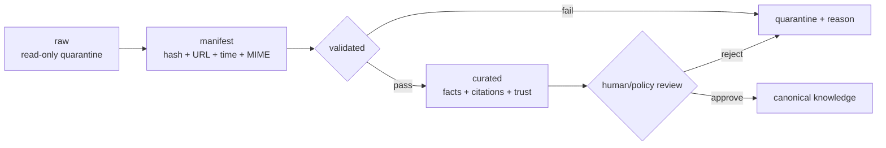

# Arquitetura-alvo de graph engineering

## 1. Veredicto arquitetural

O Orion's Belt já possui bons componentes de disciplina — council, hooks, contratos JSON, ledger,
wiki temporal, adaptador do Understand e testes de instalação — mas ainda os coordena principalmente
por texto, convenções de arquivos e sentinelas. O alvo é transformar esses componentes em **três
grafos lógicos interoperáveis**, sem introduzir banco de grafo ou framework de agentes antes de haver
necessidade medida:

1. **Control Graph:** o que pode acontecer numa execução e em qual ordem;
2. **Knowledge Graph:** o que o sistema sabe sobre código e documentação, com origem e confiança;
3. **Evidence/Provenance Graph:** qual evidência sustenta cada claim de conclusão.

Os grafos são lógicos: JSON/JSONL/YAML e validadores locais são suficientes no primeiro estágio.
Neo4j, LangGraph ou outro runtime só entram se escala, concorrência ou consultas reais demonstrarem
um ganho que compense a nova dependência.

## 2. Estado atual versus arquitetura-alvo

Legenda: **implementado** = existe e possui teste executável; **parcial** = existe, mas não satisfaz
todo o contrato alvo; **planejado** = direção aprovada, não deve ser anunciada como capacidade entregue.

| Área | Estado em 2026-07-21 | Arquitetura-alvo | Status inicial |
|---|---|---|---|
| Council | Skill e schema alinhados, inclusive `SABATINAR` | Grafo declarativo com 11 nós, reducer, budgets e validação de transições | implementado |
| Contratos | JSON Schemas para council, ledger e os três grafos | Schemas versionados e validadores sem dependência externa | implementado |
| Estado durável | Event log bloqueado, checkpoints com hash e ledger validado | resume idempotente e replay determinístico | implementado |
| Conclusão | Stop hook confere IDs, contagens, gaps, worktree e tipo de evidência; pipeline integrado produz PROV | permitir executor independente opcional sem acoplar o core a fornecedor | implementado |
| Conhecimento | Provider contract e adapter concreto do Understand | IDs estáveis, arestas tipadas, proveniência, tombstones e paridade incremental=clean | implementado |
| Ingestão externa | CLI segura executada sobre os 134 itens de `.firecrawl` sem alterar o raw | 80 validados, 54 em quarentena e nenhuma promoção automática | implementado |
| Evals | Golden trajectories e regressão incremental=clean | ampliar cobertura de transições além do baseline atual de 42,1% | parcial |
| Observabilidade | Pipeline Council→Control→Evidence emite traces correlacionados e redige secrets | backend remoto só quando medido como necessário | implementado |
| Release | `engine/release_check.py` local e provider-agnostic | gate fail-closed agregado; adapters externos somente por opt-in | implementado |

## 3. Control Graph

### 3.1 Contrato

O Control Graph transforma o council de fluxo narrado em máquina de estados auditável. O núcleo deve
conter:

- definição versionada de nós, eventos e transições legais;
- reducer puro `estado + evento → novo estado`;
- validação de invariantes antes de persistir;
- log append-only e checkpoints derivados, nunca uma segunda verdade manual;
- replay determinístico a partir do log;
- `event_id`, `run_id`, sequência monotônica e chave de idempotência;
- limites explícitos de rodadas, custo, tempo e fan-out;
- pausa para decisão humana sem consumir rodada adversarial.

Nós mínimos: `context`, `risk_router`, `plan`, `plan_review`, `human_input`, `execute`,
`execution_review`, `proof` e estados terminais. O vocabulário contratual inclui
`SATISFEITO`, `REPLANEJAR`, `SABATINAR`, `BLOQUEADO`, `CORRIGIR` e os respectivos eventos, sem
duplicar enums divergentes entre skill e schema.

### 3.2 Replay, resume e idempotência

Um restart deve reconstruir o mesmo estado pelo mesmo histórico. Side effects recebem chave de
idempotência; evento duplicado não repete execução. Checkpoints são snapshots aceleradores com hash
do prefixo do log: podem ser descartados e reconstruídos. Estado terminal não aceita nova transição
sem evento explícito de reabertura.

## 4. Knowledge Graph

### 4.1 Provider contract

O Orion não deve reimplementar o parser de código do Understand Anything. Ele define um contrato de
provider e adapta provedores externos. Todo provider entrega:

- entidades com ID estável, tipo, localização e hash do conteúdo;
- arestas com origem, destino, tipo, método de extração e evidência;
- metadados de versão do provider e commit analisado;
- tombstones para entidades removidas;
- operação full e incremental com o mesmo formato de saída.

Classes de aresta:

| Classe | Exemplo | Confiança padrão |
|---|---|---|
| `deterministic` | arquivo contém símbolo; doc referencia path | alta, reproduzível pelo parser |
| `compiler_resolved` | import/call resolvido pela linguagem | alta, vinculada à versão do analisador |
| `llm_inferred` | conceito implícito ou relação semântica | nunca canônica sem proveniência, score e política de promoção |

### 4.2 Invariantes

- IDs não dependem de ordem de scan.
- Toda aresta inferred registra fonte, modelo/método, prompt ou regra, score e timestamp.
- Exclusão gera tombstone antes de compactação, impedindo conhecimento fantasma.
- O conjunto normalizado após atualização incremental deve ser igual ao de um rebuild limpo no
  mesmo commit; uma suíte de paridade prova essa propriedade.
- O roteador escolhe busca exata, lexical, vetorial, travessia ou resumo global conforme a pergunta;
  nenhuma técnica única é default universal.

## 5. Evidence/Provenance Graph

### 5.1 Modelo mínimo

Inspirado no modelo entidade/atividade/agente do W3C PROV, cada claim liga-se às atividades que o
geraram e aos artefatos usados ou produzidos:

```text
claim ← supported_by — test/command — generated — artifact
                              └──── used ──── source/config
```

O manifesto registra pelo menos `schema_version`, `run_id`, `git_sha`, comando normalizado, diretório,
exit code, início/fim, hashes de stdout/stderr, artefatos, hashes dos artefatos, executor e tempos
`recorded_at`/`valid_at`. Um claim conta como PASS apenas quando todas as evidências exigidas existem,
são aplicáveis ao item e ainda correspondem ao workspace/commit declarado.

### 5.2 Limite de confiança honesto

Um gate executado no mesmo usuário e workspace do agente **não é uma fronteira criptográfica**: um
agente com permissão de escrita pode fabricar ou alterar arquivos locais. O gate local aumenta
rastreabilidade e detecta erros/overclaim acidental; resistência adversarial exige uma fronteira
externa, como executor isolado, CI protegida de qualquer fornecedor, assinatura por identidade
separada, log remoto imutável ou política do host. Essa separação é opcional e depende do risco do
projeto; não faz parte do kernel. A documentação e a UI jamais devem chamar a validação local de
atestação inviolável.

## 6. Ingestão segura de corpus

Conteúdo crawleado é dado não confiável. Texto externo pode conter prompt injection, instruções
operacionais, segredos, links maliciosos, duplicatas e afirmações sem fonte. O pipeline obrigatório é:



Regras:

- raw é imutável e nunca autoriza ferramenta, comando ou mudança de política;
- o manifest mantém URL original/final, horário de captura, MIME, tamanho, hash e licença quando
  conhecida;
- validação cobre integridade, duplicação, parse, links e indicadores de conteúdo hostil;
- curadoria extrai claims pequenos com citação e rótulo de confiança, sem copiar instruções;
- promoção canônica é explícita, reversível e registra revisor/política;
- atualização não apaga silenciosamente a versão anterior: temporalidade e supersessão são dados.

## 7. Evals, observabilidade e release gate

### Evals

- **golden set de transições:** entradas e estados esperados do Control Graph;
- **trajectory evals:** sequência completa, decisões, retries, custo e resultado;
- **knowledge parity:** incremental versus rebuild limpo;
- **retrieval evals:** precisão, cobertura e proveniência das respostas;
- **evidence evals:** claim sem prova, prova stale, artefato alterado e contagem forjada devem falhar;
- **render/brownfield matrix:** Claude-only, Codex-only, ambos, flags condicionais e update localmente
  modificado.

### Observabilidade

Cada subsistema emite JSONL versionado com `run_id`, `event_id`, componente, duração, resultado e
erro estruturado. Métricas mínimas: taxa de transição inválida, retries por etapa, fan-out, duração,
falhas por gate, freshness do grafo, diferença incremental/full e claims sem evidência válida.

### Release gate

O comando local e provider-agnostic `python3 engine/release_check.py` agrega, conforme aplicabilidade:
schemas/contratos, testes dos hooks,
render matrix, instalação/update brownfield, wiki/ref integrity, paridade de runtime, Control Graph,
Knowledge Graph e Evidence Graph. `skip` deve carregar motivo e política; dependência ausente obrigatória
é falha, não sucesso silencioso.

GitHub Actions, Bitbucket Pipelines, GitLab CI, Jenkins ou um executor local isolado podem invocar esse
mesmo comando como adapters opcionais. Nenhum provider é requisito do core e o default de instalação
é não gerar integração hospedada.

## 8. Matriz de capacidades Claude Code × Codex

Esta matriz descreve o estado após a primeira implementação da arquitetura-alvo. Ela deve ser
atualizada junto com código e testes, nunca por intenção.

| Capacidade | Claude Code | Codex | Contrato |
|---|---|---|---|
| Council, adversarial review, grill, marathon, prova, curator, verify, harness-init | disponível | disponível | núcleo compartilhado; paridade testável |
| Custom agents do council | disponível em Markdown | disponível em TOML | mesmos papéis, adapters distintos |
| Hooks físicos `.harness/hooks` | registrados em `settings.json` | registrados em `hooks.json` | scripts compartilhados, eventos adaptados |
| UI evidence | condicional | condicional | skill compartilhada; runner Playwright do projeto |
| Run/deploy adapters | condicionais | condicionais | gerados quando há capability configurada |
| Understand incremental | condicional | condicional | adapters distintos sobre o mesmo provider contract e diff relativo |
| Skills especializadas Claude-native | catálogo adicional | não disponível por default | não alegar paridade total |
| Hookify e `/loop` nativo | Claude/plugin | sem equivalente nativo | checklist externo é workaround, não equivalência |

Critério de paridade: comportamento e contrato observáveis equivalentes, não arquivos necessariamente
byte-idênticos. Diferenças inevitáveis de protocolo devem ter adapter e teste próprios.

## 9. Sequência de adoção

1. **Fechar bloqueios de verdade:** alinhar enums skill/schema, impedir testes internos no render,
   preservar arquivos living em updates, eliminar truncamento de instruções e tornar claims honestos.
2. **Control Graph mínimo:** schemas, reducer, transições, ledger validado, replay e testes.
3. **Evidence Graph mínimo:** runner de evidência, manifesto, freshness e integração ao gate; executor
   independente opcional quando o modelo de risco exigir separação de confiança.
4. **Ingestão:** manifest/quarentena/validação/curadoria antes de consumir corpus externo.
5. **Knowledge provider contract:** adaptar Understand, provar tombstones e paridade incremental/full.
6. **Evals/telemetria/release:** agregar todos os checks e estabelecer budgets a partir de baseline real.
7. **Otimizar somente com medição:** storage especializado ou framework externo entra depois de volume,
   latência ou concorrência excederem o desenho baseado em arquivos.

## 10. Condições de não-adoção

- Não adotar banco de grafo quando os datasets cabem em artefatos versionados e consultas offline.
- Não adotar orquestrador externo enquanto reducer + ledger cobrem os workflows reais.
- Não usar LLM para aresta obtida deterministicamente por parser/compiler.
- Não promover corpus sem origem/licença/confiança verificáveis.
- Não tratar mais agentes como ganho automático: paralelizar apenas subtarefas independentes e manter
  coordenação central quando houver estado compartilhado.
