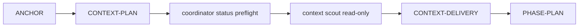

# Context Delivery e busca híbrida adaptativa

Status: **capability opt-in implementada no template**. Ative com `use_context_delivery=true`; sem essa resposta, o Council preserva o comportamento anterior e não gera marker, agentes, skill, receipts ou providers de Context Delivery.

## Objetivo

O `Context Brief` deixa de ser apenas uma recomendação em prosa. Novos runs mutáveis iniciados pelo runtime canônico, com a capability habilitada, exigem:

O orquestrador classifica a tarefa, executa o preflight de frescor e resolve conflitos. O context scout reconcilia discovery, resolve reachability e devolve claims compactos. `parallel_shards` permanece bloqueado até existir prova de lifecycle, ferramentas e cobertura por shard; as definições geradas são reservadas para essa evolução. Saídas brutas permanecem em `.harness/runs/`.

## Predicados P1–P6

| Predicado | Origem obrigatória |
|---|---|
| P1 — diff toca núcleo compartilhado | `git diff` contra `harness_core_paths` |
| P2 — diff toca três ou mais arquivos de código | `git diff --name-only` |
| P3 — diff contém padrão de escrita em dados | conteúdo real do diff contra `harness_data_write_patterns` |
| P4 — símbolo é ambíguo | conjunto completo de definições `path:line` presente em receipts reais de grafo, LSP ou busca |
| P5 — índice está fresco | saída real de `codegraph status --json` executado pelo coordenador na mesma sessão |
| P6 — fluxo dinâmico de estado/controle | `task_shape=DYNAMIC_STATE_FLOW` no plano |

Antes de existir diff, P1–P3 ficam `DEFERRED`, não `false`. O modelo não pode reduzir o risco mínimo calculado pelos predicados medidos.

## Roteamento

| Forma | Ordem |
|---|---|
| `LEXICAL_ENUMERATION` | status preflight ∥ docs → `rg` → classificação/leitura → CodeGraph/LSP para entrypoints |
| `KNOWN_SYMBOL_IMPACT`, alto raio | docs → CodeGraph ∥ `rg` → join/leitura → P4 → LSP se necessário |
| `KNOWN_SYMBOL_IMPACT`, baixo raio | rota semântica principal → verificação focada |
| `DYNAMIC_STATE_FLOW` | `rg` → leitura/LSP do caminho evento → estado/dado → comportamento → grafo externo |
| `DOCS_OR_CONFIG` | docs canônicos → busca textual → leitura |
| `LIVE_STATE` | runtime/banco read-only ∥ código relevante → reconciliação |

Não há fork universal. Paralelismo só ocorre quando os inputs são independentes. O coordenador executa `codegraph status --json` como **preflight separado** antes da delegação: o receipt da mesma sessão prova apenas frescor/capability e nunca satisfaz o método `codegraph` de busca/impacto. O MCP 1.5 continua responsável pela consulta operacional no scout. Shards são rejeitados pelo router no estado atual.

## Agentes nativos e modelos

| Runtime | Scout | Shard |
|---|---|---|
| Claude Code | `.claude/agents/<projeto>-context-scout.md` | `.claude/agents/<projeto>-context-shard.md` |
| Codex | `.codex/agents/<projeto>-context-scout.toml` | `.codex/agents/<projeto>-context-shard.toml` |

Claude não registra o TOML do Codex. Os quatro modelos e efforts são respostas do Copier; não são constantes escondidas. O scout Claude nega escrita, Bash e recursão, herda somente MCPs configurados e usa `.mcp.json` do projeto quando CodeGraph é selecionado. O Codex recebe o mesmo provider em `.codex/config.toml`. Os agentes shard são gerados, mas não são despacháveis enquanto `parallel_shards` falhar fechado.

## Proveniência de execução

Hash sozinho prova imutabilidade, não execução. Claude usa os hooks nativos; no Codex, o status do coordenador injeta um comando pós-`wait_agent` para `codex_context_receipts.py`. O adaptador existe porque builds que já executam custom agents podem ainda não propagar hooks de lifecycle/tools à thread filha. Ele lê somente o transcript concluído, rejeita calls não read-only, vincula o modelo resolvido e faz o verificador recalcular o hash do transcript. `CONTEXT-DELIVERY` exige:

- lifecycle real `SubagentStart`/`SubagentStop` ou eventos equivalentes derivados do transcript Codex concluído, modelo efetivo e definição do agente;
- pares reais `PreToolUse`/`PostToolUse` ou pares determinísticos derivados dos calls observados no transcript Codex, com `tool_use_id`, runtime, agente, modelo, hashes e sequência;
- artefatos JSON que incorporam exatamente os receipts das chamadas que os produziram;
- P4 vinculado ao conjunto completo de IDs `path:line` presente na saída observada;
- P5 e `provider_state` vinculados à mesma chamada real `codegraph status --json` do coordenador, na mesma sessão;
- contagens de cobertura derivadas de identidades existentes e receipts de discovery/leitura;
- métricas observadas vinculadas ao lifecycle, ou zeros explícitos com `source=UNAVAILABLE`;
- claims apontando para artefato existente ou `path:line` válido.

Um arquivo arbitrário chamado `codegraph.json` não autoriza a transição.

## Providers

Capabilities ficam em `.harness/context-providers/`. Limitação medida num provider/version não vira verdade universal. CodeGraph é o provider operacional de impacto/reachability; `rg` é discovery textual; Serena/LSP é escalada de identidade, alias, re-export ou conflito. O health gate do Serena bloqueia chamadas quando fan-out/RSS ultrapassa limites, mas nunca mata processos.

O provider smoke executa um probe de transporte MCP stdio da era `2025-11-25` para a consulta operacional e, separadamente, valida o JSON da CLI de status. Ele valida o servidor diretamente. O smoke real de Claude/Codex continua sendo a prova autoritativa de compatibilidade com cada host instalado.

## Validação

A validação tem duas camadas:

1. **Determinística local:** schemas, roteamento, P1–P6, receipts, hashes, ordem, freshness, cobertura, render e release check integral.
2. **Runtime real:** controle negativo Claude TOML-only, controle positivo Claude Markdown agent, delegação Codex, modelos observados e provider consumido pelos hosts reais.

Ausência de CLI, autenticação ou provider é `SKIP`/`BLOCKED`, nunca `PASS`. Commit automático só ocorre após todos os gates determinísticos; smoke real também é exigido, salvo override explícito e registrado.

## Compatibilidade

Runs históricos sem `context_required=true` continuam replayáveis. Novos runs só recebem essa flag quando a capability explícita está habilitada.
