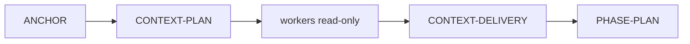

# Context Delivery e busca híbrida adaptativa

Status: **implementado por contrato de template**.

## Objetivo

O Context Brief deixou de ser apenas recomendação de prompt. Em todo run mutável criado por `council_session.py`, a máquina de estados exige:

O orquestrador premium classifica a tarefa e resolve conflitos. Workers baratos fazem discovery lexical delimitado. O context scout sintetiza e resolve reachability. O parent materializa evidências compactas; os outputs brutos não entram na janela decisória.

## Roteamento

| Forma | Ordem |
|---|---|
| `LEXICAL_ENUMERATION` | `rg` por shards → classificação → CodeGraph/LSP para entrypoints |
| `KNOWN_SYMBOL_IMPACT`, alto raio | CodeGraph ∥ `rg` → join → LSP se houver ambiguidade decisiva |
| `KNOWN_SYMBOL_IMPACT`, baixo raio | rota semântica principal → leitura/verificação focada |
| `DYNAMIC_STATE_FLOW` | evento → state/data → comportamento local → reachability externa |
| `DOCS_OR_CONFIG` | docs canônicos + busca textual + leitura |
| `LIVE_STATE` | runtime/banco read-only ∥ código relevante |

Não há fork universal. Paralelismo só ocorre quando os inputs são independentes; em enumeração lexical, o grafo depende dos candidatos e entra depois.

## Agentes nativos

| Runtime | Scout | Shard |
|---|---|---|
| Claude Code | `.claude/agents/<projeto>-context-scout.md` (`sonnet`) | `.claude/agents/<projeto>-context-shard.md` (`haiku`) |
| Codex | `.codex/agents/<projeto>-context-scout.toml` (`gpt-5.6-terra`) | `.codex/agents/<projeto>-context-shard.toml` (`gpt-5.6-luna`) |

Claude não registra TOML do Codex. A prova determinística de invocação no Claude é uma `@agent-<projeto>-context-scout` seguida dos recibos `SubagentStart`, `AgentToolResult` e `SubagentStop`. No Codex, a disponibilidade de papéis nomeados deve ser validada na superfície/version atual; se o papel não for exposto, `CONTEXT-DELIVERY` não passa silenciosamente.

## Evidência exigida

`CONTEXT-DELIVERY` valida:

- `agent_id`, `agent_type`, runtime e modelo permitido;
- lifecycle JSONL com SHA-256;
- um artefato com SHA-256 por método obrigatório;
- estágio de cada método e todas as dependências `before → after`;
- frescor do CodeGraph quando a rota o exige;
- cobertura (`eligible_files`, `analyzed_files`, candidatos e classificações);
- claims com evidência e ausência de unresolved crítico/alto.

Claims exaustivos exigem `analyzed_files == eligible_files`, `unresolved == 0` e todos os candidatos classificados.

## Providers

Capabilities são declaradas em `.harness/context-providers/`. Uma limitação observada num provider/version não vira verdade universal. CodeGraph é o default operacional de impacto/reachability; `rg` é descoberta literal; Serena/LSP é escalada para identidade/alias/re-export/conflito. O health gate do Serena bloqueia a tool call quando fan-out ou RSS excede limites, mas nunca mata processos.

## Compatibilidade

Runs históricos cujo ANCHOR não contém `context_required=true` continuam replayáveis. Runs mutáveis novos criados por `council_session.py` definem a flag e não conseguem alcançar `PHASE-PLAN` sem Context Delivery verificado.
