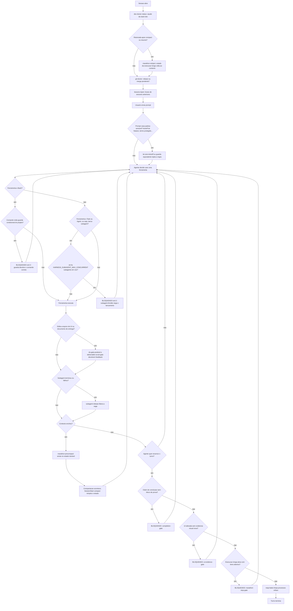

# 01. Visão geral — o harness que este framework instala no seu projeto

Imagine que você contratou um assistente de código muito capaz — ele lê arquivos, roda comandos, edita código — mas que às vezes esquece as regras da casa: declara "terminei tudo" sem mostrar prova, some sem avisar que deixou processos rodando em segundo plano, ou repete num projeto novo o mesmo erro que já cometeu em outro. O **harness** (arreio, em inglês) que este framework instala é o conjunto de automações que cerca esse assistente com alarmes, porteiros e lembretes automáticos, para que os erros conhecidos não se repitam. A peça central são os **hooks**: scripts pequenos que o runtime do agente executa sozinho quando certos eventos acontecem, sem que ninguém precise lembrar de rodá-los. Um hook é como o alarme de uma casa: ninguém o aciona na mão — ele dispara quando a porta abre. Quem decide *qual* script roda em *qual* evento é a camada de registro descrita abaixo.

Em volta desses hooks, o harness soma *regras declarativas* (guardas escritas em markdown, capítulo 07), *skills* (manuais de procedimento carregados sob demanda, capítulo 09), um *council* de revisão adversarial por subagents (capítulo 11) e um ciclo de auto-melhoria (capítulo 12) — tudo parametrizado por uma **config central** que descreve o SEU projeto.

O princípio de arquitetura: **comportamento crítico não fica em prosa; fica em guarda mecânica**. Instrução escrita ("nunca declare 100% sem evidência") falha sob pressão; um Stop hook que bloqueia o fim do turno quando detecta o claim sem o bloco de evidência não falha. O harness converte as regras operacionais do projeto em enforcement executável.

Dois termos antes de continuar:

- **Turno** — o ciclo completo de uma interação: o usuário digita um pedido, o agente trabalha (lê arquivos, roda comandos, edita código) e, quando acha que terminou, tenta encerrar a resposta. Cada etapa desse ciclo tem um evento de hook com nome próprio.
- **Gate** (portão) — um hook que pode **bloquear** a ação em vez de só observar. A convenção técnica é simples: o script termina com código `0` para "pode passar" e código `2` para "bloqueado — e esta mensagem explica o porquê" (a mensagem volta para o agente, que precisa corrigir antes de tentar de novo). Já os hooks de início de sessão e de prompt usam outro canal: o que eles **imprimem** vira contexto, ou seja, texto que o agente lê como se fizesse parte da conversa.

## As três camadas físicas

| Camada | Onde vive no projeto instalado | O que é |
|---|---|---|
| **Config central** | `.harness/harness.conf` (+ `.harness/answers.yml`) | KEY=value com a identidade e os limites do projeto. Gerada pelo questionário do Copier — nunca editada à mão. |
| **Motor** | `.harness/hooks/*` + `.harness/lib/*` | Os scripts de hook (neutros de runtime) e as bibliotecas determinísticas (`_tooling_conf.py`, `scan_project.py`, `merge_docs.py`). |
| **Registro por runtime** | `.claude/settings.json` (Claude Code) e/ou `.codex/hooks.json` (Codex) | Cada runtime tem **exatamente uma** fonte de registro apontando para os MESMOS scripts físicos de `.harness/hooks/` — o hook é escrito uma vez e serve os dois. |

No repositório do framework, os artefatos correspondentes são: [templates/.harness/harness.conf.jinja](../../templates/.harness/harness.conf.jinja) (o template da config central), [templates/.harness/hooks/](../../templates/.harness/hooks/) (os scripts), [copier.yml](../../copier.yml) (o questionário que preenche tudo) e os registros [settings.json.jinja](<../../templates/.claude/settings.json.jinja>) / [hooks.json.jinja](<../../templates/.codex/hooks.json.jinja>).

## Os eventos, em linguagem leiga

Antes da tabela técnica, a intuição de cada evento — o que ele é, comparado a algo do mundo físico:

| Evento | Analogia | Quando acontece |
|---|---|---|
| **SessionStart** | Briefing matinal ao chegar no escritório | Uma sessão de trabalho abre (nova, retomada, ou após compactação de memória) |
| **UserPromptSubmit** | Bilhete grampeado ao pedido antes de chegar à mesa | O usuário envia um prompt, antes de o agente começar a trabalhar |
| **PreToolUse** | Segurança na porta de cada sala | O agente está prestes a usar uma ferramenta (rodar comando, lançar subagent) |
| **PostToolUse** | Inspetor de qualidade logo após o serviço | Uma ferramenta terminou com sucesso |
| **PostToolUseFailure** | O mesmo inspetor, quando o serviço deu errado | Uma ferramenta falhou |
| **PreCompact** | Anotar o essencial antes de a memória ser resumida | O contexto encheu e vai ser compactado |
| **Stop** | Porteiro que revisa antes de deixar sair | O agente tenta encerrar o turno |

## Os eventos de hook e o ciclo de vida de um turno

O runtime do agente expõe esses eventos; o harness registra um ou mais scripts em cada um. A tabela abaixo é o mapa completo do que o framework instala (a coluna Codex difere onde o protocolo do Codex tem evento mais preciso):

| Evento | Hook(s) instalados | Papel | Capítulo |
|---|---|---|---|
| `SessionStart` | `dev-doctor status`, `marathon-reinject`, `git-doctor`, `lessons-inject` | Preparar o contexto: estado da stack, estado do git, lições anteriores, estado de execução longa | 02 |
| `UserPromptSubmit` | `lei-zero-kickoff` (+ `understand-context-inject`, condicional) | Injetar regras no instante em que o assunto aparece | 03 |
| `PreToolUse` | `subagent-throttle` (matcher Task/Agent; no Codex, evento `SubagentStart`) (+ `understand-apps-diff-guard`, condicional, matcher Bash) | Barrar a ação ANTES de executar | 04 |
| `PostToolUse` | `ds-gate-posttool`, `deliverable-scrub-gate` (matcher Edit/Write), `subagent-release` (matcher Task/Agent; no Codex, `SubagentStop`) | Feedback segundos depois da edição; liberar recursos | 05 |
| `PostToolUseFailure` | `subagent-release` (Claude; o Codex cobre pelo `SubagentStop`) | Não vazar slot quando o subagent falha | 04/05 |
| `PreCompact` | `marathon-precompact` | Marcar a compactação no estado durável | 06/08 |
| `Stop` | `completion-gate`, `ui-evidence-gate` (condicional a `use_ui_evidence`), `marathon-stop-gate`, `reap-leaks` | Os porteiros do fim de turno | 06 |

### Fluxograma: o ciclo de vida completo de um turno

O contrato dos hooks é o mesmo nos dois runtimes: o script lê um JSON do evento em stdin; `exit 0` deixa passar (stdout de SessionStart/UserPromptSubmit vira contexto do modelo); `exit 2` + stderr bloqueia a ação e devolve a mensagem ao agente. Todos os hooks do framework são **fail-open**: erro interno do guarda nunca trava a sessão (config ausente ⇒ defaults; dependência ausente ⇒ no-op).

### Dois turnos hipotéticos atravessando o pipeline (cenário simulado)

**Exemplo 1 — sessão nova recebe o briefing automático.** Imagine o projeto `acme`, API na porta `8000`, com o harness instalado. Toda sessão que abre passa por `dev-doctor status`, `git-doctor` e `lessons-inject` antes da primeira palavra do usuário: `dev-doctor status` imprime a saúde real da stack (containers de dev, portas configuradas em `HARNESS_DEV_API_PORT`/`HARNESS_DEV_WEB_PORT`, MCPs); `git-doctor` confere se há rebase ou merge abandonado — a mesma classe de armadilha que faria uma sessão nova herdar um working tree quebrado sem que ninguém percebesse; `lessons-inject` cola no contexto as últimas linhas do arquivo de lições do projeto (`HARNESS_LESSONS_FILE`), incluindo erros já corrigidos em sessões passadas. Resultado: o agente começa o turno já sabendo o estado da máquina, o estado do git e os erros que não pode repetir — sem que o usuário precise lembrar de contar nada disso de novo.

**Exemplo 2 — turno de UI barrado na saída.** O agente edita um componente de interface do `demo-app` e usa um tamanho de fonte fora da escala de tokens do design system — exatamente a violação que `ds-gate-posttool` acusa segundos depois da edição, dentro do próprio turno, com a mensagem "hardcode → token" ou a válvula de escape declarada. Quando o agente tenta encerrar o turno sem gerar evidência visual da mudança (print + manifest), `ui-evidence-gate` bloqueia com `exit 2` e devolve a instrução de captura — mecanismo genérico para um problema recorrente em qualquer projeto de UI: reportar mudança visual só a partir de diff de código, sem nunca renderizar a página, deixa passar regressão que só aparece no pixel. O turno só termina de verdade depois que o print e o manifest existem.

O mesmo princípio cobre o incidente que deu origem ao `reap-leaks`: scripts de automação de navegador (Playwright, Chrome DevTools) que falham no meio do caminho deixam processos headless órfãos para trás; acumulados turno após turno, eles degradam a máquina até esgotar memória. Por isso o `reap-leaks` roda a cada fim de turno, incondicionalmente, e mata processos órfãos ou vivos além do tempo esperado — sem depender de o agente lembrar de limpar.

---

## A config central em 30 segundos

`.harness/harness.conf` é o único lugar onde os NÚMEROS e NOMES do projeto vivem. Os hooks nunca hardcodeiam valores — leem daqui, via o parser único [`_tooling_conf.py`](../../templates/.harness/lib/_tooling_conf.py) (`get_config`/`get_config_int`/`get_config_csv`/`get_config_bool`, com CLI para consumidores bash). Blocos:

- **Identidade** — `PROJECT_NAME`, `PROJECT_ROOT`, `OWNER_NAME`, opcionais `CLIENT_NAME`/`CLIENT_PRODUCT_NAME` (projetos entregues a terceiros) e `GIT_REMOTE_URL`.
- **Dev stack** — `HARNESS_DEV_API_PORT`, `HARNESS_DEV_WEB_PORT`, `HARNESS_DEV_DB_PORT`/`HARNESS_DEV_DB_INTERNAL_PORT`, `HARNESS_DEV_REDIS_PORT`, `HARNESS_RESERVED_PORTS`, `HARNESS_DEV_CONTAINER_PREFIX` (derivado de `${PROJECT_NAME}-`).
- **Prod (opcional)** — bloco inteiro só existe se o projeto declarou uma stack de produção a proteger: `PROD_STACK_PREFIX`, `PROD_PROTECTED_SERVICES`, `PROD_REGISTRY_URL`, `PROD_PUBLIC_WEB_URL`, `PROD_HOST_NAME`. Sem ele, nenhum guarda de produção é gerado.
- **Caps do harness** — `HARNESS_SUBAGENT_MAX_CONCURRENT`, `HARNESS_LESSONS_INJECT_MAX_LINES`, `HARNESS_UI_EVIDENCE_SKIP_TTL_SECONDS`, `HARNESS_PLAN_REVIEW_MAX`, `HARNESS_EXECUTION_REVIEW_MAX`, `HARNESS_ADVERSARIAL_REVIEWER_MODEL`, entre outros — cada um documentado no capítulo do componente que o lê.
- **Convenções** — `HARNESS_DOCS_DIR`, `HARNESS_LESSONS_FILE`, `HARNESS_RUNS_DIR`, `HARNESS_EVIDENCE_DIR`, `IGNORED_TOOL_DIRS`, `HARNESS_SKILLS_DIR`.

Exemplo: num projeto `acme` com API em `HARNESS_DEV_API_PORT=8000`, o hook de porta avisa quando um comando aponta a porta errada, e a mensagem cita a porta certa lida da config — o mesmo script serve qualquer projeto porque o valor nunca está no script.

## Como configurar

Toda a configuração desta camada nasce do questionário [copier.yml](../../copier.yml) na instalação (capítulo 14). Para mudar um valor depois: `copier update` (ou a skill `harness-init`), nunca edição manual do `.conf` — o arquivo é derivado de `.harness/answers.yml`, e edição manual drifta na próxima atualização.

## Onde ler a seguir

- Instalar num projeto: capítulo [14-instalacao-e-update.md](14-instalacao-e-update.md).
- Um hook específico: capítulos 02-06, organizados por evento.
- Guardas declarativas sem escrever código: capítulo [07-hookify.md](07-hookify.md).
- O que o framework ainda NÃO cobre: capítulo [15-limitacoes-conhecidas.md](15-limitacoes-conhecidas.md).
