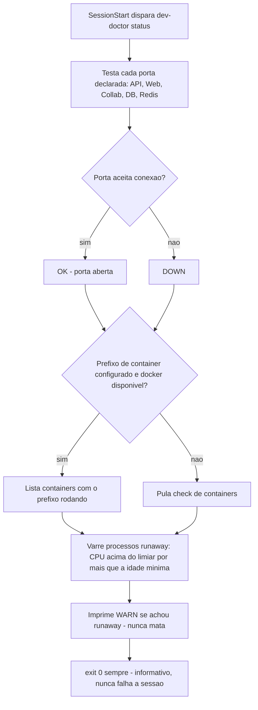
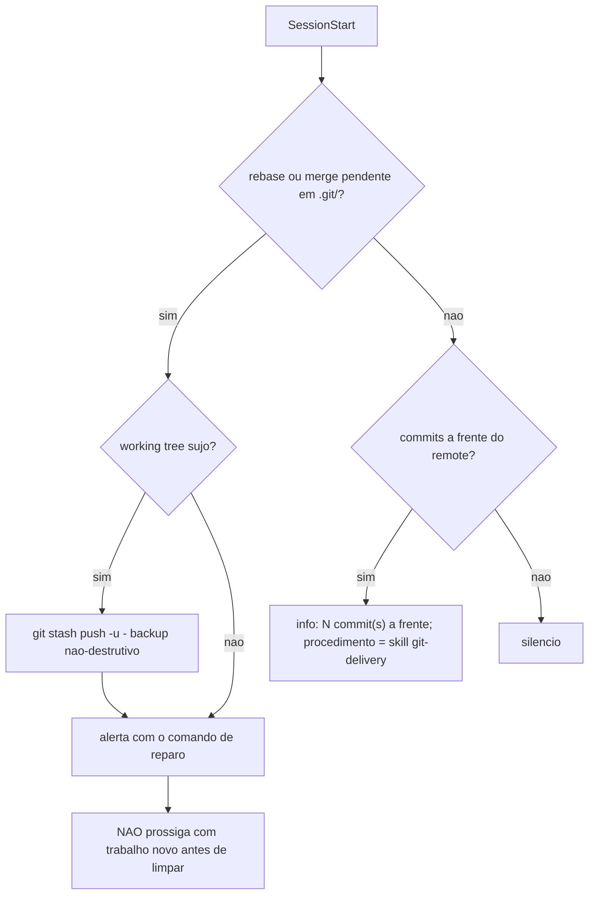
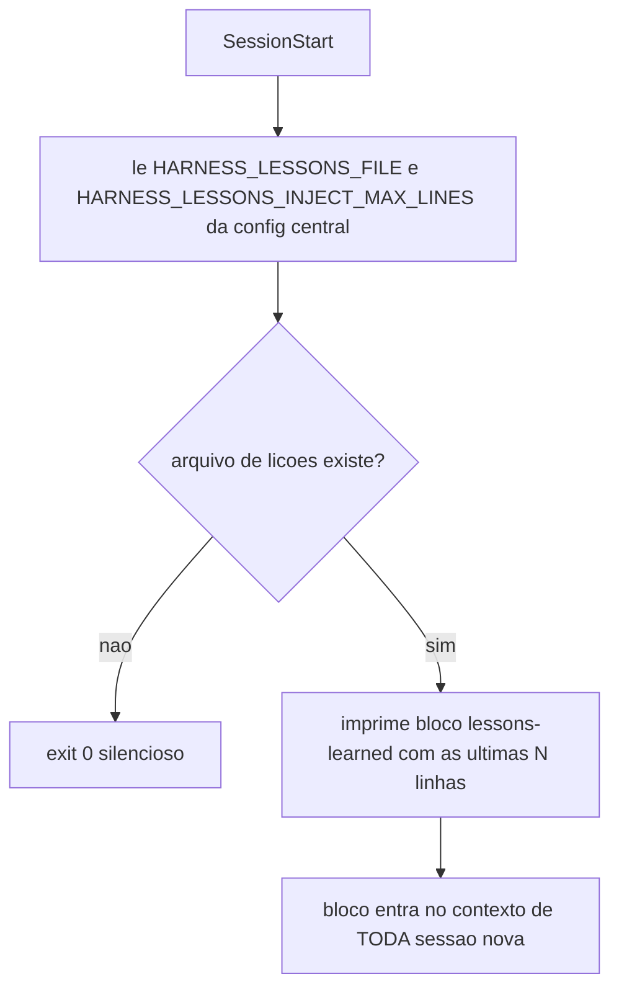

# 02. Hooks de início de sessão — o contexto que aparece "de graça"

Quando uma sessão do agente abre, ele começa cego: não sabe se a stack dev está no ar, se o git está num estado envenenado, o que deu errado nas sessões anteriores, nem se havia uma execução longa em andamento. Os hooks de `SessionStart` resolvem isso imprimindo contexto **antes do primeiro prompt** — tudo que esses scripts escrevem em stdout entra no contexto do modelo.

Um **hook**, no vocabulário deste framework, é um alarme automático ligado a um evento do ciclo de vida do agente: quando o evento acontece, o alarme dispara sozinho um script, sem que ninguém precise lembrar de rodar nada manualmente. O evento aqui é o `SessionStart` — o instante em que uma sessão nasce (ou uma sessão antiga é retomada, ou o contexto acabou de ser compactado). Um hook pode declarar um **matcher**: um filtro que restringe em quais variantes do evento ele dispara. `"matcher": "compact|resume"`, usado por um dos seis hooks abaixo, faz esse hook tocar SÓ quando a sessão reabre depois de compactação ou resume — nunca numa sessão nova comum.

Os seis hooks deste capítulo são **informantes, não porteiros**: imprimem contexto e deixam a sessão seguir, nunca a bloqueiam. Porteiros — hooks que podem travar o *fim* de um turno com `exit 2` — existem no framework, mas são os **Stop hooks** (capítulo 06), com um propósito estrutural diferente: `SessionStart` acontece cedo demais no ciclo para impedir qualquer coisa (a sessão ainda nem viu o primeiro prompt), então o único papel possível ali é informar; barrar um turno que já foi trabalhado é papel de outro momento do ciclo.

O framework registra seis entradas de `SessionStart` (ver o registro em [settings.json.jinja](<../../templates/.claude/settings.json.jinja>) e [hooks.json.jinja](<../../templates/.codex/hooks.json.jinja>)), nesta ordem:

## dev-doctor — o snapshot genérico da stack dev

**O que é** — [templates/.harness/hooks/dev-doctor.sh](../../templates/.harness/hooks/dev-doctor.sh), chamado aqui em modo `status` (com `|| true` — informativo, nunca falha a sessão). É a versão genérica mínima de um "médico de stack": conhece SÓ o que a config central declara, e reporta o estado antes de o agente assumir qualquer coisa.

**Analogias** — Um **container** é uma caixa isolada que roda um único serviço (banco de dados, cache, fila de tarefas): o que acontece lá dentro não vaza para os vizinhos, mesmo compartilhando a mesma máquina host. Uma **porta** é o ramal telefônico desse serviço — um número fixo pelo qual ele atende chamadas (`HARNESS_DEV_API_PORT` é o ramal da API, `HARNESS_DEV_DB_PORT` o do banco). "A porta está aberta" só prova que alguém atendeu o telefone; não prova que quem atendeu fala a língua certa.

**O que faz** — Em `status`: testa cada porta declarada (`HARNESS_DEV_API_PORT`, `HARNESS_DEV_WEB_PORT`, `HARNESS_DEV_COLLAB_PORT`, `HARNESS_DEV_DB_PORT`, `HARNESS_DEV_REDIS_PORT`) e reporta aberta/fechada; lista os containers com o prefixo `HARNESS_DEV_CONTAINER_PREFIX` rodando (se docker existir — sem docker, pula); e emite WARN de processo *runaway* (CPU sustentada acima de `HARNESS_RUNAWAY_CPU_PCT` por mais de `HARNESS_RUNAWAY_MIN_AGE_SECONDS` — nunca mata, pode ser servidor legítimo). O modo `reap` (colheita de processos vazados) é chamado pelo Stop hook `reap-leaks` (capítulo 06). Um modo `up` (SUBIR a stack) não é fornecido: subir exige conhecer os comandos do projeto — é conteúdo que o projeto adiciona por cima, tipicamente via a skill `run-<projeto>` (capítulo 09).

**Handshake funcional > porta aberta** — o check de porta acima (`ss -ltn` ou uma tentativa crua de conexão TCP) é deliberadamente o mínimo denominador comum: funciona para qualquer serviço, mas só confirma que a porta aceita conexão — não que o processo por trás fala o protocolo certo. Para um serviço que exige um protocolo específico (um servidor MCP, por exemplo, que precisa inicializar sessão e listar suas capacidades antes de estar realmente pronto), uma porta aberta pode esconder um processo travado ou um proxy morto respondendo erro em toda chamada. O padrão mais forte — que um projeto acrescenta por cima do genérico quando tem esse tipo de serviço — é o **handshake funcional**: abrir a sessão do protocolo de verdade e só declarar `OK` se a resposta contiver o que se espera dela. "A porta responde" e "o serviço funciona" são afirmações diferentes; o dev-doctor genérico prova a primeira, a segunda é responsabilidade de quem estende o check.

**Padrão crash-loop via restart-counter** — o check de containers acima só reporta presença: `docker ps` achou um container com o prefixo configurado? então conta como `OK`. Isso é suficiente quando o container tem healthcheck (Docker já reporta `unhealthy` sozinho), mas é cego para um container **sem** healthcheck que fica reiniciando em loop — crasha, o orquestrador sobe de novo, crasha de novo. Numa fotografia isolada isso não aparece: `docker ps` mostra "Up 2 seconds" toda vez que alguém olha, porque de fato está de pé naquele instante. O sinal real de um crash-loop não está no estado instantâneo, está na **contagem de reinícios** (`docker inspect --format '{{.RestartCount}}'`): um contador que sobe rápido demais é o crash-loop se denunciando. Um projeto com um serviço assim (ex.: um worker sem healthcheck) estende o dev-doctor com esse check — WARN quando o RestartCount ultrapassa um limiar pequeno (3, 5) — porque "o container está de pé agora" e "o container está preso num loop de crash" são estados que `docker ps` sozinho não distingue.

**Como configurar** — As portas e o prefixo de container vêm do questionário (capítulo 01); os três caps de reap/runaway (`HARNESS_REAP_CHROMIUM_MAX_AGE_SECONDS`, `HARNESS_RUNAWAY_CPU_PCT`, `HARNESS_RUNAWAY_MIN_AGE_SECONDS`) são lidos da config central em runtime. Fail-open total: sem `python3`/config, usa defaults; sem docker, pula containers.

## git-doctor — estado git que envenena a sessão

**O que é** — [templates/.harness/hooks/git-doctor.sh.jinja](../../templates/.harness/hooks/git-doctor.sh.jinja). Detecta (sem auto-mutar destrutivamente) os dois estados que quebram tudo que vem depois: **rebase pendente** (`.git/rebase-merge`/`rebase-apply`) e **merge pendente** (`.git/MERGE_HEAD`). Um rebase abandonado numa sessão anterior polui cada `SessionStart` seguinte e transforma qualquer push em negociação.

**O que faz** — Se detecta estado pendente: reporta o problema com o comando de reparo (`git rebase --abort`/`--continue`, `git merge --abort`) e, se o working tree estiver sujo, faz um backup **não-destrutivo** antes: `git stash push -u`. O *stash* é a gaveta temporária do Git — em vez de descartar ou commitar as mudanças soltas, ele as tira do caminho e guarda de lado, devolvendo exatamente o mesmo conteúdo com `git stash pop` quando for a hora certa de retomá-las. É o oposto de um `git reset --hard`, que apaga de verdade: o stash é reversível, por isso é a única automação que o git-doctor se permite fazer sozinho — a filosofia é "SessionStart não aborta rebase por conta própria; protege o conteúdo e guia". Se o repo está limpo: reporta apenas quantos commits estão à frente do remote (e, se `GIT_REMOTE_URL` foi configurada, qual remote), apontando a skill `git-delivery` para o procedimento de push.

**Como configurar** — `GIT_REMOTE_URL` (opcional, do questionário) é embutida na mensagem informativa de push. O resto é comportamento fixo e fail-open.

## lessons-inject — as lições das sessões anteriores

**O que é** — [templates/.harness/hooks/lessons-inject.sh.jinja](../../templates/.harness/hooks/lessons-inject.sh.jinja), a metade "injetar" do ciclo de auto-melhoria (capítulo 12). Existe por causa de uma propriedade estrutural do modelo por trás do agente: uma LLM não tem memória própria entre chamadas — cada sessão nasce **stateless**, sem qualquer traço do que aconteceu em sessões anteriores, por mais que um erro tenha sido corrigido explicitamente ontem. Sem um mecanismo externo que reintroduza esse histórico no início de cada sessão, o mesmo erro se repete indefinidamente, porque do ponto de vista do modelo ele simplesmente nunca aconteceu. O lessons-inject é esse mecanismo externo: lê o arquivo de lições do projeto e imprime as últimas linhas dentro de um bloco `<lessons-learned>`, com a instrução de reler as lições do domínio da tarefa atual e de promover lição repetida a regra/hook.

**O que faz** — Resolve a raiz do projeto (`$CLAUDE_PROJECT_DIR`, com fallback `git rev-parse --show-toplevel`), lê da config central o path do arquivo (`HARNESS_LESSONS_FILE`, default `tasks/lessons.md`) e o teto de injeção (`HARNESS_LESSONS_INJECT_MAX_LINES`, default 80), e injeta `tail -n <teto>` do arquivo. Arquivo ausente = exit 0 silencioso. Quando o arquivo passa do teto, imprime antes do conteúdo um `WARNING` com a contagem exata de linhas cortadas e a direção do corte (o `tail` descarta o **começo** do arquivo, as lições mais antigas), mais o comando de headroom e as duas saídas — promover lição antiga a regra ou subir o teto.

O teto tem uma segunda função, menos óbvia que "não inflar o prompt": ele **força a promoção**. Se o arquivo de lições crescer sem controle, as entradas mais antigas simplesmente saem da janela das últimas N linhas e param de ser injetadas — esquecidas em silêncio, exatamente o problema que o mecanismo existe para evitar. A saída correta não é aumentar o teto (isso só adia o problema e infla o contexto de toda sessão nova); é **promover** a lição que se repete — virar regra permanente no documento de instruções do projeto, ou um hook executável que a enforce sozinho — antes que ela role para fora da janela. O cap é o que impede o arquivo de lições de virar um lixão só-de-append: ele cobra o ciclo inteiro (capturar → injetar → **promover** → consolidar), não só a captura.

**Como configurar** — `HARNESS_LESSONS_FILE` (path relativo à raiz) e `HARNESS_LESSONS_INJECT_MAX_LINES` (inteiro). O seed do arquivo em si é [templates/tasks/lessons.md.jinja](../../templates/tasks/lessons.md.jinja) — instalado vazio, com o cabeçalho-contrato do formato.

## marathon-reinject — retomar execução longa após compactação

**O que é** — [templates/.harness/hooks/marathon-reinject.sh](../../templates/.harness/hooks/marathon-reinject.sh), registrado com matcher `compact|resume`: só dispara quando a sessão REABRE (após compactação de contexto ou resume), não em sessão nova comum. Existe porque a janela de contexto de uma sessão tem um limite físico de tamanho; quando enche, o histórico da conversa passa por **compactação** — um resumo automático que preserva o essencial e descarta o resto para abrir espaço. Esse resumo é *lossy* por definição: detalhes finos do meio do trabalho (qual sub-passo exato vinha a seguir, decisões já tomadas) tendem a se perder. Sem contramedida, o agente sai da compactação **"grogue"**: lembra vagamente do objetivo geral, mas não do ponto exato onde parou — e o risco concreto é replanejar do zero ou repetir trabalho já concluído. O marathon-reinject é essa contramedida: é a metade "restaurar" do subsistema de execuções longas (capítulo 08), reintroduzindo o estado durável do disco exatamente no momento da reabertura.

**O que faz** — Se `<HARNESS_RUNS_DIR>/ACTIVE` existe (há uma maratona em andamento), lê o slug da execução e injeta as primeiras 150 linhas do `RUN.md` correspondente num bloco `<marathon-run-state>`, com a instrução: o estado durável é a fonte da verdade — execute a "Próxima ação" registrada, não re-planeje. Sem maratona ativa, silêncio.

**Como configurar** — `HARNESS_RUNS_DIR` (default `.harness/runs`) define onde o estado durável vive. O conteúdo do RUN.md é contrato da skill `marathon` (capítulo 08).

## harness-freshness — o próprio harness instalado está desatualizado?

**O que é** — [templates/.harness/hooks/harness-freshness.sh](../../templates/.harness/hooks/harness-freshness.sh). Distinto do "graph freshness" do self-improvement loop (capítulo 12, que checa o grafo de código do Understand Anything): este hook checa a **instância do próprio harness** instalada neste projeto — se ela existe, e se está no mesmo ref/versão que o checkout usado para instalar.

**O que faz** — Detecta instância `ABSENT` (arquivos-chave do harness sumiram) ou `STALE` (versão instalada mais antiga que o checkout de referência) e avisa uma vez por sessão (warn-only). `HARNESS_AUTOHEAL=1` habilita correção automática opt-in; sem essa flag, o hook só informa — a decisão de reinstalar continua sendo do usuário.

## request-reinject — reancorar o pedido original

**O que é** — [templates/.harness/hooks/request-reinject.py](../../templates/.harness/hooks/request-reinject.py), metade "restaurar" do mecanismo de Original Request Anchor (ver README, "What is Orion's Belt?"). Complementa o `request-ledger` (capítulo 03, que escreve a âncora): este hook lê de volta.

**O que faz** — Se `.harness/requests/CURRENT-TASK.md` existe, reinjeta o pedido original VERBATIM no início da sessão — contramedida para a deriva mais comum em conversa longa: o objetivo é parafraseado pela compactação, e a próxima review acaba validando um plano intermediário que silenciosamente substituiu o pedido real. Sem tarefa ativa, silêncio.

## O que fica de lição

`SessionStart` é o único momento em que o harness pode agir sem depender de o agente lembrar de nada — por isso concentra os seis "médicos": stack, git, memória de erros, estado de execução, frescor da própria instalação e fidelidade ao pedido original. Todos são fail-open e silenciosos quando não há nada a dizer: o custo de contexto é proporcional ao problema, não fixo.

O princípio comum a todos, e ao framework como um todo, é este: **um lembrete não protege — um hook protege**. Uma instrução em prosa do tipo "rode a limpeza de vez em quando" ou "confira se o worker não entrou em crash-loop" depende de alguém lembrar de executá-la manualmente, sessão após sessão; na prática ela é esquecida assim que a atenção migra para outra coisa, e o problema que deveria prevenir volta a acontecer. O caso concreto por trás do modo `reap` deste capítulo: processos headless órfãos (navegadores automatizados abertos por scripts de teste/automação sem teardown) se acumulam silenciosamente atrás de qualquer sessão que rode esse tipo de ferramenta, e degradam a máquina até o ponto de travar sessões futuras. A correção estrutural não é escrever a instrução de forma mais enfática — é amarrar a limpeza a um evento que dispara sozinho, sem depender da memória de ninguém: por isso o `reap` do dev-doctor é chamado por um Stop hook a cada fim de turno (capítulo 06), e não é apenas um modo que existe e espera ser lembrado. O mesmo raciocínio vale para os seis hooks deste capítulo: nenhum deles é "documentação de como checar a stack" — são checagens que rodam sozinhas, todo início de sessão, sem que ninguém precise se lembrar de pedir.
