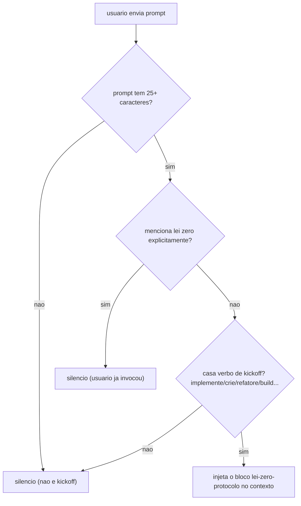

# 03. Hooks de cada prompt — injeção de regra no instante certo

Antes de tudo, o vocabulário. Um **hook** é um alarme automático: um pequeno script que o runtime do agente dispara sozinho toda vez que um evento específico acontece — sem que ninguém precise lembrar de rodá-lo. É como uma secretária invisível que desliza um bilhete de lembrete por baixo da porta cada vez que alguém entra para falar com um consultor: o consultor lê o bilhete junto com a pergunta, antes de responder. Hooks de `UserPromptSubmit` rodam a **cada mensagem do usuário**, antes de o modelo responder — o bilhete desta seção. O que eles imprimem em stdout entra no contexto daquela resposta. O padrão de design aqui é o **post-it condicional**: o hook fica em silêncio na imensa maioria dos prompts e só injeta a regra quando o TEXTO do prompt indica que ela vai ser necessária — regra certa, na hora certa, custo zero no resto do tempo. Os três hooks desta seção compartilham a mesma filosofia de segurança: **fail-open** — se o script quebrar por qualquer motivo (JSON ilegível, exceção não prevista), ele sai em silêncio e o prompt segue seu curso normal, sem travar o turno.

O framework instala dois hooks incondicionais e um condicional:

## lei-zero-kickoff — o protocolo "não reinventar a roda"

**O que é** — [templates/.harness/hooks/lei-zero-kickoff.py](../../templates/.harness/hooks/lei-zero-kickoff.py). A "LEI ZERO" é a regra número um das instruções de projeto geradas ([templates/AGENTS.md.jinja](../../templates/AGENTS.md.jinja) §0): antes de implementar qualquer feature não-trivial, pesquisar soluções maduras existentes, portar e reaproveitar; implementar do zero é exceção declarada. O problema que o hook resolve: essa regra vive num documento que o agente pode não reler no momento do kickoff — e o dono do projeto acaba colando o protocolo à mão, sessão após sessão. O hook automatiza a colagem.

**Quando dispara** — O prompt precisa (1) ter pelo menos 25 caracteres (prompts curtos como "continue"/"corrija" não são kickoff) e (2) casar a regex de kickoff — verbos de construção em português e inglês (`implemente`, `desenvolva`, `crie`, `refatore`, `migre`, `construa`, `monte um plano`, `nova feature`, `implement`, `build a`, `add a feature`...). Se o prompt já menciona "lei zero" explicitamente, o hook cala (o usuário já invocou a regra).

**O que faz** — Injeta o bloco `<lei-zero-protocolo>` com os 4 passos: pesquisar soluções maduras (GitHub/awesome-lists, docs oficiais); portar/reaproveitar antes de escrever; verificar o que o repo JÁ TEM (grep, lockfile, blocos de referência canônica das instruções de projeto); mudanças transversais sempre sequenciais, 1 por vez, testadas. Fecho: "se o plano final reinventa algo que existe, o plano está errado".

**Exemplo (cenário simulado)** — num projeto fictício `acme-app`, o usuário digita: "implemente um endpoint de webhooks com retry exponencial". A frase tem mais de 25 caracteres, não menciona "lei zero" e casa o verbo "implemente" — os dois filtros passam, e o bloco `<lei-zero-protocolo>` é injetado antes de qualquer linha de código ser escrita. Se em vez disso a mensagem fosse só "continue" (8 caracteres), o filtro de tamanho barra sozinho: nada é injetado, porque retomar um trabalho em andamento não é kickoff de feature nova — é exatamente o tipo de prompt curto que o limiar `MIN_LEN = 25` existe para excluir.

**Como configurar** — Sem variáveis: a regex e o protocolo são fixos no script (deliberado — a LEI ZERO é o núcleo transversal do harness, igual em qualquer projeto). Fail-open: JSON malformado ou qualquer exceção ⇒ exit 0 sem output — o hook nunca bloqueia o prompt, mesmo quando falha por dentro.

## request-ledger — a âncora do pedido original

**O que é** — [templates/.harness/hooks/request-ledger.py](../../templates/.harness/hooks/request-ledger.py). Metade "gravar" do mecanismo de Original Request Anchor (a metade "restaurar" é o `request-reinject` do capítulo 02). Resolve a deriva mais recorrente: numa conversa longa, o objetivo original vai sendo lossy-comprimido pela compactação de contexto, e um subagent de review começa com contexto ZERADO — nunca viu o pedido real, só o plano derivado. A review acaba validando o plano intermediário, não o pedido — "revisou a coisa errada, corretamente".

**Quando dispara** — Todo prompt não-trivial (acks como "continue"/"ok"/"sim"/"beleza" são ignorados — não são pedido novo, são confirmação).

**O que faz** — Anexa o prompt VERBATIM + timestamp UTC em `.harness/requests/session-<id>.md`, append-only. A primeira entrada da sessão é a ÂNCORA; entradas seguintes são emendas (mudanças explicitamente acordadas pelo usuário). O hook nunca classifica intenção — só grava; o custo de um objetivo perdido é catastrófico, o de uma linha extra não é. As skills `delivery-council` e `adversarial-review` leem esse ledger para que toda review confronte o objetivo ORIGINAL, não o plano que foi mudando pelo caminho.

**Como configurar** — Sem variáveis. Fail-open: qualquer erro ⇒ exit 0 sem output, nunca bloqueia o turno.

## understand-context-inject — a regra do diff relativo (condicional)

**O que é** — [understand-context-inject.py](<../../templates/.harness/hooks/understand-context-inject.py.jinja>), gerado **apenas** quando o projeto declarou `harness_understand_apps_root` no questionário — isto é, quando o projeto usa o grafo de código Understand Anything com um SUBDIRETÓRIO do monorepo (ex.: `apps/`) como raiz do grafo, e não a raiz do git. Essa combinação cria uma armadilha de paths silenciosa, explicada em detalhe no capítulo 13.

**Quando dispara** — Só quando o prompt menciona o vocabulário do grafo: `/understand`, `understand-anything`, `.understand-anything`, `knowledge-graph`, "grafo de código/conhecimento", `compute-batches` ou `changed-files.txt` (case-insensitive).

**O que faz** — Injeta o bloco `<understand-apps-incremental-guard>` com a regra bloqueante: o diff incremental do grafo DEVE usar `git diff --relative=<subdiretório>`; o hash de referência NUNCA é uma constante decorada — lê-se sempre de `<subdiretório>/.understand-anything/meta.json` (campo `gitCommitHash`), de preferência via o script canônico `bash .harness/lib/understand-apps-changed-files.sh`; e `--full` não é incremental. O hook é só informativo — o bloqueio físico do comando errado é papel do guard PreToolUse do capítulo 04.

**Exemplo (cenário simulado)** — no mesmo projeto `acme-app`, com `harness_understand_apps_root=apps` declarado no questionário, o usuário digita: "atualiza o grafo do understand-anything com o que mudou desde o último /understand". A palavra "understand-anything" casa com `TRIGGER_RE`, e o bloco `<understand-apps-incremental-guard>` entra no contexto. Em vez de rodar um `git diff` bruto a partir da raiz do repositório — que devolveria os paths com o prefixo `apps/` sobrando e faria o comparador do grafo concluir, em silêncio, que quase nada mudou —, o agente lê a regra e roda o script canônico, que resolve o hash de referência em `apps/.understand-anything/meta.json` e gera o diff já relativo a `apps/`. Se a mensagem fosse só "o dashboard está lento" — nenhuma palavra da lista de gatilho —, o hook fica em silêncio; o limiar aqui não é contagem de caracteres, é a presença de vocabulário do grafo.

**Como configurar** — `harness_understand_apps_root` no questionário (vira `HARNESS_UNDERSTAND_APPS_ROOT` na config central). Vazio = projeto não usa o grafo em subdiretório = nem este hook nem o guard do capítulo 04 são gerados. Fail-open: JSON malformado ou qualquer exceção ⇒ exit 0 sem output — mesma filosofia do hook anterior, nunca bloqueia o prompt.

## O que fica de lição

Regra injetada a cada prompt disputa espaço de contexto com o trabalho real — por isso lei-zero-kickoff e understand-context-inject são condicionais por conteúdo (verbo de kickoff; vocabulário do grafo). O request-ledger é a exceção deliberada: incondicional, porque o custo de perder o pedido original é maior que o custo de gravar toda mensagem. Ao portar esse padrão para uma regra própria do seu projeto, a pergunta de design é sempre: "qual palavra no prompt indica que ESTA regra vai ser necessária AGORA?" (ou, para gravação de estado como o ledger: "o custo de NÃO gravar supera o custo de gravar sempre?") — e usar as regras hookify de evento `prompt` (capítulo 07) antes de escrever um hook Python novo.
