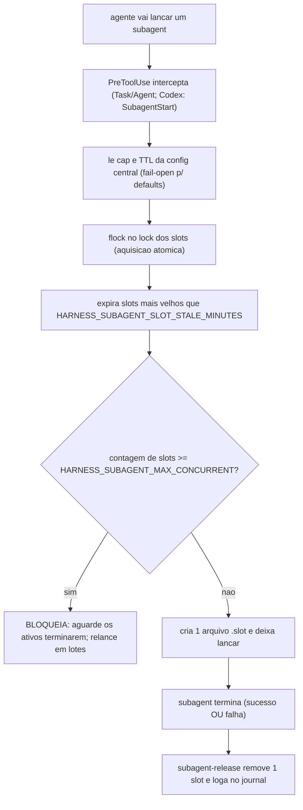
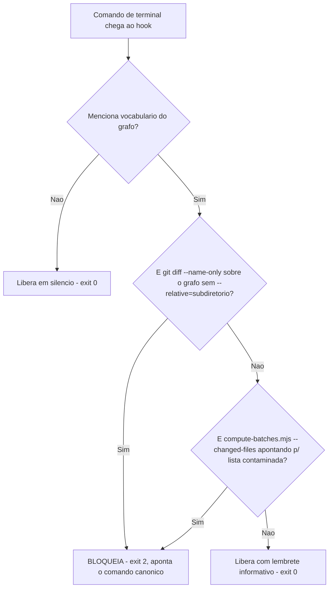

# 04. Hooks antes de cada ferramenta — o semáforo de subagents e o guard de diff

Hooks de `PreToolUse` são os únicos que agem **antes** da ação: recebem o JSON da chamada de ferramenta que o agente está prestes a fazer e podem barrá-la (`exit 2` + mensagem em stderr — a ferramenta não roda e a mensagem vira contexto). É o lugar dos guardas que previnem dano, em vez de remediá-lo. Cada hook é registrado com um **matcher**: o filtro que diz para qual ferramenta ele vale — um matcher `Bash` só vê comandos de terminal, um matcher `Task|Agent` só vê o lançamento de subagents (cópias auxiliares que o agente principal despacha para investigar algo em paralelo). É o matcher que deixa o hook se autolimitar antes mesmo de rodar sua lógica interna: uma chamada de ferramenta que não casa com o matcher nem chega a acordar o script.

O framework instala um guarda incondicional (o semáforo de subagents) e um condicional (o guard de diff do grafo de código).

## subagent-throttle — o semáforo de subagents

**O que é** — [templates/.harness/hooks/subagent-throttle.sh](../../templates/.harness/hooks/subagent-throttle.sh). Subagents (o agente principal despachando agentes auxiliares) são a forma canônica de paralelizar pesquisa e review — mas lançados sem limite estouram cota de tokens e degradam a máquina. Este hook implementa um **semáforo com N vagas**: cada lançamento de subagent consome uma vaga; o lançamento que excederia o limite é bloqueado com a instrução de aguardar e relançar em lotes. A melhor analogia é um estacionamento com N vagas e uma cancela na entrada: cada subagent que entra ocupa uma vaga (um arquivo `.slot` numa pasta de controle); quando todas as vagas estão ocupadas, a cancela não abre para o próximo carro até que alguém saia e devolva a sua.

**Quando dispara** — No Claude Code: `PreToolUse` com matcher `Task|Agent` (as ferramentas de despachar subagent). No Codex: evento `SubagentStart` — mapeamento mais preciso que existe naquele runtime (casa o início do subagent em si, não o nome da ferramenta). Mesmo script físico nos dois.

**O que faz** —
1. Lê da config central `HARNESS_SUBAGENT_MAX_CONCURRENT` (o cap, default 6) e `HARNESS_SUBAGENT_SLOT_STALE_MINUTES` (default 45) via o parser único `.harness/lib/_tooling_conf.py`. Fail-open: sem `python3` ou sem config, usa os defaults — o comportamento nunca regride para "sem throttle".
2. Os slots são **arquivos** em `<HARNESS_RUNS_DIR>/.slots/` (1 arquivo `.slot` = 1 subagent em voo). A aquisição é atômica via `flock` num arquivo de lock — duas chamadas simultâneas não furam o cap.
3. Antes de contar, expira slots velhos: um subagent que morreu sem liberar a vaga não pode travar o sistema para sempre — `find -mmin +<STALE> -delete` limpa slots mais velhos que o TTL.
4. Se a contagem ≥ cap: bloqueia (`exit 2`) com a mensagem citando a contagem, o cap e a variável que o configura. Senão: cria um slot novo (timestamp em nanossegundos como nome) e libera.
5. O contador de vagas não é um número guardado em memória ou em algum arquivo de estado central — é a própria contagem de arquivos `.slot` existentes na pasta, naquele instante. Essa escolha torna o throttle à prova de reinício: se o processo do agente cair e a sessão for retomada, a contagem continua correta porque os arquivos continuam no disco (e, se ficaram órfãos de um subagent que morreu sem liberar a vaga, o TTL do passo 3 os expira sozinhos na próxima checagem).

A **liberação** da vaga é o hook irmão [subagent-release.sh](../../templates/.harness/hooks/subagent-release.sh) — registrado em `PostToolUse` E `PostToolUseFailure` (Claude) ou `SubagentStop` (Codex), para a vaga voltar tanto em sucesso quanto em falha. Ele ordena os nomes dos arquivos `.slot` (que são timestamps) e apaga o mais antigo — não necessariamente o do subagent que efetivamente terminou, mas o mais velho da fila. Essa remoção é **FIFO por aproximação**: o hook não sabe *qual* subagent concluiu, só que *um* concluiu; e como o que importa para um contador de capacidade é *quantas* vagas estão livres — não *qual* subagent as ocupava — devolver a vaga mais antiga é equivalente ao FIFO exato e bem mais simples de implementar, porque dispensa rastrear o ID de cada subagent lançado; basta comparar timestamps de arquivo. Em seguida, registra uma linha no journal (`task-journal.log`) no formato `<timestamp ISO 8601> task-done slots_em_voo=<N>` — por exemplo, (cenário simulado) `2024-03-01T09:15:42 task-done slots_em_voo=2`: uma trilha auditável de cada conclusão de subagent e de quantos outros ainda estavam em voo naquele instante.

**Exemplo de batching (cenário simulado)** — uma revisão com 16 frentes de verificação independentes, uma por subagent, e `HARNESS_SUBAGENT_MAX_CONCURRENT=6` (o default). Lançar as 16 de uma vez não funciona: os lançamentos 1 a 6 criam seu `.slot` e partem; no 7º, o hook conta 6 arquivos, bloqueia com a mensagem de throttle citando `6/6`, e o agente precisa reorganizar o trabalho em rodadas — por exemplo, 6 + 6 + 4 — relançando o próximo lote assim que `subagent-release` devolve vagas suficientes. Com um cap menor (o projeto `demo-app` do parágrafo abaixo, com `HARNESS_SUBAGENT_MAX_CONCURRENT=3`), o mesmo trabalho de 16 viraria 3 + 3 + 3 + 3 + 3 + 1: mais rodadas, cada uma mais segura para uma cota apertada.

**Como configurar** — `HARNESS_SUBAGENT_MAX_CONCURRENT` (quantos subagents em paralelo o seu plano de conta aguenta; num projeto `demo-app` com cota apertada, 3 é um valor defensável) e `HARNESS_SUBAGENT_SLOT_STALE_MINUTES` (equilíbrio entre "slot fantasma trava vaga" e "subagent legítimo longo é expirado cedo demais"). Ambas no questionário do Copier.

## understand-apps-diff-guard — o porteiro do diff do grafo (condicional)

**O que é** — [understand-apps-diff-guard.sh](<../../templates/.harness/hooks/understand-apps-diff-guard.sh.jinja>), gerado apenas quando `harness_understand_apps_root` foi declarado. É a versão **coercitiva** do lembrete do capítulo 03: enquanto aquele injeta a regra do diff relativo quando o assunto aparece na conversa, este bloqueia fisicamente o comando errado.

**Quando dispara** — `PreToolUse` com matcher `Bash`. Autolimita-se: só age se o comando mencionar o vocabulário do grafo (`understand`, `.understand-anything`, `knowledge-graph`, `compute-batches`, `changed-files.txt`); qualquer outro comando passa sem custo.

**O que faz** — Duas regras de bloqueio (detalhe do porquê no capítulo 13):
1. **Diff bruto:** comando com `git diff` + `--name-only` sobre o grafo SEM `--relative=<subdiretório>` ⇒ bloqueia. Esse diff produz paths no formato errado e faz a atualização incremental virar um no-op silencioso — "parece rápido" porque não casou nada.
2. **Lista contaminada:** invocação de `compute-batches.mjs --changed-files=<arquivo>` onde o arquivo apontado contém linhas começando com `<subdiretório>/` ou paths da raiz do repo (`.claude/`, `docs/`, `scripts/`...) ⇒ bloqueia. Mesmo uma lista gerada errada em outro momento não entra no pipeline.

Comando que menciona o grafo mas não viola nenhuma regra: passa com o lembrete informativo impresso (formato correto dos paths, comando canônico) — é o nó `G` do fluxograma acima.

**Como configurar** — `harness_understand_apps_root` no questionário. Os prefixos de raiz bloqueados na regra 2 incluem os diretórios de tooling e docs padrão; o subdiretório do grafo vem da variável.

## O que fica de lição

`PreToolUse` é o único evento onde o custo do erro é zero — a ação errada nunca aconteceu. A contrapartida: o guarda roda em TODA chamada da ferramenta casada, então precisa se autolimitar cedo e barato (matcher específico no registro; grep de vocabulário na primeira linha do script) para não taxar as chamadas inocentes.
