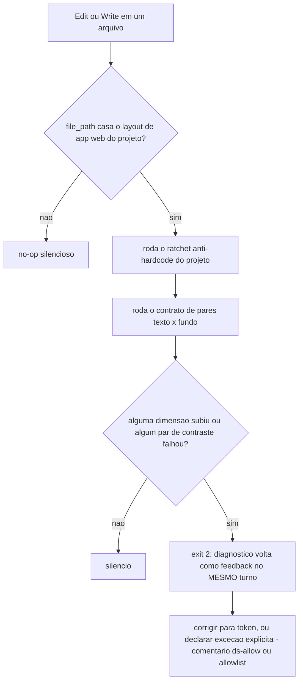
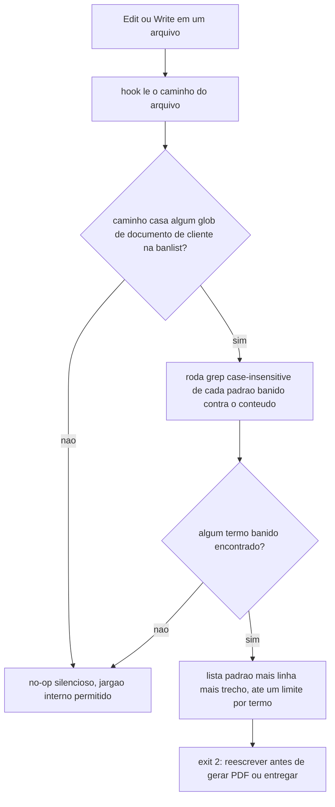

# 05. Hooks depois de cada edição — feedback em segundos, não em dias

Hooks de `PostToolUse` rodam **depois** que a ferramenta executou, recebendo o JSON da chamada e do resultado. Para edição de arquivos, isso cria o padrão mais valioso do harness: **o gate de qualidade que devolve a violação segundos depois da edição** — enquanto o agente ainda tem o contexto na cabeça — em vez de dias depois, no olho do revisor humano. O contrato: `exit 2` + stderr NÃO desfaz a edição (já aconteceu); devolve a violação como feedback para o agente corrigir no mesmo turno.

Duas palavras merecem definição antes de seguir. Um **hook** é um alarme automático: dispara sozinho quando o evento certo acontece, sem que ninguém precise lembrar de rodá-lo — como um alarme de incêndio, que não espera alguém sentir cheiro de fumaça para agir. Um **gate** ("portão") é um hook que além de disparar, **julga** o resultado: inspeciona o que aconteceu e decide entre deixar passar em silêncio ou barrar com uma reclamação específica — como o portão de uma catraca, que só libera quem tem passagem válida e devolve todo mundo mais na fila quando não tem. Os dois hooks de qualidade deste capítulo são gates: não impedem a edição (ela já aconteceu, o arquivo já está gravado em disco), mas revistam o resultado e, havendo violação, devolvem a reclamação como feedback imediato para o mesmo turno.

O framework registra três hooks aqui (dois gates de qualidade em Edit/Write e o release do semáforo, já descrito no capítulo 04).

## ds-gate-posttool — o gate do design system (condicional por layout)

**O que é** — [ds-gate-posttool.sh](<../../templates/.harness/hooks/ds-gate-posttool.sh.jinja>), gerado quando `use_ds_gate` está ativo. Em projetos com design system tokenizado, a violação recorrente é o agente escrever valor hardcoded (cor crua, cinza arbitrário) em vez do token semântico. Este hook roda os verificadores do design system do projeto sempre que um arquivo de UI muda.

Vale parar dois parágrafos no que esse gate está de fato protegendo. Um **design token** é um apelido oficial para uma decisão visual: em vez de escrever a cor crua `#22c55e` (ou a classe utilitária que a materializa, por exemplo `bg-green-500`) em duzentos lugares do código, o projeto escreve um nome semântico — `bg-primary`, "fundo na cor primária" — e um único arquivo central define o que "primária" significa em cada tema. Trocar o tema inteiro do produto (claro, escuro, uma marca alternativa) vira editar um arquivo, porque toda tela aponta para o apelido, não para o valor.

Um **hardcode** é o pecado oposto: escrever o valor cru direto na tela. A armadilha é que ele funciona no exato momento em que é escrito — a tela renderiza certinho sob o tema atual — e só quebra depois, **silenciosamente**, quando alguém troca de tema ou a paleta central muda: aquele valor cravado nunca esteve de fato ligado ao sistema de temas, então não ouve a mudança. É esse atraso entre o erro (a linha escrita) e o sintoma visível (a tela errada, semanas depois, sob outro tema) que torna hardcode perigoso o bastante para merecer um gate automático em vez de depender de revisão humana lembrar de checar todos os temas a cada PR.

**Quando dispara** — `PostToolUse` com matcher `Edit|Write|MultiEdit`, e só quando o `file_path` editado é `.tsx`/`.css`/`.ts` dentro do diretório do app web resolvido em runtime de `HARNESS_WEB_APP_DIR` (default `.` — a raiz do projeto; se o projeto for um monorepo, ex. `apps/web`, o valor vem do questionário). **Auto-gated**: num projeto sem esse diretório, é um no-op silencioso — nunca um erro.

**O que faz** — Chama dois verificadores SHIPADOS PELO HARNESS (não pelo projeto) em `.harness/lib/`, gated por `use_ds_gate`: um **ratchet** anti-hardcode (`.harness/lib/ds-gate.sh`) e um **contrato de pares** (`.harness/lib/ds-pairs-check.py` — texto × fundo com contraste válido em todos os temas). O que é dado do projeto é só o *estado* que o ratchet lê/escreve — a baseline commitada (`.ds-baseline.txt`, dentro do diretório do app web) — não o script.

O nome **ratchet** ("catraca") é literal: como a catraca de uma roleta de estádio, ela só gira para um lado. O script conta, por dimensão (cor cinza crua, cor nomeada tipo `red-500`, hex cru, tamanho de fonte fixo em pixels, z-index mágico, etc.), quantos hardcodes existem hoje e compara contra uma baseline commitada no repositório. Se a contagem de qualquer dimensão **subiu** em relação à baseline, o ratchet falha — não interessa se o total absoluto ainda parece pequeno, subiu é subiu. Se ficou igual ou caiu, passa. A baseline só encolhe, e só por comando explícito de quem está deliberadamente pagando a dívida — nunca sobe sozinha. Um projeto que zera a baseline de uma dimensão trava qualquer hardcode novo naquela dimensão dali para frente.

Gotcha que vale destacar: **o ratchet pune o repositório, não o autor da linha.** Ele não sabe quem escreveu o hardcode nem quando — só compara o total de agora contra o total salvo. Isso significa que débito visual antigo, esquecido num arquivo que ninguém tocava havia tempo, pode travar a edição de HOJE de um agente completamente alheio àquele débito, só porque o ratchet varre o projeto inteiro a cada chamada, não apenas o arquivo tocado no turno atual. A correção mais rápida costuma ser resolver o hardcode antigo (trocar pelo token equivalente) para destravar o próprio trabalho — mesmo sem ter sido quem o causou.

Falhou qualquer um dos dois verificadores ⇒ `exit 2` com o diagnóstico e as duas saídas legítimas: trocar o valor por token, ou declarar exceção explícita (comentário `// ds-allow: <motivo>` na linha, ou glob na allowlist do projeto).

**Worked example (cenário simulado)** — O agente edita um botão em `apps/web/components/dashboard/summary-card.tsx` e escreve `className="bg-green-500 text-white"` em vez do token equivalente. Segundos depois, o hook devolve algo como:

```
DS-GATE: a edicao em apps/web/components/dashboard/summary-card.tsx introduziu violacao do design system.
  color-named: baseline=0 atual=1  SUBIU (+1)
  color-wb:    baseline=0 atual=1  SUBIU (+1)
Corrija trocando o valor cru pelo token semantico (ex.: bg-primary text-primary-foreground),
ou declare excecao explicita: comentario "// ds-allow: <motivo>" na linha, ou glob em .ds-allowlist.
```

O agente lê a reclamação, troca pelas classes de token, e a edição seguinte passa limpa — sem humano no circuito.



**Como configurar** — O hook lê `HARNESS_WEB_APP_DIR` da config central (via `.harness/lib/_tooling_conf.py`) para saber onde procurar arquivos de UI; os verificadores (`ds-gate.sh`/`ds-pairs-check.py`) são shipados pelo harness em `.harness/lib/`, gated por `use_ds_gate` — só a BASELINE (`.ds-baseline.txt`) pertence ao projeto. O conceito de ratchet vale para qualquer contador que o projeto queira "só piorar nunca": a baseline é commitada; o gate compara o estado atual contra ela; melhorar aperta a baseline, piorar falha — o design system só anda numa direção.

**Baseline inicial (H2/A6.2)** — `harness-install.sh` gera `.ds-baseline.txt` automaticamente na 1ª instalação (se `use_ds_gate` estava ativo) a partir da contagem REAL do projeto-alvo nesse momento — sem isso o ratchet nunca teria contra o que comparar e ficaria permanentemente em modo `--report` (nunca falha, mesmo com hardcode óbvio; era exatamente esse o estado antes desta correção). Instalou via `copier copy`/skill `harness-init` em vez de `harness-install.sh`? Gere a baseline manualmente uma vez: `bash .harness/lib/ds-gate.sh --update-baseline` (dentro do diretório do app web, ou de qualquer lugar do repo — o script resolve `HARNESS_WEB_APP_DIR` sozinho). Regenerar depois é sempre ação explícita do usuário — reinstalação/`copier update` nunca resetam uma baseline já commitada.

**Allowlist por caminho é GLOB de verdade (H2/A6.3)** — `.ds-allowlist` (um padrão por linha, `#` comenta) casa via `fnmatch` do Python (`.harness/lib/ds_allowlist_filter.py`), não substring: `legacy/**` ou `components/vendor/*` funcionam como esperado. (Uma versão anterior fazia `grep -vF` — substring literal — e um padrão com `**` nunca casava nenhum path real; a doc já prometia "glob" antes disso ser verdade.)

## deliverable-scrub-gate — jargão interno não vaza em documento de cliente

**O que é** — [templates/.harness/hooks/deliverable-scrub-gate.sh.jinja](../../templates/.harness/hooks/deliverable-scrub-gate.sh.jinja). Em projetos que produzem entregáveis para um cliente (`CLIENT_NAME` preenchido no questionário), o risco recorrente é vazamento de contexto interno — nome de ferramenta interna, processo da equipe, contexto de outro trabalho — dentro do documento que o cliente vai ler. Este hook casa o arquivo editado contra uma **banlist declarativa** e devolve as ocorrências como feedback.

**Quando dispara** — `PostToolUse` com matcher `Write|Edit|MultiEdit`. Só age se o projeto tiver o arquivo `.claude/deliverable-banlist.txt` (fail-open sem ele) e se o arquivo editado casar algum glob de "documento de cliente" declarado na própria banlist.

**O que faz** — A banlist tem dois tipos de linha: `glob: <padrão>` (quais arquivos são documento de cliente — ex.: `glob: docs/deliverables/**`) e padrões regex de jargão banido (um por linha; `#` comenta). Se o arquivo editado casa um glob E contém padrão banido: `exit 2` listando cada padrão com as primeiras ocorrências (linha e trecho), e a instrução de reescrever antes de gerar PDF/entregar. A mensagem cita o nome do produto do cliente (`CLIENT_PRODUCT_NAME`, com fallback para `PROJECT_NAME`) para ancorar o ponto: o documento é sobre o produto DELE, não sobre o processo interno de quem o produz.

**Worked example (cenário simulado)** — Um projeto configurou `CLIENT_NAME=acme` e `CLIENT_PRODUCT_NAME=Acme Portal`; a banlist tem `glob: docs/deliverables/**` e o termo banido `\binternal-framework-x\b`. O agente edita `docs/deliverables/relatorio-status.md` e fecha um parágrafo com "...construído sobre o internal-framework-x, que a equipe usa internamente para orquestrar...". O hook devolve:

```
DELIVERABLE-SCRUB: jargao interno em documento de CLIENTE (docs/deliverables/relatorio-status.md)
  padrao violado: \binternal-framework-x\b
    linha 42: "...construido sobre o internal-framework-x, que a equipe usa..."
Lembrete: o produto do cliente e "Acme Portal" - reescreva antes de gerar PDF ou entregar.
```

O agente reescreve o parágrafo sem o termo interno antes de considerar o documento pronto.

**A regra de ouro (o insight mais transferível deste capítulo)** — Uma constraint negativa do tipo "NUNCA mencione X" não pode, em nenhuma etapa do processo, virar um checklist positivo do tipo "mencione Y no lugar de X" ou "confirme que Y aparece no documento". O motivo é estrutural, não estilístico: um checklist positivo é satisfeito verificando a **presença** de algo — e presença de Y não prova ausência de X. Um agente (ou um humano apressado revisando por cima) pode legitimamente marcar "Y está presente, item concluído" num documento que ainda contém X em outro parágrafo, porque o checklist nunca chegou a perguntar por X. A skill de contrato de entregável documenta esse fracasso já observado na prática: prosa sozinha ("lembre-se de não mencionar X") falhou porque quem executou reportou conformidade tendo, na verdade, invertido a constraint — leu "não X", produziu um relatório otimizado em torno de "sim Y", e nunca voltou a checar se X tinha de fato sumido. É exatamente por isso que o gate mecânico existe: rodar `grep` contra o padrão negativo original (`\bX\b`) é a única forma de provar ausência, porque ausência não é uma caixa que se marca por observação direta — é a caixa que nunca acende quando alguém efetivamente procura pelo termo proibido no texto final.



**Como configurar** — `client_name`/`client_product_name` no questionário (parametrizam a mensagem); o conteúdo da banlist é do projeto — o template instala um seed em [deliverable-banlist.txt.jinja](<../../templates/.claude/deliverable-banlist.txt.jinja>) para preencher com os termos internos reais. A skill `deliverable-contract` (capítulo 09) é o par declarativo deste gate: registra por escrito as constraints do entregável — incluindo as negativas, copiadas palavra por palavra, nunca reformuladas em positivo — que a banlist então vigia.

## subagent-release — a contraparte do semáforo

Registrado aqui (matcher `Task|Agent`) e em `PostToolUseFailure` — descrito no capítulo 04 junto com o throttle. A razão do registro duplo no Claude Code: a vaga do semáforo precisa voltar tanto quando o subagent conclui quanto quando ele falha; no Codex, o evento único `SubagentStop` cobre os dois casos.

## O que fica de lição

`PostToolUse` é o ponto de **feedback imediato**: o gate não impede a edição (isso seria `PreToolUse`, caro demais — exigiria avaliar a edição antes de existir), mas transforma a violação em informação no mesmo turno, quando corrigir custa uma edição e não um ciclo de review. Os dois gates são declarativos na borda do projeto (baseline do ratchet; banlist do scrub) — o mecanismo é do framework, o conteúdo é seu.
