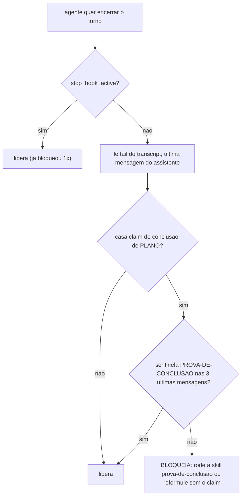
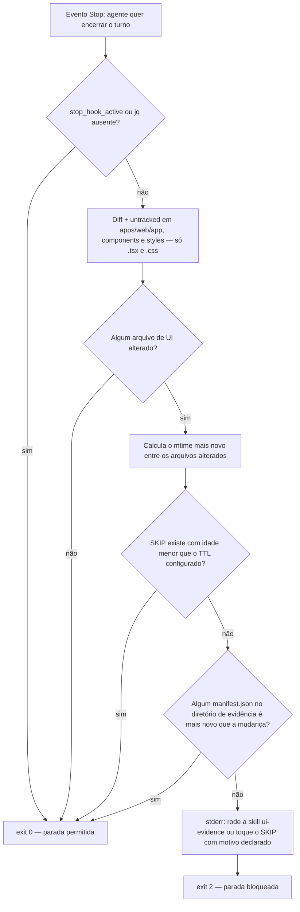
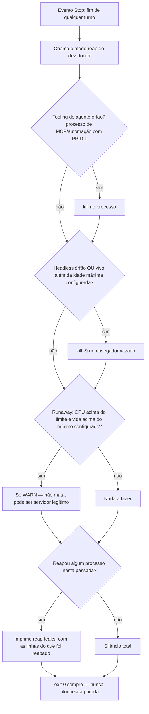

# 06. Os porteiros do fim de turno — Stop hooks e o PreCompact irmão

Hooks de `Stop` rodam quando o agente quer **encerrar o turno** — o último checkpoint antes de a resposta final chegar ao usuário. É o lugar dos gates que auditam o TRABALHO INTEIRO do turno, não uma ação isolada: houve claim de conclusão sem prova? mudou UI sem evidência visual? a execução longa foi abandonada no meio? sobrou processo vazado?

O contrato de todos: `exit 2` + stderr bloqueia a parada (a mensagem volta para o agente, que precisa resolver e tentar encerrar de novo); o campo `stop_hook_active` do JSON do evento indica que o hook JÁ bloqueou uma vez neste turno — todos os porteiros liberam nesse caso, prevenindo loop infinito de bloqueio.

O framework registra quatro Stop hooks e um `PreCompact` irmão.

## completion-gate — claim de conclusão exige bloco de evidência

**O que é** — [templates/.harness/hooks/completion-gate.py](../../templates/.harness/hooks/completion-gate.py). O anti-overclaim: a tendência do agente de declarar "100% executado", "tudo corrigido", "pronto para produção" sem evidência verificável. A regra que ele enforça: qualquer claim de conclusão **de nível de plano** exige o bloco de evidência da skill `prova-de-conclusao` (capítulo 09), terminando na linha-sentinela literal `PROVA-DE-CONCLUSAO: <x>/<y> PASS, gaps: [...]`.

**O que faz** —
1. Lê o tail do transcript da sessão (via `transcript_path` do JSON; só os últimos 2 MB — transcripts crescem a dezenas de MB) e extrai as últimas mensagens do assistente do loop principal (ignora sidechains de subagents).
2. Testa a ÚLTIMA mensagem contra a regex de claims de plano: `100%`, "plano executado/concluído", "tudo corrigido/implementado", "todos os itens fechados", "pronto para produção/homolog/deploy", "gaps zerados", "implementação completa". Claims de mudança única ("arquivo corrigido") passam de propósito — para esses vale a skill `verify`, não o gate.
3. Se casou claim: procura a sentinela `PROVA-DE-CONCLUSAO: n/m` nas 3 últimas mensagens (o veredito pode estar na mensagem anterior ao resumo). Ausente ⇒ `exit 2` com a instrução: rodar a skill, montar a tabela de evidência POR ITEM (comando + exit code, grep com path e linha, contagem de testes, manifest de evidência visual), ou **reformular o veredito sem o claim** — fabricar certeza é a violação máxima; declarar gap é sempre legítimo.

**Exemplo (cenário simulado)** — Numa sessão de correção de bugs no repositório `demo-app`, o agente termina o turno com a frase "Todos os itens do plano foram corrigidos, pronto para produção." sem ter rodado a skill `prova-de-conclusao` nas mensagens anteriores. O `completion-gate` casa a frase contra a regex de claim de plano, procura a sentinela `PROVA-DE-CONCLUSAO:` nas 3 últimas mensagens e não encontra — bloqueia com `exit 2` e devolve: "rode a skill prova-de-conclusao ou reformule o veredito sem o claim". Na tentativa seguinte, o agente roda os testes reais (`npm test`, exit 0, 12/12), faz o grep dos itens corrigidos com path e linha, monta a tabela por item e escreve `PROVA-DE-CONCLUSAO: 5/5 PASS, gaps: []` — a parada é liberada.

**Como configurar** — Sem variáveis; regexes fixas (o vocabulário de overclaim é o mesmo em qualquer projeto). O par declarativo é a skill `prova-de-conclusao`.

## ui-evidence-gate — mudança de UI exige pixel renderizado

**O que é** — [ui-evidence-gate.sh](<../../templates/.harness/hooks/ui-evidence-gate.sh.jinja>), gerado quando o módulo de evidência visual está ativado (`use_ui_evidence` no questionário, default true — desligue em backend puro). A regra: trabalho de UI só é "pronto" com evidência RENDERIZADA (screenshot + manifest), nunca com diff de código — diff não prova que a tela ficou certa. O motivo é concreto, não teórico: revisão só por diff já deixou passar bugs que só existem no pixel — texto invisível porque herdou a cor errada do tema, borda que regride depois de já ter sido corrigida mais de uma vez, ou animação de transição imperceptível ou ausente. Nenhum desses aparece numa listagem de linhas alteradas. O gate bloqueia o fim do turno quando há mudança de UI no working tree sem evidência mais recente que a mudança.

**O que faz** —
1. Coleta os arquivos de UI alterados (diff + untracked) sob o layout de app web do projeto (`apps/web/{app,components,styles}`, `.tsx|.css` — literal hoje; ver capítulo 15) e o mtime mais novo entre eles.
2. Escape hatch: se existir `<HARNESS_EVIDENCE_DIR>/SKIP` com idade menor que `HARNESS_UI_EVIDENCE_SKIP_TTL_SECONDS`, libera — é a válvula para mudança comprovadamente não-visual ou stack fora do ar, com o motivo declarado no veredito. O TTL impede o SKIP de virar permanente.
3. Procura algum `<HARNESS_EVIDENCE_DIR>/*/manifest.json` com mtime ≥ o da mudança. Achou ⇒ libera. Não achou ⇒ `exit 2` com as duas opções: gerar a evidência (skill `ui-evidence`, capítulo 09) ou tocar o SKIP declarando o motivo.

**Exemplo (cenário simulado)** — O agente ajusta a cor de fundo de `apps/web/components/ui/badge.tsx` no projeto `demo-app` e tenta encerrar o turno. O gate roda o diff, encontra `badge.tsx` alterado dentro de `apps/web/components`, calcula o mtime da mudança e varre `<HARNESS_EVIDENCE_DIR>/*/manifest.json` — nenhum manifest é mais novo que a mudança, e não existe `SKIP` válido. Bloqueia com `exit 2` listando o arquivo descoberto. O agente roda `npm run ui:evidence -- after --routes /`, o manifest é gerado com mtime posterior à mudança, e na tentativa seguinte de parada o gate libera.

**Como configurar** — `use_ui_evidence` (gera ou não o módulo), `HARNESS_EVIDENCE_DIR` (default `.claude/evidence`), `HARNESS_UI_EVIDENCE_SKIP_TTL_SECONDS` (default 14400 = 4h) e `HARNESS_UI_EVIDENCE_THEMES` (CSV de temas que a skill captura; default `light,dark`).

## marathon-stop-gate — execução longa não é abandonada em silêncio

**O que é** — [templates/.harness/hooks/marathon-stop-gate.sh](../../templates/.harness/hooks/marathon-stop-gate.sh). Quando há uma maratona ativa (capítulo 08), o agente não pode simplesmente parar no meio: o gate compara o checklist do `RUN.md` com a tentativa de parada.

**O que faz** — Sem `<HARNESS_RUNS_DIR>/ACTIVE`: inerte. Com maratona ativa: se o checklist tem itens abertos (`- [ ]`), bloqueia devolvendo a "Próxima ação" registrada. Paradas legítimas: checklist zerado, ou a seção "Próxima ação" começando com `AGUARDANDO:` (bloqueado em decisão do usuário). **Anti-prisão**: `HARNESS_MARATHON_MAX_BLOCKS_WITHOUT_PROGRESS` bloqueios consecutivos (default 3) SEM o `RUN.md` mudar (o mtime é o detector de progresso) ⇒ libera com aviso — o gate cobra progresso, não mantém refém.

**Exemplo (cenário simulado)** — Numa maratona ativa no projeto `demo-app`, o checklist do `RUN.md` ainda tem 2 itens abertos e a "Próxima ação" não começa com `AGUARDANDO:`. O agente tenta encerrar o turno assim mesmo; o gate bloqueia, incrementa o contador de strikes e devolve a "Próxima ação" registrada. Se isso se repetir por `HARNESS_MARATHON_MAX_BLOCKS_WITHOUT_PROGRESS` vezes seguidas sem o mtime do `RUN.md` mudar — sinal de que nada avançou de verdade —, o gate desiste de insistir, zera os strikes e libera a parada com um aviso de sistema. A maratona segue `ACTIVE`, mas o agente não fica preso num loop de bloqueios inúteis.

## reap-leaks — processos vazados não acumulam entre turnos

**O que é** — [templates/.harness/hooks/reap-leaks.sh](../../templates/.harness/hooks/reap-leaks.sh). Tooling de agente vaza processos: navegadores headless lançados por scripts de screenshot sem teardown, dev-servers órfãos. Acumulados, degradam a máquina (memória/swap) sessão após sessão. Este hook roda a colheita a cada fim de turno.

Este hook nasce de um mecanismo real, não de teoria: um servidor de automação acumulou dezenas de navegadores headless vazados de scripts que quebravam antes do teardown, o swap encheu e a máquina ficou lenta para o resto do trabalho. O detalhe que importa não é o incidente em si, é a causa raiz: a limpeza já existia como comando manual, mas cobria só o padrão previsto (processos de tooling de agente com nome reconhecível) — o vazamento real era um navegador headless CRU, fora desse padrão, e ninguém rodava o comando porque nada o disparava sozinho. Daí o hook: fecha os dois buracos ao mesmo tempo, amplia a detecção e a liga a um evento determinístico.

**O que faz** — Delega a limpeza ao modo `reap` do [dev-doctor genérico](../../templates/.harness/hooks/dev-doctor.sh) instalado (capítulo 02), em três frentes: (1) mata tooling de agente órfão — processos de MCP/automação re-parentados ao init; (2) mata navegador headless vazado — órfão, ou vivo além do cap de idade (`HARNESS_REAP_CHROMIUM_MAX_AGE_SECONDS`); (3) processo de alta CPU acumulada e vida longa gera só WARN — nunca é morto, pode ser servidor ativo legítimo (`next dev`, `uvicorn --reload`, um watcher de build). O hook em si é um invólucro fino e não-bloqueante (exit 0 sempre) e silencioso quando não há nada a colher — só fala quando reapou algo, com a contagem.

A detecção de headless é segura por construção: a assinatura usada (flag `--headless` nos argumentos do processo, path apontando para o cache de binários do framework de automação, ou o nome do executável do navegador sem interface) é algo que um navegador aberto por um humano NUNCA carrega — ninguém abre o navegador do dia a dia em modo headless nem aponta o binário para o cache de uma lib de automação. Por isso o `kill -9` pode ser aplicado sem checagem adicional em qualquer máquina onde o hook rode: o guard nunca derruba o navegador real de quem está usando o teclado, só processos que existem exclusivamente para automação sem interface.

**Exemplo (cenário simulado)** — Um script de captura `screenshot-check.mjs` do projeto `demo-app` chama `chromium.launch({headless: true})` para revisar uma página em `localhost:8000`, mas uma asserção falha antes do `browser.close()`. O processo do navegador fica órfão, vivo, consumindo memória — ninguém percebe durante o resto do turno. Ao fim do turno, o `reap-leaks` roda o modo `reap` do dev-doctor: a frente de detecção de headless encontra o processo com idade acima de `HARNESS_REAP_CHROMIUM_MAX_AGE_SECONDS` (default 300s), aplica `kill -9` e imprime `reap-leaks: chromium headless leaked <pid> (380s)` seguido de `1 processo(s) reapados`. A parada é liberada normalmente — o hook nunca bloqueia, só limpa.

**Como configurar** — `HARNESS_REAP_CHROMIUM_MAX_AGE_SECONDS` (idade a partir da qual um headless é leak; default 300), `HARNESS_RUNAWAY_CPU_PCT` (default 50) e `HARNESS_RUNAWAY_MIN_AGE_SECONDS` (default 3600) — lidos da config central pelo dev-doctor.

**Checklist universal — construir qualquer guard/checker que funcione de verdade**

A lição por trás do reap-leaks generaliza para qualquer guard novo do harness (Stop, PreToolUse, SessionStart...):

1. **Cobrir o caso REAL, não só o previsto.** Antes de escrever o padrão de detecção, reproduzir o cenário de falha concreto — um guard desenhado só para o caso imaginado na hora do design deixa passar a variação real que ninguém antecipou.
2. **Ligar a um hook determinístico**, nunca a um comando manual ou a uma instrução em prosa (README, CLAUDE.md). Uma salvaguarda que depende de alguém lembrar de rodar não reduz taxa de erro — só vira enforcement quando o harness a dispara sozinho, no evento certo.
3. **Testar que dispara sozinho.** Provocar o cenário de verdade (processo vazado, claim sem prova, diff de UI sem evidência) e confirmar o exit code e o efeito observado — nunca validar só por leitura do script.

## marathon-precompact — o irmão PreCompact

**O que é** — [templates/.harness/hooks/marathon-precompact.sh](../../templates/.harness/hooks/marathon-precompact.sh), registrado em `PreCompact` (dispara quando o contexto da sessão vai ser compactado). Se há maratona ativa, registra a compactação no journal do `RUN.md` — na volta, o `marathon-reinject` (capítulo 02) restaura o estado. O par precompact/reinject é o que faz uma execução longa SOBREVIVER à compactação de contexto.

## O que fica de lição

Os porteiros do Stop são a materialização de "definition of done" como código: prova antes de claim, pixel antes de "UI pronta", checklist antes de parar, faxina antes de sair. Cada um tem escape hatch honesto (reformular o veredito; SKIP com TTL e motivo; `AGUARDANDO:`; anti-prisão de 3 strikes) — gate sem válvula legítima ensina o agente a contornar o gate.
