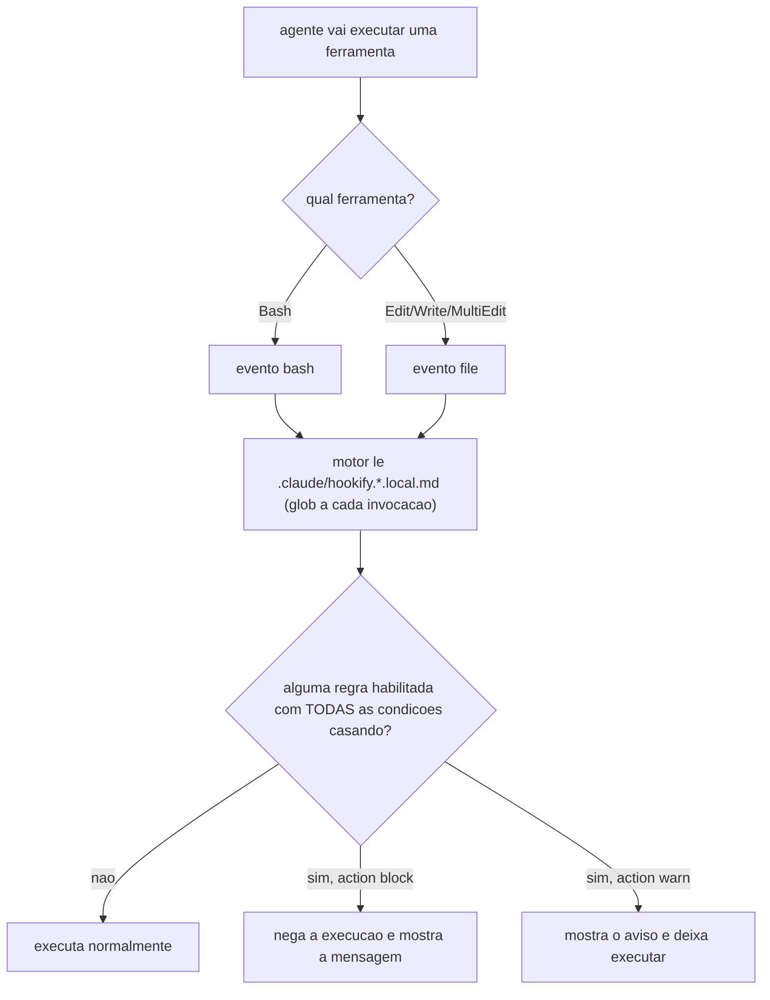

# 07. Regras hookify — guardas declarativas em markdown

Criar um hook exige escrever um script e registrá-lo. O plugin **hookify** (plugin oficial do Claude Code, marketplace `claude-plugins-official`) elimina essa exigência para a classe mais comum de guarda: você escreve um arquivo markdown — `.claude/hookify.<nome>.local.md` — com um cabeçalho YAML dizendo "quando o comando/edição casar este padrão, bloqueie/avise com esta mensagem", e o motor do plugin transforma isso em guarda ativa. É **declarativa**: descreve O QUE vigiar, não COMO. A analogia: em vez de treinar um segurança novo para cada risco, você escreve um cartaz de "procurado" e cola na guarita — o mesmo segurança lê todos os cartazes a cada revista.

No harness, o hookify tem um segundo papel estrutural: é o **destino de promoção** do ciclo de auto-melhoria (capítulo 12) — lição que se repete vira regra declarativa, sem escrever código.

> **Dependência externa, agora DECLARADA:** o motor é o plugin hookify instalado no runtime (Claude Code); o framework instala as REGRAS, não o motor. Instalar o plugin exigiria escrever em `~/.claude/plugins/`, fora da raiz do alvo — o instalador nunca faz isso (é a mesma invariante de confinamento POSIX do capítulo 14). O que ele faz, com `use_hookify=true` (default), é **declarar a dependência** no `.claude/settings.json` do projeto, pelo mecanismo oficial de *team marketplaces*:
>
> ```json
> {
>   "extraKnownMarketplaces": {
>     "claude-plugins-official": { "source": { "source": "github", "repo": "anthropics/claude-plugins-official" } }
>   },
>   "enabledPlugins": { "hookify@claude-plugins-official": true }
> }
> ```
>
> Ao confiar na pasta do repositório, o Claude Code pede consentimento para instalar o plugin; enquanto isso não acontece ele reporta o plugin como não instalado e mostra o comando `claude plugin install`. **Declarar é do projeto, instalar é do usuário.** Sem a declaração — o comportamento até a v1.6.3 — as regras ficavam no disco como markdown inerte, sem nenhum sinal de que a guarda não existia. Com `use_hookify=false` nenhuma regra é gerada, justamente para não deixar artefato inerte. Ver capítulo 15 para o estado no Codex.

## O formato de uma regra

```markdown
---
name: minha-regra
enabled: true
event: bash            # bash | file | stop | prompt | all
action: warn           # warn (avisa e deixa passar) | block (nega a execução)
conditions:            # TODAS precisam casar (E lógico); regex case-insensitive
  - field: command
    operator: regex_match
    pattern: docker\s+system\s+prune
  - field: command
    operator: not_contains
    pattern: --dry-run
---

O corpo markdown é a mensagem exibida quando a regra dispara —
explique o PORQUÊ e dê o caminho certo, não só o "não".
```

Regras antigas com um único `pattern:` (sem `conditions:`) viram automaticamente uma condição sobre `command` (evento bash) ou sobre o texto escrito (evento file). `action: block` devolve `permissionDecision: deny` — a ferramenta não roda; `action: warn` deixa rodar mas injeta a mensagem no contexto. Block sempre vence warn quando ambos casam.

Critério para escolher entre as duas ações: `block` é para dano garantido e de alto raio de explosão, sem caso de uso legítimo plausível — remover o serviço de produção, apagar as imagens que servem de rollback. Ali um falso positivo custa uma tentativa recusada e uma reformulação do comando; o preço é baixo comparado ao dano evitado. `warn` é para um padrão geralmente arriscado mas com exceção legítima real — e a mensagem então carrega uma válvula de escape explícita: algo como "se este uso NÃO é o caso perigoso descrito acima, siga em frente, mas declare isso no veredito". Bloquear esse caso sem a válvula geraria falso positivo caro toda vez que o uso legítimo aparecesse; avisar com a válvula preserva o alarme sem travar o trabalho válido.

## As 12 regras que o framework instala

Cinco regras de higiene de sessão/design são geradas sempre que `use_hookify=true` (default); as demais dependem da configuração do projeto (coluna "condição de geração"). Todas vivem em `.claude/hookify.*.local.md` no projeto instalado (fonte: [templates](<../../templates/.claude/hookify.bare-python.local.md.jinja>) — um `.jinja` por regra, no mesmo diretório).

| Regra | Evento | Ação | O que vigia | Condição de geração |
|---|---|---|---|---|
| `bare-python` | bash | **block** | `python` "pelado" como comando (máquinas onde só existe `python3` — falha 127 recorrente) | com `use_hookify` (default true) |
| `relative-cd` | bash | warn | `cd` para path relativo (o cwd reseta entre chamadas Bash do agente — o `cd` não vale na chamada seguinte) | com `use_hookify` (default true) |
| `mass-sed` | bash | warn | `sed -i` sobre código em lote (regex mal ancorada corrompe substrings sem diff visível); injeta o protocolo contar-antes/1-arquivo/contar-depois | com `use_hookify` (default true) |
| `web-dev-port` | bash | warn | `npm run dev`/`next dev` sem a porta canônica — cita `HARNESS_DEV_WEB_PORT` e as `HARNESS_RESERVED_PORTS` (portas de outra ferramenta local que o dev não pode ocupar) | com `use_hookify` (default true) |
| `icones-lucide` | file | warn | import de biblioteca de ícones fora do cânon do projeto em arquivos de UI | só com `use_icon_guard` (default false; ative após confirmar frontend e biblioteca canônica) |
| `no-scaley-dropdown` | file | warn | `scale-y-`/`scaleY(` em UI — anti-pattern de animação de overlay (distorce o texto); aponta o padrão canônico do projeto | com `use_hookify` (default true) |
| `db-port-<n>` | bash | warn | comando de banco apontando a porta INTERNA do container no host — cita o mapeamento `HARNESS_DEV_DB_PORT`→`HARNESS_DEV_DB_INTERNAL_PORT` | só se as duas portas diferem |
| `<prefixo>-prod-destroy` | bash | **block** | `docker service rm`/`stack rm`/`scale ...=0` tocando os serviços protegidos | só com `has_prod_stack` |
| `<prefixo>-prod-image-source` | bash | **block** | `service update --image` em serviço de produção apontando imagem fora de `PROD_REGISTRY_URL` (3 condições em E) | idem |
| `<prefixo>-prod-prune` | bash | **block** | qualquer `docker prune` na máquina de produção (as imagens antigas são o único rollback) | idem |
| `<prefixo>-prod-push-latest` | bash | warn | `docker push ...:latest` do registry de prod — injeta o ritual de preservar a tag `:prev-<data>` ANTES de sobrescrever | idem |
| `<prefixo>-prod-update-monitor` | bash | warn | `service update` em prod sem `--update-monitor` (janela de monitor menor que o start-period do healthcheck gera falso revert em loop) | idem |

Os cinco guardas de produção usam `PROD_STACK_PREFIX` no próprio NOME do arquivo e nos padrões (ex.: projeto com `prod_stack_prefix=acme-shop` gera `hookify.acme-shop-prod-prune.local.md` vigiando os serviços `acme-shop_*`), e as mensagens citam `PROD_REGISTRY_URL`/`PROD_HOST_NAME`. Sem stack de produção declarada, nenhum deles existe — o harness não assusta um projeto de biblioteca com guardas de Swarm.

Duas dessas regras merecem a analogia que justifica a severidade **block** sem exceção. `<prefixo>-prod-prune`: um `docker prune` na máquina de produção é destruir o extintor de incêndio — as imagens antigas no daemon e no registry são o único caminho de volta (rollback) se um deploy novo quebrar, então não existe warn aceitável, só block. `<prefixo>-prod-destroy`: a regra vigia duas formas de apagar a luz, não uma — remover o serviço é óbvio, mas escalar as réplicas a zero (`scale ...=0`) produz o mesmo apagão sem soar como remoção. O princípio geral por trás disso: uma boa regra vigia **efeitos equivalentes, não só o comando literal** — um agente que evita a palavra proibida mas produz o mesmo dano por um caminho lateral passa ileso por uma regra ingênua que só olha o verbo óbvio.



## O motor por dentro (o que importa para confiar nele)

- **4 hook points, 1 comando cada:** o plugin registra `PreToolUse`, `PostToolUse`, `Stop` e `UserPromptSubmit`, sem matcher — a filtragem por evento/ferramenta acontece dentro do motor Python, que já precisa ler o `tool_name` do JSON de qualquer forma. Os 4 scripts de evento são quase idênticos; a diferença é qual `event` passam ao carregador de regras (`Bash`→`bash`; `Edit|Write|MultiEdit`→`file`; `stop`/`prompt` hardcoded).
- **Parser de frontmatter próprio** (sem dependência de YAML lib), com fallback granular: regra malformada é PULADA com log — nunca derruba o carregamento das outras.
- **Fail-open absoluto:** qualquer exceção interna termina com exit 0 — um bug no vigia nunca paralisa o trabalho.
- **Campo por ferramenta é hardcoded:** o mapeamento de `field` (`command`, `new_text`, `file_path`, `content`, `transcript`, `user_prompt`) para o JSON real de cada tool é um `elif` por ferramenta conhecida — limite real de portabilidade para runtimes com schema de tool diferente (capítulo 15).
- **Sem cache:** o glob roda a cada invocação — regra nova/editada vale imediatamente, sem restart.

## Autoria: de lição repetida a regra, sem escrever código

Dois caminhos para criar uma regra:

1. **Manual** — copie o formato acima para `.claude/hookify.<nome>.local.md`. Checklist de autoria em 4 passos:
   - Passo 1 — cubra quebra de linha: `[\s\S]*` no lugar de `.*` quando o comando pode vir com continuação (`\` no fim da linha).
   - Passo 2 — condições em E para eliminar falso-positivo (ex.: porta + termo de banco, não só a porta isolada).
   - Passo 3 — mensagem que explica o porquê e dá o caminho certo, não só o "não".
   - Passo 4 — ancore o padrão no token inteiro, não na substring: sem fronteira, o regex casa por acidente dentro de um comando maior. Um guard pensado para vigiar `python` acende também em `python3` se faltar a negativa de dígito depois da palavra; um `sed -i` sem âncora, ao apagar `hover:foo`, também some com o pedaço certo dentro de `group-hover:foo` — mesma classe de erro que motivou o protocolo "contar antes / contar depois" da regra `mass-sed` (cenário simulado). Pergunta de bolso: este padrão pode casar dentro de um token maior que não deveria ser afetado?
2. **Conversacional** — o comando `/hookify:hookify` do plugin: um subagent lê as últimas mensagens da conversa procurando correções repetidas do usuário ("não faça X", reversões, frustração), propõe as regras candidatas, o usuário confirma block/warn por item (decisão humana no loop), e o arquivo é escrito no `.claude/` do projeto — ativo na próxima invocação. LLM só participa da AUTORIA da config; a avaliação em runtime é sempre o motor determinístico.

## Como configurar

`has_prod_stack` + `prod_stack_prefix`/`prod_protected_services`/`prod_registry_url`/`prod_host_name` (guardas de produção), `harness_dev_web_port`/`harness_reserved_ports` (porta do dev web), `harness_dev_db_port`/`harness_dev_db_internal_port` (regra de porta de banco — só gerada se diferem), `use_icon_guard` (regra de ícones — só faz sentido com frontend de componentes). As regras de design (`icones-lucide`, `no-scaley-dropdown`) instalam com o padrão do template; edite o `.local.md` gerado para apontar o cânon real do seu projeto (são arquivos seus depois de instalados — o Copier preserva a edição no update).

## O que fica de lição

Prosa não segura comportamento sob pressão; guarda mecânica segura. O custo é praticamente zero (as regras só acordam quando o padrão perigoso aparece; o motor é fail-open), e a mensagem de cada regra carrega o PORQUÊ — o agente que esbarra no cartaz aprende a regra no ponto exato da decisão errada.
