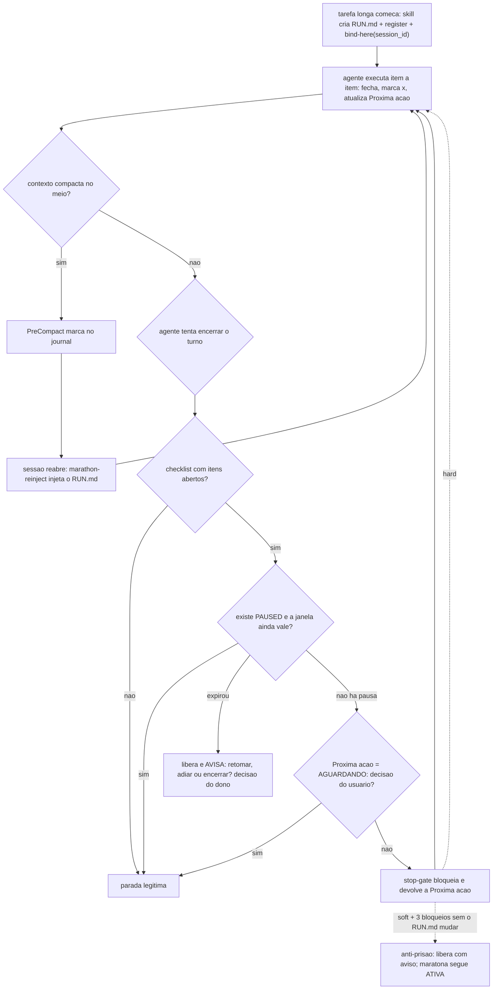
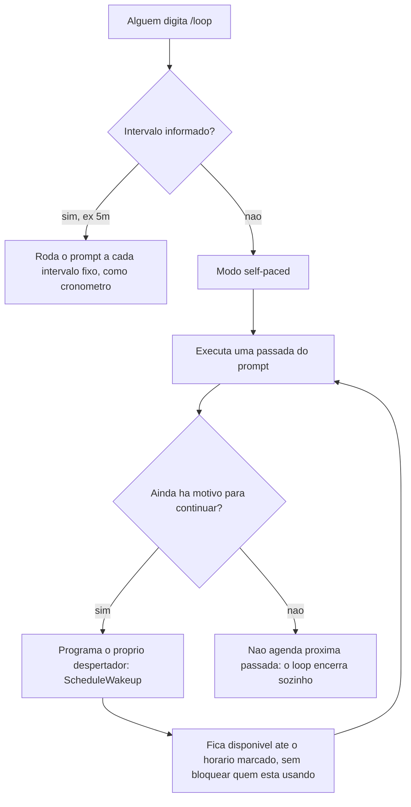

# 08. Execuções longas — marathon, estado durável e o loop de manutenção

Uma execução longa (plano multi-fase, migração em ondas, "termine tudo") tem dois inimigos: a **compactação de contexto** (o runtime resume a conversa e o agente esquece onde estava) e a **parada prematura** (o agente declara o turno encerrado com metade do checklist aberto). O subsistema **marathon** resolve os dois com um princípio: o estado da execução vive em ARQUIVO durável, não no contexto da conversa.

## A anatomia: registry + binding de sessão + RUN.md

Tudo vive sob `HARNESS_RUNS_DIR` (default `.harness/runs`):

- **`$HOME/.harness/marathon-active`** — inventário de runs vivas; pode conter várias linhas e vários repositórios.
- **`$HOME/.harness/marathon-session-bindings/<runtime>/<session_id>`** — vínculo positivo e exclusivo entre uma conversa e um `run_id`. É a autoridade usada pelos hooks.
- **`$HOME/.harness/marathon-runs/<run_id>`** — índice `UUIDv4 → caminho canônico`; mover a run não muda sua identidade.
- **`ACTIVE`** — ponteiro local legado de uma linha, mantido para compatibilidade de inventário; não seleciona a run de uma conversa.
- **`<slug>/RUN.md`** — o estado durável: `run_id` UUIDv4 imutável, objetivo, checklist (`- [ ]` / `- [x]`), a seção **"Próxima ação"** (a instrução exata do que fazer a seguir — é o que o agente executa ao retomar, sem re-planejar) e um journal de eventos.
- **`stop_policy`** — `soft` mantém o escape anti-prisão; `hard` é obrigatório quando o dono declara uma condição terminal como “termine tudo” ou “não pare”.

O contrato de escrita é da skill `marathon` ([template](<../../templates/.claude/skills/marathon/SKILL.md.jinja>)): invocada quando a tarefa é estimada longa (mais de ~1h ou 3+ fases) ou quando existe vínculo para a sessão ao abrir a conversa. O bootstrap cria o RUN.md, registra a run e executa `bind-here <run-dir>`. O ciclo por item: fechar o item → marcar `[x]` → atualizar "Próxima ação" → seguir.

O isolamento é 1:1: uma sessão tem no máximo uma run, e uma run tem no máximo uma sessão. O identificador da conversa é `runtime:session_id`, evitando colisão entre Codex, Claude e Antigravity; o binding armazena o `run_id`, não o path. Duas maratonas simultâneas usam dois arquivos de binding diferentes. Sessão sem binding não recebe reinject, não escreve journal e não é bloqueada, mesmo que o registry contenha outras runs. Os hooks não fazem fallback por repositório, ordem ou mtime; essa proibição elimina a mistura silenciosa entre chats. Runs e bindings legados baseados em path são migrados na primeira resolução.

## Os três hooks que o sustentam

O subsistema é sustentado por três hooks já registrados (capítulos 02 e 06), que fecham o ciclo de vida:

| Momento | Hook | Papel |
|---|---|---|
| Contexto vai compactar | [marathon-precompact.sh](../../templates/.harness/hooks/marathon-precompact.sh) (`PreCompact`) | Registra a compactação no journal do RUN.md — o estado já está em disco, o hook só marca o evento |
| Sessão abre (qualquer origem: `startup`, `compact`, `resume`) | [marathon-reinject.sh](../../templates/.harness/hooks/marathon-reinject.sh) (`SessionStart`) | Reinjeta as primeiras 150 linhas do RUN.md no contexto: "execute a Próxima ação, não re-planeje" — ou, se a run está pausada, só o aviso de pausa |
| Agente tenta parar | [marathon-stop-gate.sh](../../templates/.harness/hooks/marathon-stop-gate.sh) (`Stop`) | Bloqueia a parada com itens abertos, devolvendo a "Próxima ação"; política `soft` ou `hard`; inerte se a run está pausada |

O reinject era registrado só com matcher `compact|resume`. Uma sessão NOVA
(`source=startup`) portanto abria sem saber que existia maratona — o estado
durável só voltava depois de uma compactação, então fechar o terminal e reabrir
perdia a run até algo compactar. Como o hook é inerte quando não há maratona
localizada, registrá-lo em toda `SessionStart` não custa nada no caso comum e é
o que dá à pergunta de pausa-expirada (abaixo) um lugar confiável para acontecer.



As paradas legítimas são explícitas: checklist zerado, "Próxima ação" começando com `AGUARDANDO: <pergunta>` (bloqueado em decisão humana), ou a run pausada (abaixo). Em `stop_policy: soft`, o anti-prisão usa um **checksum do conteúdo** do RUN.md como detector de progresso e libera após `HARNESS_MARATHON_MAX_BLOCKS_WITHOUT_PROGRESS` tentativas sem mudança. Em `stop_policy: hard`, esse escape fica desabilitado: enquanto houver trabalho executável, o Stop continua bloqueado; `pause`, `AGUARDANDO:` ou encerramento explícito continuam sendo as saídas controladas.

Antes de iniciar ou retomar, `bash .harness/hooks/marathon-locate.sh preflight` deve passar. O comando valida a presença e a sintaxe de `stop-gate`, `reinject` e `precompact`; os consumidores também falham fechados se a biblioteca compartilhada desaparecer.

## Pausar sem perder o estado (e sem voltar a executar sozinho)

Uma maratona que depende de algo externo — decisão de terceiro, janela de deploy, viagem — tinha só dois caminhos, os dois ruins: **encerrar** (`rm ACTIVE` + `unregister`), que joga o estado durável fora, ou **deixar armada**, e aí o stop-gate empurra o agente de volta para ela em todo turno. A pausa é o terceiro caminho: um arquivo `PAUSED` ao lado do RUN.md.

```bash
bash .harness/hooks/marathon-locate.sh pause                       # default: 24 horas
bash .harness/hooks/marathon-locate.sh pause 2026-08-20 "cliente"   # data explícita
bash .harness/hooks/marathon-locate.sh pause +3d "build de sexta"   # relativa
bash .harness/hooks/marathon-locate.sh pause manual "sem prazo"     # aberta, só com pedido explícito
bash .harness/hooks/marathon-locate.sh status                       # slug, itens abertos, estado
bash .harness/hooks/marathon-locate.sh resume                       # levanta a pausa, executa NADA
```

O default de **24 horas** é deliberado: `pause` seco é o comando de quem está saindo, não uma declaração de que a run morreu — então a janela fecha sozinha no dia seguinte e volta como PERGUNTA. A forma relativa é gravada **já resolvida** em instante absoluto; guardar `+3d` literal seria reavaliado a cada checagem e nunca expiraria. O arquivo é texto (`until:` / `reason:` / `paused_at:`) e pode ser editado à mão para empurrar a data.

Enquanto a pausa vale, dois comportamentos mudam:

1. **O stop-gate fica inerte** — a parada não é bloqueada, e a sessão fica livre para outro assunto.
2. **O reinject não injeta o checklist**, só um aviso curto de que a run existe e está dormindo. Esse é o ponto central: injetar o checklist é justamente o que faz um modelo retomar o trabalho por conta própria. Silêncio total seria pior — o agente acharia `ACTIVE`/`PAUSED` no disco sem moldura nenhuma e poderia decidir sozinho que retomar é o comportamento prestativo.

**Expirar não é retomar.** Quando a janela fecha, o estado vira `pause-expired`: o stop-gate continua sem bloquear e avisa o dono de que a janela acabou; o reinject injeta o estado com a instrução explícita de PERGUNTAR antes de qualquer trabalho — retomar, adiar para uma data nova, ou encerrar. Re-armar o gate na expiração colocaria o agente de volta a executar sozinho, que é exatamente o comportamento que este mecanismo existe para impedir. Data ilegível ou ausente também mantém pausado: o fail-safe aponta para perguntar, nunca para executar.

## Ignorar temporariamente a run vinculada à sessão atual

O binding positivo já impede que uma run de outra conversa apareça aqui. A
blocklist existe somente para silenciar temporariamente a própria run vinculada
sem pausar seu estado global:

```bash
bash .harness/hooks/marathon-locate.sh ignore-here
bash .harness/hooks/marathon-locate.sh session-status
bash .harness/hooks/marathon-locate.sh allow-here
```

`ignore-here` grava o par exato `runtime:session_id + caminho canônico da run` em
`$HOME/.harness/marathon-session-blocklist/<runtime>/`. Os três consumidores consultam a
mesma exceção: `SessionStart` não reinjeta, `PreCompact` não escreve no journal
e `Stop` não bloqueia. Não há inferência por assunto nem pausa implícita;
`allow-here` remove somente a exceção corrente.

Prova executável: [engine/hooks/tests/test_marathon_pause.sh](../../engine/hooks/tests/test_marathon_pause.sh) (13 cenários dirigindo os hooks reais como subprocessos).

## Como configurar

- `HARNESS_RUNS_DIR` — onde o estado durável vive (default `.harness/runs`), lido pelos três hooks. O mesmo diretório abriga os slots do semáforo de subagents (capítulo 04) e o ledger do council (capítulo 11, `HARNESS_LEDGER_DIR` deriva dele).
- `HARNESS_MARATHON_MAX_BLOCKS_WITHOUT_PROGRESS` — o limite do anti-prisão (default 3), lido pelo stop-gate em runtime.

## O loop de manutenção

As instruções de projeto geradas ([templates/AGENTS.md.jinja](../../templates/AGENTS.md.jinja)) referenciam um segundo padrão de execução recorrente: o **loop de manutenção** — uma passada periódica que roda os lints da wiki (capítulo 10), verifica lições pendentes de promoção (capítulo 12), aponta árvore git suja e (se instalados) os módulos condicionais de className/design-system. A convenção: um arquivo `.claude/loop.md` descreve os checks da passada, e o runtime que suportar comando de loop recorrente (`/loop` no Claude Code) o executa em intervalo.

**Materializado desde R5** (plano de resgate §2): [templates/.claude/loop.md.jinja](<../../templates/.claude/loop.md.jinja>) — instalado sempre que `use_claude=true` (não tem flag própria; Codex não tem comando de loop nativo, capítulo 15 item 1). Os checks apontam só para motores que este projeto de fato instalou: `docs_wiki_lint.py`/`ref_integrity.py` de `.harness/lib/` sempre; o check de mining de className é condicional a `use_ui_skills`; o check de ratchet de design-system é condicional a `use_ds_gate`; o check de **frescor do grafo** (conta os arquivos mudados sob o `PROJECT_ROOT` do Understand Anything desde o último build via `meta.json` + diff relativo, e dispara `/understand` incremental quando passam de `HARNESS_GRAPH_REFRESH_THRESHOLD`, default 15) é condicional a `harness_understand_apps_root`. O threshold existe porque `/understand` é LLM-heavy (subagents, cota da assinatura) — o loop paga o grafo só quando o diff acumulado justifica, não a cada passada. Se o seu runtime não tem loop nativo (ou `use_claude=false`), o equivalente é um cron chamando o agente em modo não-interativo com o mesmo checklist — os componentes que a passada roda (lints, lessons, gates) são todos instalados e funcionam standalone independente do arquivo de orquestração existir.

**A tolerância a imperfeição é deliberada.** O check de wiki (`docs_wiki_lint.py`, capítulo 10) devolve dois níveis de severidade e a passada trata cada um diferente: **FAIL** — por exemplo, um arquivo sob `docs/` sem menção em índice algum — é o que a passada corrige de fato, editando o índice da categoria e re-rodando o lint até ficar verde; **WARN** — naming fora do padrão kebab-case, ou um índice vivo linkando a uma pasta de arquivo morto como wayfinding intencional — não bloqueia a passada, fica registrado como backlog que o próprio loop vai "queimando" aos poucos em passadas futuras. A razão é econômica: forçar a migração completa de naming numa única passada não é "barato o suficiente" para caber na regra de abertura da seção ("consertando o que for barato e reportando o que não for") — então o lint deixa a porta aberta para ignorar o cosmético sem deixar de bloquear o que de fato quebra a navegabilidade da wiki. Detalhe completo dos dois níveis no capítulo 10.

### O comando /loop e o modo self-paced (ScheduleWakeup)

**O que é** — `/loop` é o motor genérico de repetição do runtime: um slash command (atalho iniciado por barra que injeta uma instrução pronta na conversa) que faz o agente executar um prompt — ou outro slash command — repetidamente, sem que alguém precise pedir de novo a cada passada. Ele aceita dois modos:

- **Intervalo fixo** (`/loop 5m /algum-comando`) — funciona como um cronômetro de cozinha: a cada 5 minutos dispara, e o agente roda o comando de novo, sem julgamento sobre se ainda faz sentido continuar.
- **Self-paced** (`/loop` sozinho, ou `/loop <prompt>` sem intervalo) — quem decide **quando** volta a rodar é o próprio agente, programando um **ScheduleWakeup** ("agendar despertar"). A analogia útil: é um despertador que o próprio agente configura antes de "dormir" entre passadas. Se avaliou que nada urgente está acontecendo, marca o despertador para mais tarde; se a situação pede atenção, marca para mais cedo; se concluiu que não há mais razão para voltar, simplesmente **não programa o despertador** — e o loop morre de morte natural.

Esse último ramo é o que separa um loop bem projetado de um processo zumbi: a condição de parada precisa ser explícita, escrita no próprio prompt que o loop executa. **Loop sem condição de parada não é automação — é vazamento**: cada passada sem critério de término consome ciclo de agente, tokens e, se a passada tocar rede ou disco, recursos externos, indefinidamente, sem que ninguém tenha decidido que aquilo deveria continuar. O `loop.md` de manutenção e qualquer loop de propósito específico que um projeto construa sobre o mesmo motor (por exemplo, uma skill que acompanha um processo externo de longa duração — um deploy em andamento, uma importação de dados — até ele terminar) só são seguros porque escrevem a condição de parada em texto, nunca a deixam implícita.



Convenção deste framework: `/loop` **sem argumentos** roda a passada de manutenção descrita em `.claude/loop.md`. Um projeto também pode escrever um prompt próprio e invocar o mesmo motor em modo self-paced dentro de uma skill de propósito específico, calibrando o próprio `ScheduleWakeup` conforme o sinal que recebe a cada ciclo — por exemplo, se a fonte externa que o ciclo consulta responder com erro de rate limit, aumentar o intervalo no próximo agendamento em vez de insistir no mesmo cadence.

### As 3 regras de um loop autônomo seguro

Qualquer passada de loop autônomo — a de manutenção deste framework ou uma escrita por cima do mesmo motor — segue 3 regras fixas, já embutidas no template real ([loop.md.jinja](<../../templates/.claude/loop.md.jinja>), seção "Regras do loop"):

1. **Ação irreversível fica FORA do loop.** Push, delete de arquivo tracked, deploy, qualquer mutação em produção: a passada só REPORTA, nunca executa. Um loop que corre sozinho, sem supervisão humana em tempo real a cada ciclo, não pode ter no escopo nenhuma ação que não dê para desfazer se o julgamento daquela passada estiver errado.
2. **Cada passada termina com um resumo curto e limitado** (3-6 linhas no template): o que passou, o que foi consertado, o que precisa de decisão humana. Um loop que roda sem ninguém acompanhando cada ciclo não pode produzir um relatório do tamanho da tarefa inteira a cada volta — o resumo precisa caber no que alguém lê de relance ao voltar a prestar atenção.
3. **Auto-término após passadas vazias.** Nada a fazer em 2 passadas seguidas → encerrar o loop (em modo self-paced: não agendar a próxima). É a mesma lógica do "não programar o despertador" da subseção anterior, só que como regra explícita de desligamento: uma ronda de manutenção que passa duas vezes seguidas sem achar nada para consertar não tem motivo para continuar rondando período após período — ela para e só volta a ser chamada sob demanda.

**Exemplo (cenário simulado)** — num projeto `demo-app`, alguém dispara `/loop` sem argumentos numa manhã tranquila. Passada 1: todos os checks de `.claude/loop.md` passam verdes; o agente reporta o resumo e agenda um `ScheduleWakeup`. Passada 2: tudo verde de novo. Pela regra 3, o agente **não** agenda a terceira passada e encerra o loop, declarando o motivo no próprio resumo. Nenhum processo fica rodando à toa.

## O que fica de lição

Contexto de conversa é memória volátil; arquivo é memória durável. Qualquer execução que não caiba com folga numa janela de contexto precisa externalizar o estado — e uma vez externalizado, os hooks garantem as três pontas: preservar (precompact), restaurar (reinject) e não abandonar (stop-gate).
