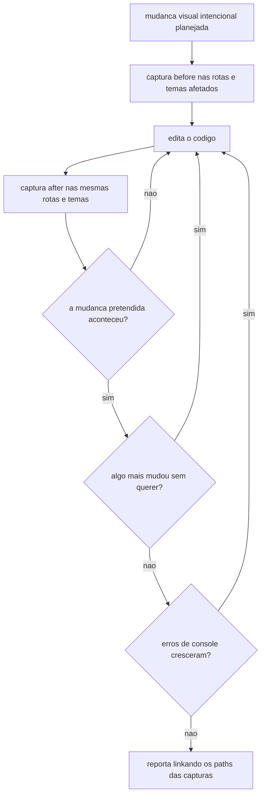
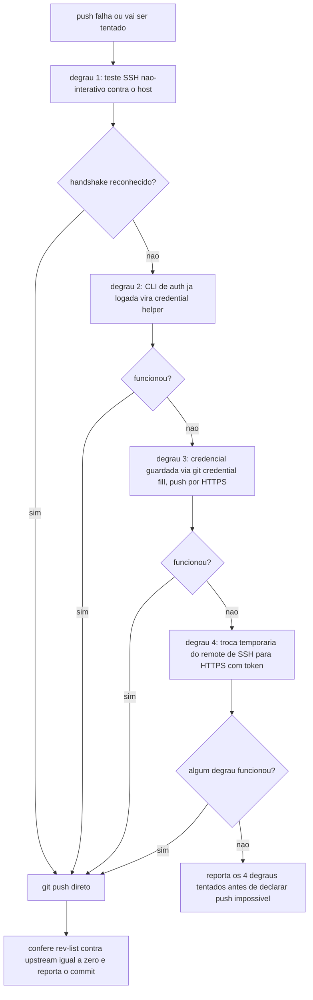
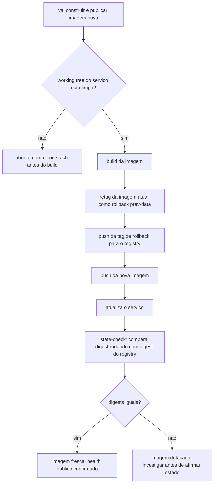
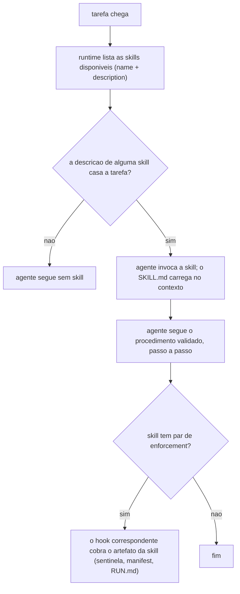

# 09. Skills operacionais — manuais de procedimento carregados sob demanda

Uma **skill** é um manual de instruções empacotado (`SKILL.md` com frontmatter `name`/`description`) que o agente carrega quando a tarefa casa a descrição — em vez de improvisar um procedimento, ele segue o validado. As skills complementam os hooks: o hook FORÇA um comportamento no evento; a skill ENSINA o procedimento completo quando o agente precisa dele. Vários pares andam juntos (gate + skill): `completion-gate` ↔ `prova-de-conclusao`; `ui-evidence-gate` ↔ `ui-evidence`; guardas de prod ↔ skill de deploy.

Onde vivem no projeto instalado: `.claude/skills/<nome>/SKILL.md` (Claude Code) e as dual-runtime em `HARNESS_SKILLS_DIR` (default `.agents/skills` — servem Claude e Codex; capítulo 11). Fonte no framework: os templates sob [skills-shared/](../../templates/.harness/skills-shared/harness-init/SKILL.md.jinja) (fonte única das dual-runtime) — `.jinja` quando parametrizadas por projeto.

## As skills do núcleo operacional

| Skill | Par de enforcement | O que procedimenta |
|---|---|---|
| `prova-de-conclusao` | Stop hook `completion-gate` | O bloco de evidência por item antes de qualquer claim de conclusão de plano: tabela com comando + exit code / grep com path e linha / contagem de testes por item declarado, terminando na sentinela `PROVA-DE-CONCLUSAO: <x>/<y> PASS, gaps: [...]`. Item sem evidência vira gap declarado — nunca certeza fabricada. |
| `ui-evidence` (condicional a `use_ui_evidence`) | Stop hook `ui-evidence-gate` | Evidência visual auditável: screenshot full-page + erros de console + `manifest.json` por rota e por tema (`HARNESS_UI_EVIDENCE_THEMES`), gravados em `HARNESS_EVIDENCE_DIR`. Protocolo before/after para mudança visual intencional — e OLHAR as imagens antes de reportar. |
| `marathon` | Stop hook `marathon-stop-gate` + par precompact/reinject | Execução longa com estado durável (capítulo 08). |
| `git-delivery` | hook `git-doctor` (informa) | Entrega git: sequência de commit, a escada de descoberta de credencial de push (tentar o remote configurado → diagnósticos → alternativas ANTES de declarar push impossível) e verificação pós-push. |
| `deploy-<prefixo>` | guardas hookify `<prefixo>-prod-*` | Gerada só com `has_prod_stack`: o procedimento canônico de deploy/rollback/diagnóstico da stack de produção, incluindo o **state-check obrigatório** — proibido afirmar estado de deploy ("está no ar", "imagem fresca") sem rodar a verificação contra o alvo real. |
| `run-<projeto>` | regra hookify `web-dev-port` | Subir o ambiente de desenvolvimento local: sequência de comandos, portas canônicas (`HARNESS_DEV_API_PORT`, `HARNESS_DEV_WEB_PORT`, `HARNESS_DEV_DB_PORT`), gotchas. Instalada como ESQUELETO a preencher com a stack real do projeto — os comandos de processo são exemplo, não universais. |
| `deliverable-contract` | PostToolUse `deliverable-scrub-gate` | Para tarefas que produzem ENTREGÁVEL (proposta, relatório, manual): grava um contrato persistente com as prioridades e constraints negativas declaradas ("NUNCA X", valores travados), que o scrub-gate então vigia. |
| `ref-integrity` | pre-commit/CI (capítulo 10) | Detectar referências quebradas após rename/delete em massa. |
| `repo-wiki-curator` | lint `docs_wiki_lint` (capítulo 10) | Curadoria da documentação no padrão Karpathy: indexar, renomear, arquivar. |
| `grill-me` | council (capítulo 11) | A entrevista relentless que sabatina um plano até o entendimento comum, resolvendo cada ramo da árvore de decisão. Para cada pergunta, o formato D[n]: comportamento concreto, ao menos 2 exemplos aplicados bons + 2 ruins reais, "quando escolher" e Opção C quando A/B não bastam — proibido "quer A ou B?" seco. O council só a invoca pelo Gate Condicional de Grill (capítulo 11). |
| `adversarial-review` | council (capítulo 11) | O contrato do prompt do revisor adversarial. |
| `harness-init` | — | O configurador do próprio framework (capítulo 14). |

Além do núcleo, o framework porta um pacote de skills de auditoria/segurança de uso geral (análise estática, verificação de falso-positivo, auditoria de supply chain e de workflows de CI, curadoria de contexto longo, framework de documentação) — genéricas por natureza, instaladas como estão. A maior parte desse pacote (10 skills, 79 arquivos) vem, byte-a-byte, do [trailofbits/skills](https://github.com/trailofbits/skills) (CC BY-SA 4.0) — ver [`PROVENANCE.json`](../../PROVENANCE.json) e [`NOTICE`](../../NOTICE) na raiz do repo para a lista exata, componente por componente, e o item 13 do capítulo 15 para o histórico da correção.

## O mecanismo por trás de cada linha

A tabela acima é o índice; esta seção abre, linha a linha, o procedimento concreto que cada skill carrega — o "como", não um resumo novo da mesma coisa. Nada aqui é teoria: cada mecanismo nasceu de um erro real que se repetiu até virar regra escrita num `SKILL.md`.

### `prova-de-conclusao` — a regra de evidência-desta-sessão

O contrato da skill tem uma cláusula que corta pela raiz o erro mais comum de um agente otimista: **evidência tem que vir de um comando rodado NESTA sessão, agora, com a saída bruta visível** — nunca de memória de uma sessão anterior, nem de "já rodei isso mais cedo". Se a última execução de um teste ou de um `grep` aconteceu num turno passado (ou numa sessão que já foi compactada), ela conta como zero: tem que reexecutar antes de citar.

A razão é estrutural, não desconfiança gratuita: entre a execução original e o momento do claim de conclusão o código pode ter mudado — o próprio agente editou algo depois —, e a "lembrança" de um resultado passado é um resumo, sujeito a otimismo, a arredondamento silencioso ("rodei os testes, passou" quando passou só parcialmente) e à própria compactação de contexto, que descarta detalhe por definição. Comando rodado agora não tem esse problema: a saída está ali, crua, para qualquer um conferir.

(Cenário simulado) Num projeto `acme`, o agente roda a suíte de testes no início de uma sessão longa e anota "42 passed". Passa três horas editando código e, no fim, quer fechar o plano citando "testes passando" de memória. A regra obriga reexecutar a suíte ali, na hora do claim — se algo quebrou no meio do caminho, só a reexecução pega; a lembrança do início da sessão não vale como prova.

### `ui-evidence` — o protocolo before/after e o escape-hatch com prazo

Para qualquer mudança visual intencional, o procedimento é sequencial e termina em três perguntas — não em capturar e reportar direto:

1. Capturar **before** — screenshot de página inteira nas rotas afetadas, em todos os temas configurados (`HARNESS_UI_EVIDENCE_THEMES`), ANTES de tocar no código.
2. Editar.
3. Capturar **after** — mesmas rotas, mesmos temas.
4. **Olhar** as duas capturas lado a lado (nunca assumir que "deve ter funcionado") e responder três perguntas, nesta ordem: a mudança pretendida realmente aconteceu? Alguma coisa MAIS mudou, sem querer? Os erros de console (registrados no `.meta.json` de cada captura) cresceram? Só depois de responder as três — e só se as respostas forem "sim, não, não" — o trabalho é reportado, citando os paths das imagens no veredito.

O escape-hatch é o arquivo `SKIP` dentro de `HARNESS_EVIDENCE_DIR` (é o que o Stop hook `ui-evidence-gate` aceita — capítulo 06): tem validade limitada (`HARNESS_UI_EVIDENCE_SKIP_TTL_SECONDS`, quatro horas por default) e a skill exige que o motivo seja declarado no texto do veredito, não só o arquivo tocado em silêncio. Criar o `SKIP` para pular a captura de uma mudança que É visual é nomeado no contrato da skill como violação — o prazo curto existe justamente para que a válvula de escape não vire um jeito permanente de nunca provar nada.

### `git-delivery` — a escada de credencial em 4 degraus

Quando um push falha por credencial (o sintoma clássico é o SSH recusando a chave), o manual não deixa o agente escolher entre "peço ajuda" ou "desisto": ele desce uma escada fixa, um degrau de cada vez, e para no primeiro que funcionar.

1. **Teste SSH não-interativo** contra o host remoto — uma chamada com timeout curto e sem prompt (o padrão é algo como `ssh -T -o BatchMode=yes git@<host>`). Se o host responde com um handshake reconhecido, o problema não era a chave: `git push` direto.
2. **CLI de autenticação já logada** (a ferramenta oficial do provedor Git instalada na máquina) vira credential helper. Se não estiver instalada ou logada, um script de provisionamento cuida disso antes de tentar de novo.
3. **Credencial já guardada localmente**: pedir ao gerenciador de credenciais do Git (`git credential fill`) e publicar por HTTPS em vez de SSH.
4. **Troca temporária de protocolo**: se existe um token de acesso mas o SSH continua falhando, trocar a URL do remote de SSH para HTTPS usando o token, publicar, e reverter a URL depois.

A regra final é o que faz a escada valer a pena: **antes de dizer "não consigo publicar", os 4 degraus têm que ter sido tentados e reportados** — não só o primeiro que veio à cabeça.

### `deploy-<prefixo>` — árvore limpa, retag de rollback e a técnica forense de mtime

**Glossário mínimo** (três termos que o resto da seção assume):

- **working tree** — os arquivos como estão NO DISCO agora, incluindo o que ainda não foi commitado. "Limpa" (`git status --porcelain` vazio) significa idêntica ao último commit; "suja" significa que existe conteúdo que só existe ali, não no histórico do git.
- **registry** — a prateleira remota onde as imagens de container construídas ficam guardadas e endereçáveis por nome:tag (ex.: `PROD_REGISTRY_URL/<serviço>:latest`).
- **digest** — a impressão digital criptográfica do CONTEÚDO de uma imagem (um hash). Duas imagens com o mesmo digest são byte-a-byte idênticas, não importa a tag; comparar o digest do que está RODANDO com o digest que a tag aponta no registry é a única forma confiável de saber se o que está no ar é mesmo a última versão publicada — igual = "fresca", diferente = "defasada".

Dois hábitos do procedimento de deploy nascem direto de incidentes reais (processos que já regrediram produção em projetos assim) e viraram passo obrigatório, sempre nesta ordem, antes de sobrescrever qualquer coisa:

- **Árvore de trabalho limpa é pré-condição do build.** Antes de construir a imagem, o procedimento confere `git status --porcelain` na pasta do serviço; havendo qualquer arquivo alterado e não commitado, o build ABORTA — commit ou stash primeiro. O motivo: uma imagem construída a partir de uma árvore suja carrega código cuja ÚNICA cópia é o disco local ("WIP assado dentro da imagem" — trabalho em andamento que nunca chegou ao histórico do git). Se alguém, depois, fizer um build limpo a partir do último commit real, a produção REGRIDE silenciosamente — perde exatamente o que só existia na árvore suja de quem fez aquele deploy.
- **Retag de rollback ANTES de sobrescrever a tag corrente.** Antes de publicar a imagem nova como `:latest` (ou equivalente), o procedimento primeiro re-etiqueta a imagem ATUALMENTE em produção com uma tag de rollback (ex.: `prev-<data>`) e a envia ao registry — só depois publica a nova. Essa tag preservada é o "botão de desfazer": se o deploy novo quebrar, o rollback é apontar o serviço de volta para `prev-<data>`, sem depender de reconstruir nada. Sem esse hábito, uma limpeza de imagens antigas destrói o único caminho de volta.

**Técnica forense: mtime contra horário de build.** Como provar, depois do fato, que uma imagem já em produção continha "WIP assado" — código cuja única cópia era a árvore suja, nunca commitado? Compare três carimbos de tempo: (1) a data de modificação (mtime) dos arquivos suspeitos no disco; (2) o horário do último commit real que tocou esses mesmos arquivos no histórico do git; (3) o horário de criação da imagem (`docker image inspect` → campo de criação, ou equivalente noutra engine). Se o mtime dos arquivos é POSTERIOR ao último commit — ou seja, foram editados depois de qualquer coisa que está no histórico — e o horário de build da imagem é POSTERIOR (ou igual) a esse mtime, a imagem foi construída a partir do estado não commitado, não do git HEAD. É a prova de que um build limpo futuro, a partir do commit real, produziria uma imagem DIFERENTE (e pior) do que a que está rodando agora — o sinal de que existe conteúdo não commitado escondido dentro da produção.

### `run-<projeto>` — o gotcha do watcher quebrado

Um servidor de desenvolvimento fica rodando por horas ou dias com recarga automática (o "watcher" observa arquivos e recompila a cada edição). Esse watcher pode entrar silenciosamente num estado quebrado — para de recompilar, mas o processo continua de pé, respondendo na porta normalmente. O sintoma é traiçoeiro porque não lança erro nenhum: testes e capturas de tela contra esse servidor continuam "passando", mas estão validando o código ANTIGO, de antes da última edição — uma regressão invisível de validação, não de produto.

A regra derivada: antes de confiar em qualquer validação (teste, screenshot, checagem manual) rodada contra um dev server que já está de pé há um tempo, confirmar no log do processo que a recompilação da última edição de fato aconteceu — ou, na dúvida, simplesmente reiniciar o servidor antes de validar. É um gotcha diferente do "cache de bundler corrompido" que já consta como gotcha na própria skill (esse costuma gritar um erro visível do tipo `Can't resolve`); este aqui é silencioso, e por isso mais perigoso — passa despercebido até alguém notar que uma mudança "óbvia" simplesmente não aparece na tela.

(Cenário simulado) No projeto `demo-app`, o dev server web sobe na porta 8000 e fica de pé por dois dias. Numa tarde, uma edição de CSS não aparece na tela mesmo depois de recarregar o navegador — o log do processo mostra que a última recompilação registrada é de bem antes da edição. Reiniciar o processo resolve; a captura de evidência seguinte já reflete o CSS novo.

## Anatomia e gatilho

A frontmatter `description` é o gatilho — ela declara QUANDO usar ("Use SEMPRE que...", com os termos que a tarefa mencionaria). Skill boa dispara sozinha pela descrição; skill que precisa ser lembrada está com a descrição errada.

## Como configurar

- `HARNESS_SKILLS_DIR` — onde as skills dual-runtime vivem (default `.agents/skills`).
- `HARNESS_REQUIRED_SKILLS` — CSV de skills que o validador de contrato ([engine/contract/scripts/validate_skills.py](../../engine/contract/scripts/validate_skills.py)) exige existir (cada uma como `<dir>/<nome>/SKILL.md` com frontmatter válida). Vazio por default — cada projeto declara as suas.
- Skills parametrizadas usam a config na geração: `prova-de-conclusao` cita `OWNER_NAME` nos gatilhos; `ui-evidence` cita os temas; `run-<projeto>` e `deploy-<prefixo>` ganham o nome do projeto/stack no próprio nome da skill.
- Depois de instaladas, as skills são ARQUIVOS SEUS: edite-as para refletir a stack real (especialmente `run-<projeto>`, que instala como esqueleto). `copier update` preserva as edições via merge de 3 vias.

## O que fica de lição

Hooks garantem o mínimo; skills elevam o teto. O par gate+skill é o padrão a replicar quando você criar um procedimento novo: a skill descreve o caminho certo, o gate torna o desvio caro — um sem o outro é prosa (ignorável) ou muro (sem porta).
