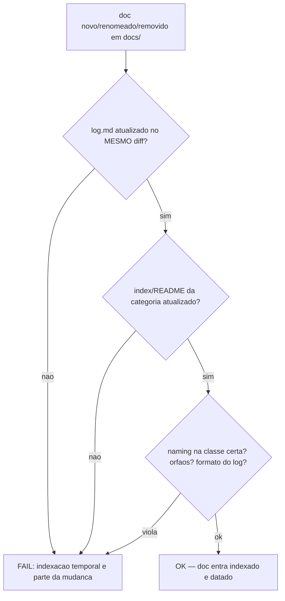
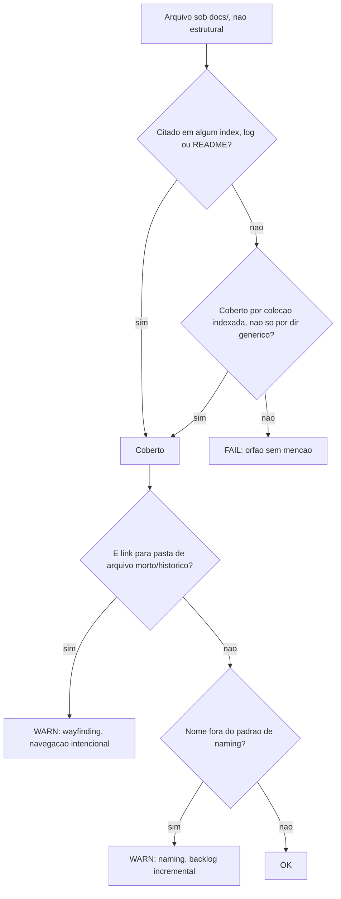
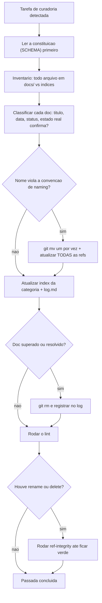

# 10. A wiki Karpathy — documentação com indexação temporal e lint executável

Documentação bagunçada não é problema estético — é **IA tomando decisão errada**: quando lixo legado e verdade atual convivem sem marcação temporal, o agente escolhe o documento errado e propaga o erro. O subsistema de wiki do harness (inspirado no padrão "LLM Wiki" de Andrej Karpathy) resolve isso com três peças: uma **constituição** (`docs/SCHEMA.md`), **dupla indexação temporal** (índice por conteúdo + log por data) e **lint executável** que transforma a convenção em gate.

## O que o framework instala

- [templates/docs/SCHEMA.md.jinja](../../templates/docs/SCHEMA.md.jinja) — a constituição da wiki do projeto: naming, classes temporais, frontmatter, ciclo de curadoria. Parametrizada por `HARNESS_DOCS_DIR` (default `docs`).
- [templates/docs/log.md.jinja](../../templates/docs/log.md.jinja) — seed vazio do índice temporal, com o cabeçalho-contrato do formato.
- Os dois lints em [engine/lint/](../../engine/lint/) (rodam do próprio framework ou copiados para o projeto): `docs_wiki_lint.py` e `ref_integrity.py`.
- As skills `repo-wiki-curator` (curadoria) e `ref-integrity` (investigação de refs quebradas) — capítulo 09.

## As regras que o SCHEMA instala no projeto

O SCHEMA organiza a vida de um documento em um ciclo de quatro fases — **ingest** (o doc entra: nomeado pela classe certa, com frontmatter, indexado nos dois índices), **query** (consulta ao índice para achar a verdade atual, sem adivinhação), **lint** (fiscalização automática de que a indexação não furou) e **prune** (o doc superado sai do working tree, preservado no histórico do git). As regras desta seção cobrem ingest e query; a fase lint tem seção própria logo adiante.

**Naming por classe temporal** — todo doc novo é `kebab-case` minúsculo, e a DATA no nome depende da classe. Cada classe tem uma analogia direta que ajuda a decidir na hora de nomear: **living** é como uma página de wiki — o endereço (o nome do arquivo) não muda, só o conteúdo é editado in-place; **event** é como um post de blog datado — uma vez publicado, o texto não muda mais, e a data-PREFIXO ordena os posts cronologicamente num `ls` puro; **sequenced** é como os capítulos de um livro — a ordem estável importa mais que a data, por isso o número no nome, não a data.

| Classe | Formato | Uso |
|---|---|---|
| **living** (verdade atual, editado in-place) | `slug.md` sem data | wiki pages, specs vivas, glossário |
| **event** (foto de um momento, imutável) | `YYYY-MM-DD-slug.md` (data-PREFIXO) | auditorias, relatórios, atas |
| **sequenced** (ordem estável) | `NN-slug.md` | ADRs, capítulos de manual (como este) |

O prefixo de data é o que torna "antigo vs. recente" visível num `ls`; o slug estável do living é o que impede rename de quebrar links a cada atualização.

**Frontmatter de status** (fase *ingest*) — docs curados declaram `status: canon | active | superseded | historico | proposta` e `updated: YYYY-MM-DD`. A regra de ouro: nunca marcar `canon` um doc que o código atual não confirma.

**Dupla indexação** (fase *query*) — todo doc aparece em DUAS listas: no índice da sua categoria (`index.md` ou `README.md` — por conteúdo) e no `log.md` (por data, formato `## [YYYY-MM-DD] tipo · categoria`). Diante de dois docs sobre o mesmo tema, o log diz qual é recente e o status diz qual vale.

**Prune: git é o arquivo** (fase *prune*) — doc superado e artefato regenerável são REMOVIDOS do working tree (recuperáveis via histórico git); o log preserva o registro do que saiu. Working tree limpo é parte do produto.

## docs_wiki_lint.py — a convenção como gate (fase *lint* do ciclo)

[engine/lint/docs_wiki_lint.py](../../engine/lint/docs_wiki_lint.py) valida o `HARNESS_DOCS_DIR` inteiro **e varre o restante do repositório atrás de markdown espalhado** (lê o path da config central via `_tooling_conf.py`). O lint distingue dois níveis de severidade — a metáfora útil é o sinal de trânsito: **FAIL** é o sinal vermelho (exit code 1, bloqueia commit/CI); **WARN** é o sinal amarelo (não bloqueia, mas fica registrado como backlog de migração incremental).

- **Órfão = FAIL** — arquivo sob docs/ sem menção em nenhum índice/log/README (cobertura individual ou por coleção explicitamente indexada). Anti-furo: um diretório genérico de armazenamento (ex.: `assets/`, `sources/`, `img/`, `reports/`) NÃO conta sozinho como cobertura — citar o diretório no índice não blinda automaticamente todo arquivo dentro dele, senão qualquer lixo derrubado ali passaria batido pelo gate.
- **Stray repo-wide = WARN (inbox do curador)** — markdown morando FORA de `docs/` (raiz do repo, `src/`, `backend/`, qualquer lugar) e não indexado é invisível à wiki: é assim que nasce o cemitério de `PLANO-FINAL-v2.md`. O sweep ignora dot-dirs, `node_modules`/`vendor`/`fixtures`, `README.md` (convenção de localidade em qualquer diretório), os estruturais da raiz (`CONTRIBUTING`, `CHANGELOG`, ...) e o arquivo de lessons; um stray citado por path exato ou por coleção (`dir/`) em índice/log é considerado indexado-no-lugar. Cada WARN é backlog para a skill `repo-wiki-curator` classificar na caixinha certa (`git mv` para `docs/<categoria>/` ou `_arquivo/`) — 1-2 por passada do loop, nunca mutirão.
- **Formato do log = FAIL** — headings fora do padrão temporal ou fora de ordem decrescente.
- **Frontmatter = FAIL** — `updated:` fora de `YYYY-MM-DD`; frontmatter aberta sem fechar.
- **Naming = WARN** (migração incremental; `--strict-naming` promove a FAIL).
- **Wayfinding = WARN, nunca FAIL** — um índice vivo linkando para a pasta de arquivo morto/histórico gera só aviso. É deliberado: se virasse bloqueio, o efeito prático seria treinar quem cura a wiki (humano ou agente) a ignorar o gate inteiro toda vez que uma referência legítima a material histórico aparecesse — fadiga de alerta. O sinal vermelho fica reservado para o que realmente precisa de correção, não para navegação intencional.
- **Política de diff** (`--worktree` / `--staged` / `--diff-base <ref>`) — markdown novo/removido/renomeado sob docs/ EXIGE atualização do `log.md` e do índice da categoria **no mesmo diff**: a indexação não é uma tarefa para depois, é parte da mudança.

O gate acima cobre a política de diff; a severidade por tipo de violação de arquivo segue esta árvore:

## ref_integrity.py — renames não deixam referências mortas

[engine/lint/ref_integrity.py](../../engine/lint/ref_integrity.py) é git-aware: dado um range (`--staged`, `--range A..B`, `--since REF`), descobre o que foi renomeado/deletado e varre o repo por (1) links markdown que não resolvem mais e (2) **citações vivas** aos nomes/paths antigos em md/json/txt/py/sh/toml/css — a classe de quebra que um lint de links puro não vê. Ignora exemplos em code fence, resolve `%20`/acentos, aceita uma allowlist por arquivo (`.ref-integrity-allowlist`) para placeholders ilustrativos legítimos, e tem `--selftest` (teste negativo do próprio detector).

**O resolve-guard** — antes de marcar uma citação como "stale" (referência ao nome/path antigo de um arquivo renomeado ou removido), o detector testa se o trecho de texto ao redor do match, lido como path, já resolve para um arquivo que existe de verdade. Se resolve, o achado é descartado: é só uma coincidência de substring do nome antigo dentro de um path diferente e válido, não uma referência morta de fato. O guard existe porque a alternativa é perigosa — corrigir "na unha" toda ocorrência do termo buscado, sem checar se ela já está dentro de um path correto, arrisca reescrever uma linha que já estava certa (o replace automático duplica ou corrompe um path que não precisava de correção nenhuma). A regra prática extraída disso: o guard vive DENTRO do detector (evita o falso positivo antes de reportar), nunca na mão de quem aplica a correção depois.

Pontos de execução recomendados: pre-commit e CI — a razão de serem dois (e não só um) está na seção de Enforcement, logo abaixo.

## Procedimento operacional da curadoria (skill `repo-wiki-curator`)

Ter a convenção (SCHEMA) e o gate (lint) não fecha o ciclo — alguém, humano ou agente, precisa efetivamente EXECUTAR a curadoria: achar o que está fora do padrão e corrigir sem quebrar o que já funciona. A skill `repo-wiki-curator` (instalada em `.claude/skills/repo-wiki-curator/SKILL.md`, com espelho dual-runtime em `HARNESS_SKILLS_DIR` — capítulo 09) empacota isso em 7 passos sequenciais:

1. **Inventário** — listar todo arquivo sob `docs/` (markdown e não-markdown) e comparar contra os dois índices (`index.md`/`README.md` da categoria + `docs/log.md`). O que não aparece em nenhum dos dois é candidato a órfão.
2. **Classificar antes de mexer** — para cada doc, ler título, veredito, data e status ANTES de decidir o que fazer com ele. Doc ambíguo ou aparentemente legado é conferido contra o estado real do projeto ("o doc mente, ou o código/estado atual confirma o que ele diz?") — nunca assumir pelo nome do arquivo.
3. **Renomear violações de naming com `git mv`** (preserva o histórico do arquivo, ao contrário de mover e apagar por fora do git) — **uma renomeação por vez**, atualizando TODAS as referências a ela no repo antes de passar para a próxima. Nunca em lote.
4. **Atualizar os dois índices** — 1 linha no `index.md`/`README.md` da categoria, 1 entrada datada no `docs/log.md`.
5. **Atualizar sub-wikis densas**, se a categoria tiver uma (um índice interno próprio além do índice de topo).
6. **Podar o superado** — `git rm` do doc resolvido/substituído, registrando a remoção no log (git preserva o conteúdo; o working tree fica limpo).
7. **Validar** — `.harness/lib/docs_wiki_lint.py` tem que fechar verde; se o passo 3 ou 6 mexeu em nomes ou removeu arquivos, `.harness/lib/ref_integrity.py --range <base>..HEAD` também precisa fechar verde antes de considerar a passada concluída.

**Guardrail de lotes pequenos** — a curadoria é incremental e contínua (o loop de manutenção a reexecuta a cada passada), não um evento único. A regra dura: não fazer mutirão de dezenas de renomeações no mesmo turno — **1 categoria por passada, testada e validada antes de abrir a próxima**. O motivo é mecânico, não estético: um `git mv` para um nome de destino que JÁ EXISTE, rastreado e indexado (porque uma passada anterior já tinha feito aquele mesmo rename), sobrescreve em silêncio a versão boa e commitada pela versão velha — o comando não avisa, só troca o conteúdo. Quanto maior o lote, maior a chance de uma renomeação colidir com trabalho já commitado sem que ninguém note antes do próximo lint. A defesa é dupla: lote pequeno reduz a superfície de erro por passada, e o passo 7 (lint + ref-integrity verdes) é o freio que pegaria a colisão — mas só funciona se rodado ANTES de seguir para a próxima categoria, não no fim de um mutirão grande. Antes de promover um arquivo não rastreado a nome canônico, a checagem barata é `git ls-files <alvo>` + busca no log/índice: se o nome canônico já existe, o arquivo não rastreado é lixo a descartar, não a promover.

## Como configurar

- `HARNESS_DOCS_DIR` — raiz da wiki (default `docs`).
- `IGNORED_TOOL_DIRS` — CSV de diretórios gerados por ferramenta que os lints ignoram (default `.understand-anything,.anythingllm`).
- As categorias dentro de docs/ (ex.: `planos/`, `auditorias/`, `adr/`, `architecture/`) são exemplo ilustrativo no SCHEMA gerado — ajuste às categorias reais do projeto editando o `docs/SCHEMA.md` instalado.

## Enforcement automático — pre-commit, CI e o loop (R5)

Os dois lints têm pontos locais de disparo automático e podem ganhar um backstop externo opcional. As camadas não são redundância: são **defesa em profundidade**, cada uma cobrindo o furo conhecido e aceito da anterior. O pre-commit pega o caso comum, mas pode ser contornado (`git commit --no-verify`, ou uma edição feita fora de um commit `git`); o loop de manutenção roda por fora do fluxo de commit como rede de segurança. Quando o projeto exigir separação de confiança, um executor externo pode cobrir o que chegou ao remoto por qualquer caminho que pulou as camadas locais. Esse executor não é requisito do harness.

| Camada | Arquivo | Gate | Ativação |
|---|---|---|---|
| pre-commit nativo | [templates/.githooks/pre-commit.jinja](<../../templates/.githooks/pre-commit.jinja>) | sempre gerado (sem flag) | `git config core.hooksPath .githooks` — roda sozinho num `_task` do Copier (ver `copier.yml`) se o destino já era repo git no `copy`/`update`; senão, manual |
| pre-commit framework (alternativa) | [templates/.pre-commit-config.yaml.jinja](<../../templates/.pre-commit-config.yaml.jinja>) | `use_pre_commit_framework` (default `false`) | `pre-commit install` (framework pre-commit.com) — quando ligado, o `_task` de `core.hooksPath` acima é desligado de propósito para não colidir |
| GitHub CI (adapter opcional) | [templates/.github/workflows/docs-integrity.yaml.jinja](<../../templates/.github/workflows/docs-integrity.yaml.jinja>) | `use_github_ci` (default `false`) | somente para projetos que escolheram GitHub Actions; o core não depende dele |
| loop de manutenção | [templates/.claude/loop.md.jinja](<../../templates/.claude/loop.md.jinja>) | `use_claude` (capítulo 08) | `/loop` sem argumentos |

As duas mecânicas de hook local (`.githooks/` nativo × framework `pre-commit`) são **mutuamente exclusivas** — mesma regra anti-double-fire do resto do harness (capítulo 06): ligar `use_pre_commit_framework` desliga o `_task` que aponta `core.hooksPath` para `.githooks/`, porque `pre-commit install` escreve seu próprio hook em `$(git rev-parse --git-path hooks)/pre-commit`, que resolveria para dentro de `.githooks/` e sobrescreveria o adaptador de ref-integrity se as duas coexistissem. `use_github_ci` permanece uma capability específica e opt-in; projetos Bitbucket, GitLab ou sem CI hospedada não geram esse adapter.

## O que fica de lição

O SCHEMA sem o lint é aspiração; o lint sem a política de diff deixa a dívida acumular. A combinação — convenção escrita + gate no mesmo diff + integridade referencial em rename — é o que mantém a documentação confiável o bastante para uma IA decidir com base nela. Este próprio manual segue as regras que descreve (classe sequenced, indexado no README da categoria e no log do repositório).
