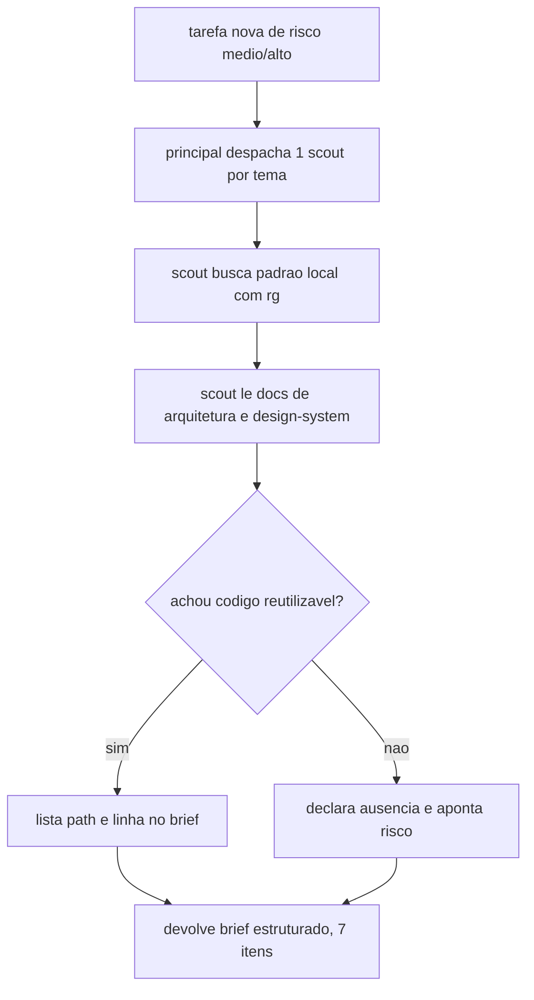
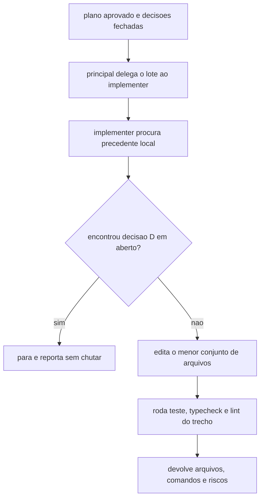
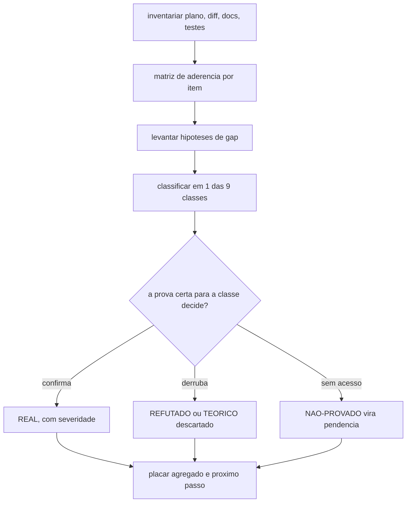
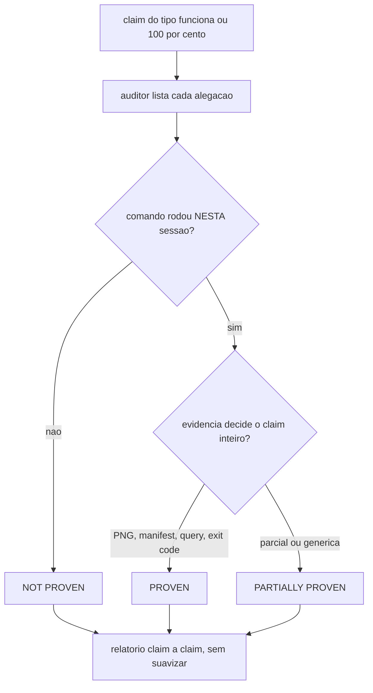
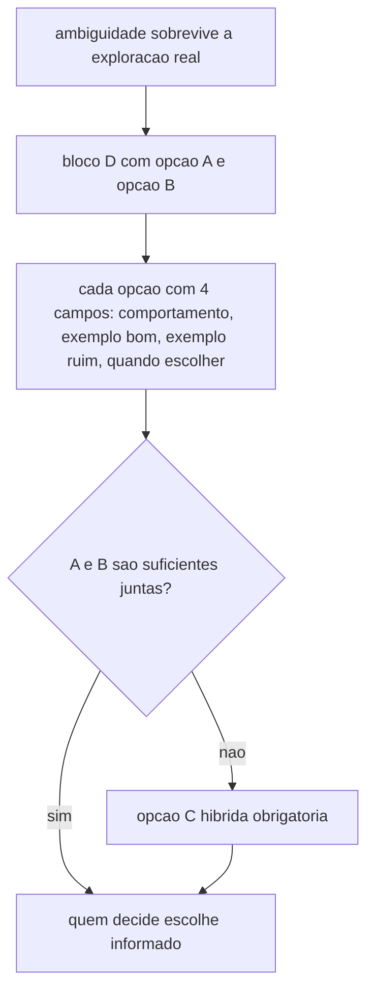
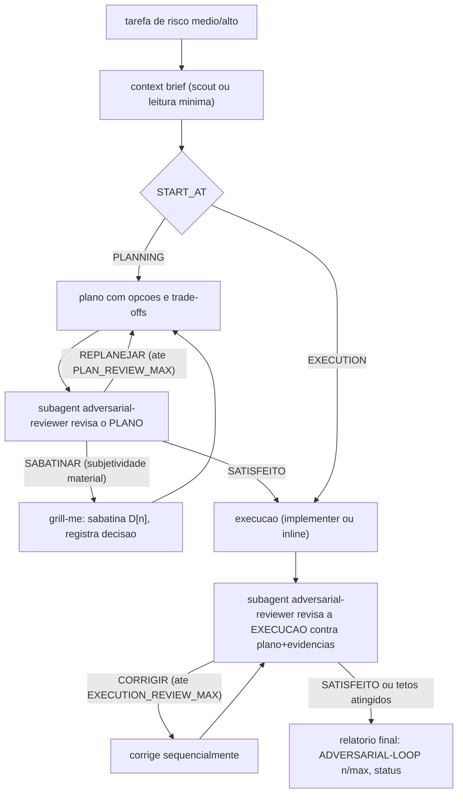

# 11. O council e os subagents — revisão adversarial por outros robôs

O princípio: **quem escreveu o código não é revisor adversarial dele**. Self-review de quem produziu o diff tende à complacência, e as leituras de review estouram o contexto principal. O harness resolve com **subagents** — agentes auxiliares descartáveis, com contexto próprio — e com o **delivery council**: a skill orquestradora que define quando planejar, quando executar e quantas rodadas de verificação adversarial rodar.

A analogia útil para os quatro papéis é a de uma obra fiscalizada: um **batedor** mapeia o terreno antes de qualquer fundação ser cavada; um **operário** constrói, mas só dentro da planta aprovada; um **auditor externo** confere o balanço de fora, porque ninguém audita o próprio trabalho de forma confiável; e um **perito** examina o laudo técnico — não decide se a obra foi boa ideia, só se a prova apresentada sustenta o que foi alegado. Cada um vira um subagent com um contrato de arquivo próprio.

## Os 4 papéis (custom agents)

O framework gera quatro subagents nomeados por projeto (`<projeto>-<papel>`), espelhados nos dois runtimes — mesmos papéis, formato por runtime (`.claude/agents/*.md` e `HARNESS_CODEX_AGENTS_DIR/*.toml`, gerados dos templates [Claude](<../../templates/.claude/agents/{{ project_name }}-adversarial-reviewer.md.jinja>) e [Codex](<../../templates/.codex/agents/{{ project_name }}-adversarial-reviewer.toml.jinja>)):

| Papel | Acesso | Função |
|---|---|---|
| `context-scout` | só leitura | Mapear arquitetura, padrões locais, reuso possível e riscos ANTES de implementar |
| `implementer` | escrita | Executar um plano já aprovado |
| `adversarial-reviewer` | só leitura | Confrontar plano × diff × docs × código real × evidências; veredito com gaps por severidade |
| `test-auditor` | só leitura | Verificar se testes/build/lint/evidências REALMENTE suportam os claims da sessão |

O revisor usa o modelo configurado em `HARNESS_ADVERSARIAL_REVIEWER_MODEL` (default `sonnet`) — separar o modelo do revisor do modelo do executor é uma alavanca de custo/rigor.

### context-scout — o batedor

É o único que age ANTES de qualquer linha ser escrita. A missão é sempre a mesma: voltar com um **Context Brief** estruturado, para que o agente principal não reinvente algo que o repositório já resolve. É só leitura — pode `rg`, `git log`, `git diff`, ler arquivos; está proibido de `git commit`, `rm`, instalar dependência ou qualquer comando que mute repositório, banco ou serviço externo.

O Context Brief tem 7 itens obrigatórios (fonte: [context-scout.md.jinja](<../../templates/.claude/agents/{{ project_name }}-context-scout.md.jinja>)):

1. Docs de arquitetura relevantes (`docs/architecture`).
2. Docs de design-system relevantes (`docs/design-system`).
3. Padrões locais já existentes, citando path + linha.
4. Componentes, serviços, hooks ou scripts reutilizáveis já presentes no repo.
5. Arquivos prováveis de mudar.
6. Testes e comandos de validação que se aplicam.
7. Riscos e decisões em aberto — o scout apenas SINALIZA um candidato a D[n], nunca resolve sozinho.

Prioriza busca cirúrgica (`rg`, leitura focada) em vez de varrer o repositório inteiro, e devolve o brief como texto estruturado — não como parágrafo de prosa — para o principal agir direto sobre ele.



### implementer — o operário com escopo travado

Diferente dos outros três, tem acesso total a ferramentas (`Read`, `Edit`, `Write`, `Bash`) — é o único autorizado a escrever. Mas a licença vem com trela curta: "stay inside the scope you were handed". O council o reserva para implementação mecânica em lote, de baixo risco, quando a decisão já foi tomada; decisão arquitetural e edição central ficam com o agente principal.

Seis regras fixas (fonte: [implementer.md.jinja](<../../templates/.claude/agents/{{ project_name }}-implementer.md.jinja>)):

1. Não implementar decisão D[n] não resolvida — se topar com uma, PARA e reporta em vez de chutar.
2. Reutilizar padrões existentes antes de criar abstração nova (`grep` por precedente local primeiro).
3. Manter o diff pequeno — tocar só os arquivos que o plano exige.
4. Preservar mudanças locais/não commitadas que já estejam na árvore de trabalho.
5. Rodar validação direcionada (teste, typecheck, lint ou o script relevante) antes de declarar pronto.
6. Jamais rodar operação git destrutiva (`reset --hard`, `push --force`, `checkout .`) ou tocar produção sem instrução explícita.

Devolve: arquivos alterados (path + o que mudou), comandos rodados com resultado real, e riscos/follow-ups restantes.



Lição operacional: **implementer nunca roda em paralelo dentro do mesmo worktree**. Dois subagents com escrita total no mesmo diretório de trabalho colidem de duas formas — um `git add -A` de um processo varre o trabalho ainda não commitado do outro, e uma edição concorrente no mesmo arquivo não tem merge automático porque nenhum dos dois sabe que o outro existe. A regra prática: um lote de implementer por vez por worktree; paralelismo real exige um `git worktree` isolado por subagent, não dois subagents dividindo o mesmo diretório.

### adversarial-reviewer — o auditor externo

É quem ataca plano, diff ou alegação de "está pronto" tentando DERRUBAR — nunca quem produziu o artefato revisando o próprio trabalho. Só leitura: pode ler e rodar comando de consulta, nunca editar. A regra dura vale sempre: **o review roda SEMPRE em subagent com contexto isolado, nunca inline** no agente principal — self-review herda os vieses de quem escreveu.

Ele confronta, citando path e linha, cinco fontes: (1) o pedido/plano original; (2) a execução real e o diff; (3) os contratos de arquitetura em `docs/architecture`; (4) os contratos de design-system em `docs/design-system`; (5) o código e os testes reais do app. Toda acusação precisa de prova concreta — inventar evidência invalida a auditoria.

O contrato completo (skill `adversarial-review`, fonte: [SKILL.md.jinja](../../templates/.agents/skills/adversarial-review/SKILL.md.jinja)) exige classificar cada hipótese de gap em uma de **9 classes**, e cada classe carrega a sua própria prova obrigatória — misturar prova de uma classe com hipótese de outra não vale:

| Classe | Quando usar | Prova obrigatória |
|---|---|---|
| PLANO/ESCOPO | item prometido não aparece na execução, ou diverge do plano | texto do plano + diff/arquivo/log do executado |
| ARQUITETURA | desvio de tenancy, runtime, deploy, domínio, ADR, qualidade | doc de arquitetura + código/config/teste que adere ou viola |
| DESIGN-SYSTEM/UI | token, tema, contraste, componente, responsividade, motion | doc de design-system + código do componente + evidência visual ou guarda quando aplicável |
| CODIGO/LOGICA | branch faltando, estado inválido, race, validação, autorização | trecho literal de código + caminho de execução + caso concreto que quebra |
| DADO/DB | premissa sobre cardinalidade, NULL, status, volume, integridade | query real no banco disponível + resultado literal — sem query, não é REAL |
| PERFORMANCE | N+1, full scan, índice ausente, render excessivo | métrica/plano de execução + volume real ou estimativa declarada |
| SEGURANCA | auth, RBAC, isolamento de tenant, injeção, dado sensível | código + doc de ameaça aplicável + caso de exploração concreto |
| FONTE/OSS | reinvenção, lib usada fora do contrato, dependência inadequada | doc oficial da lib + repo/padrão local comparado |
| TESTE/EVIDENCIA | ausência de teste, teste que não cobre o bug, claim visual sem PNG | arquivo de teste/log/manifest, ou ausência comprovada por busca |

A regra que amarra a tabela: **a prova precisa decidir a hipótese, não só existir**. Query de banco não prova bug de UI; screenshot não prova isolamento de tenant; log de build não prova regra de negócio. Usar a trilha de prova errada para a classe errada é o mesmo que não ter prova.

Cada hipótese fecha em exatamente um veredito — REAL, TEORICO-descartado, REFUTADO ou NAO-PROVADO — e "refutar exige prova no mesmo nível de acusar": o revisor também erra quando descarta sem evidência, não só quando acusa sem evidência.



Ao final de uma execução, encerra com `ADVERSARIAL-VERIFICATION: SATISFEITO | CORRIGIR | BLOQUEADO`; ao final de um plano, com `PLAN-ADVERSARIAL-VERIFICATION: SATISFEITO | REPLANEJAR | BLOQUEADO`.

Lição operacional: **um `SATISFEITO` vale só para o escopo que o revisor de fato leu e testou, nunca como certificado permanente**. Uma auditoria posterior com escopo maior — mais combinações de entrada, mais superfícies, mais cenários — pode achar um gap real que a rodada anterior simplesmente não tinha como ver, porque nunca olhou para aquele canto. O veredito precisa declarar o escopo coberto junto com o resultado; tratar um `SATISFEITO` de escopo estreito como prova de correção total é o mesmo erro de generalizar uma amostra pequena para a população inteira.

### test-auditor — o perito que examina o laudo

Não opina se a mudança de código foi boa ideia; verifica só se a alegação "funciona" está sustentada por evidência REAL desta sessão. Só leitura, mas pode RE-RODAR uma suíte de testes existente para conferir se um resultado alegado é reproduzível — é a exceção que confirma a regra: ele não escreve código novo, só reexecuta o que já existe para auditar o resultado.

Checklist de 6 itens (fonte: [test-auditor.md.jinja](<../../templates/.claude/agents/{{ project_name }}-test-auditor.md.jinja>)):

1. Comandos realmente rodados NESTA sessão — não lembrança de sessão anterior — com exit code e saída reais.
2. Logs/resultados que sustentam o claim, não paráfrase do que "deveria ter acontecido".
3. Testes que cobrem o comportamento ALTERADO, não só "os testes passam" em geral.
4. Evidência visual — PNG + manifest da skill `ui-evidence` — quando há claim de UI; um snapshot avulso de automação de browser sozinho NÃO conta.
5. Evidência de banco/dado quando há claim de dado: query real contra o banco, não suposição.
6. Nenhum "done"/"100%"/"pronto para produção" sem prova equivalente ao tamanho do claim.

Cada claim auditado sai classificado em exatamente um destes três estados — e é proibido suavizar o do meio:

- **PROVEN** — o comando/log/manifest/query decide o claim, sem ambiguidade.
- **NOT PROVEN** — não existe evidência desta sessão que sustente o claim; vira gap declarado, nunca "provavelmente está ok".
- **PARTIALLY PROVEN** — parte do claim tem prova (ex.: o teste unitário passa) e parte não (ex.: não há evidência visual do fluxo completo).



## A skill do council

Gerada como `<projeto>-delivery-council` em `HARNESS_SKILLS_DIR` (dual-runtime — a mesma `SKILL.md` serve Claude e Codex; fonte: [SKILL.md.jinja](<../../templates/.agents/skills/{{ project_name }}-delivery-council/SKILL.md.jinja>)). A entrada é um bloco `ARGS:` textual (runtimes não passam argumentos formais a skills):

```text
Use $<projeto>-delivery-council.

ARGS:
START_AT=EXECUTION | PLANNING | PLAN_REVIEW | AUTO
PLAN_SOURCE=<path | inline | issue | diff>
AUTO_DECIDE=true | false
PLAN_REVIEW_MAX=2
EXECUTION_REVIEW_MAX=3
AUTO_EXECUTE_AFTER_PLAN=false | true

TASK:
[pedido]
```

- `START_AT` decide o ponto de entrada: executar direto (leitura mínima de contexto antes), planejar do zero, revisar um plano existente (`PLAN_SOURCE` obrigatório) ou inferir pelo verbo do pedido (`AUTO`).
- `AUTO_DECIDE=true`: trade-offs comparados e escolhidos automaticamente, EXCETO ação destrutiva, credencial, produção ou decisão de negócio irreversível — essas, quando o **Gate Condicional de Grill** as classifica como subjetividade material `ALTA`/`BLOQUEANTE`, viram bloco D[n] sabatinado pela skill `grill-me` (decisão humana com exemplos aplicados, ver seção abaixo). O gate NÃO engessa o loop automático: `AUTO_DECIDE=true` continua o default e a sabatina é exceção, não etapa obrigatória.
- Os tetos de rodada vêm da config central: `HARNESS_PLAN_REVIEW_MAX` (default 2) e `HARNESS_EXECUTION_REVIEW_MAX` (default 3) — os ARGS não podem excedê-los.

## Decisões D[n]: como o council pergunta (grill-me + Gate Condicional de Grill)

Quando código, docs e dados reais já foram explorados e uma ambiguidade genuinamente humana sobrevive, o council não faz pergunta seca ("quer A ou B?"). Ele primeiro roda o **Gate Condicional de Grill**: só sabatina se a decisão continua aberta após a exploração, é subjetividade material, escolher errado gera achado `ALTA`/`BLOQUEANTE`, a resposta muda o plano/contrato/aceite, e a pergunta é resolvível sem credencial/deploy/ação destrutiva. Passando o gate, a skill `grill-me` conduz a entrevista relentless, uma pergunta por vez, num formato que mostra a consequência prática de cada caminho — a clarificação precisa "nortear a escolha, não transferir ambiguidade crua" para quem decide (fonte: [grill-me/SKILL.md](<../../templates/.claude/skills/grill-me/SKILL.md>)).

Cada decisão aberta vira um bloco `D[n]` e cada opção dentro dele carrega 4 campos obrigatórios:

1. **Comportamento** — o efeito concreto se essa opção for escolhida.
2. **Exemplo aplicado bom** — citando uma entidade, arquivo, comando, tabela ou cenário REAL do contexto analisado, nunca uma analogia genérica.
3. **Exemplo aplicado ruim** — o mesmo padrão, mas para o caso em que a opção falha ou custa caro.
4. **Quando escolher** — o critério que decide a favor dessa opção.

Não há limite artificial de decisões: uma auditoria grande pode gerar D1 até D12 sem problema. Se nem a opção A nem a B forem boas isoladas, uma **Opção C híbrida é obrigatória** — spike mínimo, fallback combinado ou estratégia composta — com a mesma exigência de explicar por que A e B sozinhas não bastam. O revisor adversarial não sabatina o usuário sozinho: quando prova o Gate Condicional de Grill para um gap REAL `ALTA`/`BLOQUEANTE` de subjetividade material, encerra a rodada com o status `SABATINAR` (`NECESSITA-GRILL: SIM`, `DECISOES-GRILL: D[n]`); o council então invoca `grill-me`, registra a decisão e retoma o mesmo revisor. `SABATINAR` é estado suspenso — não consome rodada do Planning Adversarial Loop.



## Os dois loops adversariais

**Planning Adversarial Loop** (até `HARNESS_PLAN_REVIEW_MAX` rodadas): o plano deve explicitar opções, delta de qualidade, delta de custo, breakeven e condição de não-adoção; o revisor devolve `PLAN-ADVERSARIAL-VERIFICATION: SATISFEITO | REPLANEJAR | SABATINAR | BLOQUEADO`. `SABATINAR` (suspenso, não consome rodada) sinaliza subjetividade material que dispara `grill-me` antes de replanejar; ver a seção de decisões D[n] acima.

**Adversarial Verification Loop** (execução; até `HARNESS_EXECUTION_REVIEW_MAX` rodadas): o revisor confronta o que foi FEITO contra o plano e as evidências, devolvendo `ADVERSARIAL-VERIFICATION: SATISFEITO | CORRIGIR | BLOQUEADO` com gaps por severidade. Gap real de severidade alta ⇒ corrigir sequencialmente e rodar nova rodada. A rodada N+1 pode CONTINUAR o mesmo subagent (mantém o contexto do review anterior); o relatório atribui cada rodada ao executor (linha `REVISORES:`). Itens que dependem de decisão humana/credencial/mudança destrutiva não são auto-corrigidos — viram pendência declarada, tipicamente como bloco D[n].



A regra dura, nos dois loops: **o review roda SEMPRE em subagent, nunca inline** no contexto principal. A skill `adversarial-review` é o CONTRATO do prompt do revisor (o que confrontar, formato do veredito) — o council a referencia em vez de improvisar o prompt a cada uso.

## A camada executável: schemas, witness e ledger

Disciplina de processo em prosa drifta; o framework acompanha o council com enforcement em [engine/contract/](../../engine/contract/):

- **Schemas JSON** ([schemas/](../../engine/contract/schemas/)) — a forma válida dos resultados de review (`plan-review-result`, `execution-review-result`) e dos eventos de ledger; `validate_contract.py` é a entrada única de validação.
- **Witness** ([scripts/verify_witness.py](../../engine/contract/scripts/verify_witness.py)) — verificação de "marcadores load-bearing": frases que PRECISAM existir nos artefatos do council (os vereditos-sentinela, a linha REVISORES, os marcadores de handoff `REPLAN-REQUEST`/`FIX-REQUEST` e seus `CONSUMED`). O witness do próprio framework ([templates/verification/council-witness.json](../../templates/verification/council-witness.json)) + o teste [templates/tests/test_council_merge.py](../../templates/tests/test_council_merge.py) protegem a skill contra regressão de edição — inclusive com teste NEGATIVO (o witness FALHA quando um marcador é removido).
- **Ledger JSONL** ([scripts/agent_swarm_ledger.py](../../engine/contract/scripts/agent_swarm_ledger.py)) — registro append-only por rodada de loop em `HARNESS_LEDGER_DIR` (deriva de `HARNESS_RUNS_DIR`), para auditar depois quem revisou o quê, quando, com que veredito.

## Como configurar

`HARNESS_PLAN_REVIEW_MAX`, `HARNESS_EXECUTION_REVIEW_MAX`, `HARNESS_ADVERSARIAL_REVIEWER_MODEL`, `HARNESS_SKILLS_DIR`, `HARNESS_LEDGER_DIR`; no Codex, o fan-out de subagents é limitado por `HARNESS_CODEX_MAX_THREADS` (default 4) e `HARNESS_CODEX_MAX_DEPTH` (default 1 — subagent não lança subagent; profundidade maior cria fan-out recursivo de custo imprevisível), gravados em `.codex/config.toml`. O cap de subagents simultâneos é o semáforo do capítulo 04.

## O que fica de lição

Independência entre executor e revisor não é burocracia — é a única forma de o review encontrar o que o executor não consegue ver. E processo adversarial só se sustenta quando os artefatos são verificáveis por máquina (sentinelas, witness, ledger): o que não é grep-ável, drifta.

Duas lições operacionais valem o destaque porque nascem de modo de falha real, não de teoria: processos de escrita paralelos no mesmo worktree colidem por definição (o segundo `git add -A` não sabe do primeiro trabalho não commitado) — por isso implementer é sempre sequencial por worktree. E um veredito `SATISFEITO` descreve o escopo que foi de fato verificado, não uma garantia universal — uma auditoria com escopo maior pode, legitimamente, achar o que a rodada anterior nunca teve como enxergar.
