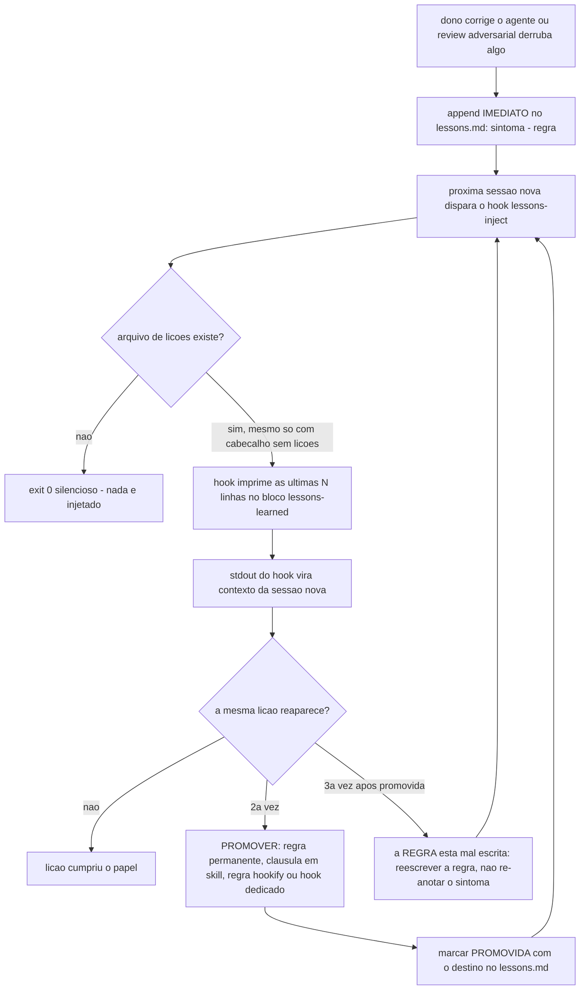

# 12. O ciclo de auto-melhoria — lessons.md, injeção e promoção a regra

Agente de IA não tem memória entre sessões: o erro corrigido hoje volta amanhã, com a mesma cara, custando a mesma correção. O ciclo de auto-melhoria do harness (inspirado no self-improvement loop de Boris Cherny) transforma correção em memória durável com quatro verbos: **capturar → injetar → promover → consolidar**. A meta mensurável: a taxa de erro repetido CAI entre sessões.

## Capturar — toda correção vira lição, na hora

O contrato (gravado nas instruções de projeto geradas, [templates/AGENTS.md.jinja](../../templates/AGENTS.md.jinja) §16): após QUALQUER correção do dono do projeto — veredito "errado", abordagem revertida, ponto cego apontado, review adversarial que derrubou algo — o agente faz append IMEDIATO no arquivo de lições, sem esperar o fim da sessão. O formato, definido no cabeçalho-contrato do seed [templates/tasks/lessons.md.jinja](../../templates/tasks/lessons.md.jinja):

```markdown
## [YYYY-MM-DD] sintoma → regra
2-4 linhas: o padrão concreto do erro e a regra que o previne. Não é desabafo.
```

O "imediato" não é estilo, é a razão de existir do passo: se a sessão travar, o contexto estourar ou a conversa for encerrada antes do fechamento normal, qualquer lição que só exista "na cabeça" do agente — pensada mas não escrita — desaparece para sempre. O modelo não carrega rascunho de uma sessão para a outra; a única cópia que sobrevive é o que foi persistido em disco antes do corte. Adiar o append para o fim da sessão aposta contra esse corte.

Uma entrada bem-formada, hipotética (cenário simulado, sem relação com nenhum incidente real):

```markdown
## [2026-03-02] listagem /items sem paginação caía com 500 em tabela grande → validar limit/offset antes do query builder
No serviço demo-app o endpoint carregava a tabela inteira em memória antes
de aplicar o filtro. Regra: todo endpoint de listagem valida limit/offset
ANTES de montar a query, nunca depois de já ter buscado os dados.
```

O arquivo instala VAZIO de entradas (as lições do projeto-doador do framework não contaminam o seu histórico) — mas não em branco: o seed grava o cabeçalho-contrato acima como conteúdo inicial. Esse é o estado de um harness recém-instalado: zero lições capturadas, arquivo presente, pronto para a primeira entrada. Vive em `HARNESS_LESSONS_FILE` (default `tasks/lessons.md`).

## Injetar — as lições voltam sozinhas, toda sessão

A metade determinística: o hook `lessons-inject` (capítulo 02) imprime as últimas `HARNESS_LESSONS_INJECT_MAX_LINES` linhas (default 80) do arquivo no contexto de TODA sessão nova. O agente não precisa lembrar de ler — a memória chega junto com a sessão.

O mecanismo por trás disso é literal, não uma API separada de "memória": tudo que um hook de `SessionStart` escreve em stdout entra direto no contexto do modelo (capítulo 02). O script imprime um envelope `<lessons-learned>` seguido do `tail -n` do arquivo, e esse texto vira parte do prompt que o agente lê antes de processar o primeiro pedido da sessão — o agente "acorda" já tendo lido as lições recentes, sem chamar ferramenta nenhuma para isso.

Comportamento gracioso nas duas bordas: se `tasks/lessons.md` (ou o path de `HARNESS_LESSONS_FILE`) não existe, o hook sai em silêncio — `exit 0`, sem imprimir erro, sem falhar a sessão. Se o arquivo existe mas só tem o cabeçalho-contrato do seed, sem nenhuma entrada ainda, o hook injeta esse cabeçalho normalmente; não há tratamento especial de "vazio" porque não precisa haver um — é exatamente o estado de um harness recém-instalado, antes de qualquer correção ter sido capturada, e não é uma condição de erro. Os dois casos seguem o mesmo princípio dos demais hooks de `SessionStart`: fail-open, custo de contexto proporcional ao que existe para dizer.

O cap de linhas é o orçamento de contexto: quando o arquivo cresce além dele, as lições antigas saem da janela de injeção — e é isso que força o passo seguinte.

## Promover — lição repetida vira enforcement

Lição que se repete 2× é sinal de que prosa não bastou. O destino da promoção não é um único caminho — são **quatro**, e vale distinguir os quatro porque cada um resolve uma classe diferente de recorrência:

1. **Regra permanente** nas instruções de projeto (CLAUDE.md/AGENTS.md) — quando é uma convenção que o agente precisa saber sempre, em qualquer tarefa, sem depender de contexto específico.
2. **Cláusula dentro de uma skill** — destino próprio, não uma variação dos outros três: quando a lição pertence a um PROCEDIMENTO específico (deploy, entrega git, revisão de plano), o passo entra direto no `SKILL.md` daquela skill (`.claude/skills/<nome>/SKILL.md`, capítulo 09) e só carrega quando a tarefa aciona aquela skill — não em toda sessão, como a regra permanente do item 1. Exemplo real do próprio framework: o **state-check obrigatório** da skill `deploy-<prefixo>` (capítulo 09) — "proibido afirmar estado de deploy sem rodar a verificação contra o alvo real" — é exatamente esse tipo de promoção: nasceu depois que a mesma falha (declarar deploy/estado sem checar) se repetiu num procedimento específico, e por isso foi para dentro do procedimento, não para uma regra genérica lida em toda sessão.
3. **Regra hookify** (capítulo 07) — quando o erro tem assinatura detectável em comando/edição: vira guarda mecânica declarativa, sem código. É o destino preferido quando a detecção é mecânica ("guard determinístico > instrução em prosa").
4. **Hook dedicado** — quando a detecção exige lógica que o formato declarativo do hookify não expressa.

A lição promovida é marcada no arquivo (`[PROMOVIDA → destino]`) — o histórico fica, a vigilância muda de camada. E a regra anti-recorrência de segunda ordem: **a mesma correção aparecendo 3× significa que a REGRA está mal escrita** — reescrever a regra (ou trocar de destino, se o destino escolhido não bastou), não re-anotar o sintoma.



## Consolidar — manutenção periódica

Com o tempo o arquivo acumula lições promovidas e lições mortas. A consolidação (parte da passada de manutenção — capítulo 08) revisa: o que já foi promovido pode ser compactado; o que nunca mais disparou pode sair (git preserva); o que está prestes a sair da janela de injeção e ainda importa DEVE ser promovido. O lint da wiki (capítulo 10) não governa este arquivo — lessons.md é operacional, não doc curado; seu ciclo é este.

## Como configurar

- `HARNESS_LESSONS_FILE` — path do arquivo (default `tasks/lessons.md`).
- `HARNESS_LESSONS_INJECT_MAX_LINES` — o orçamento de injeção por sessão (default 80). Aumentar dá mais memória e custa mais contexto por sessão; o equilíbrio certo depende de quão disciplinada é a promoção (promoção em dia = arquivo curto = cap folgado).
- Path real do hook: `.harness/hooks/lessons-inject.sh` (fonte `templates/.harness/hooks/lessons-inject.sh.jinja`), que lê os dois valores acima em runtime via `.harness/lib/_tooling_conf.py` — a mesma config central usada pelos outros hooks do capítulo 02.

## O que fica de lição

O ciclo só funciona se as quatro pontas existem: capturar sem injetar é diário morto; injetar sem promover satura a janela; promover sem marcar perde o rastro; e sem consolidar, o arquivo vira ruído. O harness automatiza a injeção (hook) e cobra o resto por contrato nas instruções de projeto — a disciplina de captura continua sendo o hábito que o dono do projeto precisa exigir.
