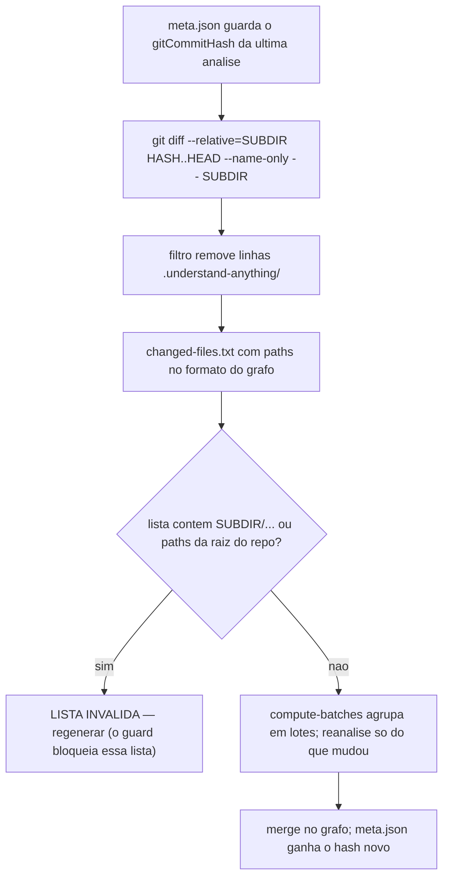

# 13. Understand Anything — grafo de código em monorepo e a armadilha do diff relativo

**Understand Anything** é um plugin de grafo de conhecimento de código (comando `/understand`): varre o repositório e produz um mapa de nós (arquivos, funções, endpoints) e arestas (quem importa/chama quem) que os agentes consultam para responder perguntas de arquitetura sem reler o código inteiro.

Uma analogia leiga ajuda a fixar o vocabulário: pense no repositório como uma cidade. Cada arquivo (ou função, ou tabela de banco) é um prédio — em teoria dos grafos isso é um **nó**. Cada relação entre eles — uma função que chama outra, um módulo que importa outro, um endpoint que lê uma tabela — é uma rua que liga dois prédios: uma **aresta**. Sem mapa, um agente que chega para trabalhar na cidade precisa vasculhar quarteirão por quarteirão toda vez que alguém pergunta "quem depende de quê". Com o grafo pronto, a mesma pergunta vira uma consulta ao mapa — rápida — em vez de uma releitura do repositório inteiro.

O grafo vive em `<raiz-do-grafo>/.understand-anything/` com um arquivo pequeno e crucial ao lado: `meta.json`, a "etiqueta de validade" — `{"gitCommitHash": "...", "analyzedFiles": N, ...}` — que diz de qual commit o mapa é o retrato. Redesenhar a cidade inteira a cada mudança seria caro: o custo de reanalisar cresce com o número de arquivos do repositório, e a imensa maioria dos commits altera só uma fração pequena deles. É esse racional de custo que justifica a atualização **incremental**: em vez de reconstruir o mapa do zero, ela pergunta ao git "o que mudou desde o commit gravado em `gitCommitHash`?" e reanalisa (e mescla) só os prédios da lista — não a cidade inteira.

O harness não instala o plugin (é uma dependência externa do runtime); instala a **camada de proteção** para a configuração que quebra silenciosamente: monorepo onde a raiz do grafo é um SUBDIRETÓRIO.

## A armadilha: `<subdir>/api/...` não é `api/...`

Num monorepo, faz sentido apontar o grafo para o subdiretório do produto (ex.: `packages/` ou `apps/`) e não para a raiz do repo — fora dele só há docs, CI e infra. Consequência: os endereços DENTRO do grafo são relativos ao subdiretório (`api/config.py`). Mas o git não sabe disso: `git diff --name-only` devolve endereços a partir da raiz do REPO (`<subdir>/api/config.py`). O passo seguinte do pipeline incremental (`compute-batches`) compara os dois formatos letra a letra — e nada casa.

O resultado é o pior tipo de falha: **um no-op que parece sucesso**. A execução termina rápida, sem erro na tela, e o grafo continua desatualizado. A cura é uma flag: `git diff --relative=<subdir>` devolve os endereços já no formato do grafo.



**Como verificar no seu repo** — para saber se a armadilha se aplica ao seu projeto, rode dois comandos a partir de qualquer lugar do repositório, trocando `<subdir>` pelo diretório que você declarou como raiz do grafo (ex.: `apps`, `packages`, `src`):

```bash
git -C <subdir> rev-parse --show-toplevel
git -C <subdir> rev-parse --show-prefix
```

O primeiro devolve a raiz do REPOSITÓRIO GIT inteiro — não a de `<subdir>` — mesmo estando "dentro" dele via `-C`. O segundo devolve exatamente o prefixo que falta somar: `<subdir>/`. Isso é a prova de que o Git nunca esqueceu que `<subdir>` é só uma pasta comum lá dentro, e explica por que um diff comum sai com `<subdir>/api/...` em vez de `api/...`. Se no seu caso os dois comandos devolverem o mesmo caminho (ou seja, `--show-prefix` vier vazio), o grafo já aponta para a raiz do repo e esta armadilha específica não existe.

## A defesa em camadas que o framework instala (condicional)

Declarar `harness_understand_apps_root` no questionário (ex.: `apps`) ativa duas camadas complementares — nada disso é gerado para projetos que não usam o grafo ou o usam na raiz do repo (onde a armadilha não existe):

1. **Lembrete no prompt** — [understand-context-inject.py](<../../templates/.harness/hooks/understand-context-inject.py.jinja>) (`UserPromptSubmit`, capítulo 03): quando o prompt menciona o grafo, injeta a regra completa do diff relativo, incluindo o comando correto que LÊ o hash do `meta.json` na hora — nunca um hash decorado em prosa.
2. **Bloqueio físico** — [understand-apps-diff-guard.sh](<../../templates/.harness/hooks/understand-apps-diff-guard.sh.jinja>) (`PreToolUse` Bash, capítulo 04): barra o diff bruto (sem `--relative=<subdir>`) e a lista de arquivos contaminada (paths do formato errado alimentando `compute-batches`) ANTES de executarem.

Vale fixar a nomenclatura, porque ela se repete em outros capítulos deste manual: um **guard** ("guarda") intercepta uma ação específica antes dela acontecer — aqui, o comando de terminal errado — e a barra individualmente; um **gate** ("portão") é o mesmo tipo de checagem automática aplicada num ponto de passagem mais amplo do ciclo de vida do agente (por exemplo, o fim de um turno inteiro). Os dois nomes descrevem a mesma ideia — travar o erro automaticamente em vez de só documentá-lo ou avisar sobre ele — diferindo apenas em ONDE no fluxo a checagem é encaixada.

Mais a skill [understand-apps-incremental](<../../templates/.claude/skills/understand-apps-incremental/SKILL.md.jinja>) — o procedimento operacional completo: confirmar o `meta.json`, gerar a lista do jeito certo, validar o formato, rodar o incremental sem `--full` (que força rebuild completo — outra operação).

O trio cobre os três lados: o lembrete torna a regra presente quando o assunto surge; o guard torna o erro impossível de executar; a skill torna o acerto o caminho de menor esforço.

## Duas correções de 2026-07-30 (relato de adopter)

**O guard validava por NOME de diretório e reprovava input correto.** Ele rejeitava qualquer linha
começando por `docs/`, `scripts/`, `infra/`, `docker/`, `.claude/`, `.agents/`, `.codex/` ou
`.github/`, tratando esses nomes como prova de path de raiz. Mas um subdiretório-raiz do grafo
legitimamente tem o seu próprio `docs/` e `scripts/`: num adopter cujo `harness_understand_apps_root`
contém os dois, **todo commit que tocava documentação fazia o script sair com `exit 2`** — e a falha
era lida como "N arquivos pendentes", porque o script escreve o `changed-files.txt` ANTES de o guard
rodar. Guard que dispara em input correto é pior que guard nenhum: ensina o operador a ignorar o
código de saída. A checagem por nome sobrevive só para o **prefixo duplo**
(`<subdir>/api/...`, a classe de erro que o guard existe para pegar, e essa é inequívoca); o resto
passou a ser decidido por **resolução** — um path app-relativo resolve sob o subdiretório no
worktree, no `HEAD` ou no commit do selo; um path de raiz não resolve em nenhum dos três. Consultar
os dois endpoints do diff, e não só o `HEAD`, é obrigatório: arquivo DELETADO entre o selo e o `HEAD`
é path app-relativo legítimo e seria reprovado por um teste que olhasse apenas o estado atual.

**A contagem respondia a pergunta errada.** `wrote N app-relative changed files` responde "quantos
arquivos mudaram", que não é "o grafo está velho". No mesmo adopter: 51 arquivos pendentes contra um
grafo com 676 nós de arquivo e **zero markdown** — as 51 mudanças eram documentação, então o grafo
estava semanticamente atual e só o `gitCommitHash` do `meta.json` estava atrás. Um sinal de frescor
que não pode chegar a zero por nenhuma quantidade de trabalho treina o agente a ignorá-lo. O script
passou a emitir o split código × doc-only e, quando nada de código mudou, a dizer explicitamente que
o grafo está atual e que a contagem não deve ser lida como defasagem. O `changed-files.txt` NÃO é
filtrado: o que cada backend de grafo indexa é decisão dele, e `HARNESS_UNDERSTAND_DOC_ONLY_RE`
permite ajustar o padrão em projeto cujo grafo indexe prosa.

## O padrão a copiar: `meta.json{gitCommitHash}` como âncora de staleness

Uma decisão de design do plugin vale generalizar para qualquer estado derivado do seu projeto (índices, caches, artefatos de build): **um arquivo pequeno com o commit hash da última geração, sempre lido na hora — nunca decorado**. Hash citado em prosa/instrução envelhece silenciosamente a cada regeneração; hash lido de `meta.json` é imune. É por isso que a mensagem injetada pelo hook manda montar o comando com `LAST=$(... meta.json ... gitCommitHash)` em vez de embutir um valor. O mesmo princípio norteia o `harness-init` (capítulo 14): estado deriva de arquivo-fonte, não de memória.

Segundo padrão do plugin que o framework adota como blueprint: **zero-token gate** — antes de gastar LLM num update, checagens determinísticas baratas decidem se algo REALMENTE mudou (hash de conteúdo primeiro; assinatura estrutural depois; LLM só no resíduo). O `scan_project.py` do harness-init segue a mesma fronteira: enumeração e classificação são sempre script; LLM só sintetiza e decide em cima do JSON.

## Como configurar

- `harness_understand_apps_root` (questionário) → `HARNESS_UNDERSTAND_APPS_ROOT` na config central. Vazio = nenhum artefato deste capítulo é gerado.
- O scan do `harness-init` detecta candidatos a esse valor (subdiretório-monorepo com a maioria do código) e SUGERE — a confirmação é sempre humana (capítulo 14).
- `IGNORED_TOOL_DIRS` já inclui `.understand-anything` por default — os lints da wiki (capítulo 10) não tratam o grafo como documentação.

## O que fica de lição

A classe de bug aqui — dois subsistemas com noções diferentes de "raiz" trocando paths — não avisa quando quebra; produz sucesso vazio. Para essa classe, aviso em doc não basta: a defesa precisa de uma camada que torne o comando errado INEXECUTÁVEL, e de uma âncora de estado que não dependa de ninguém lembrar de atualizá-la.
