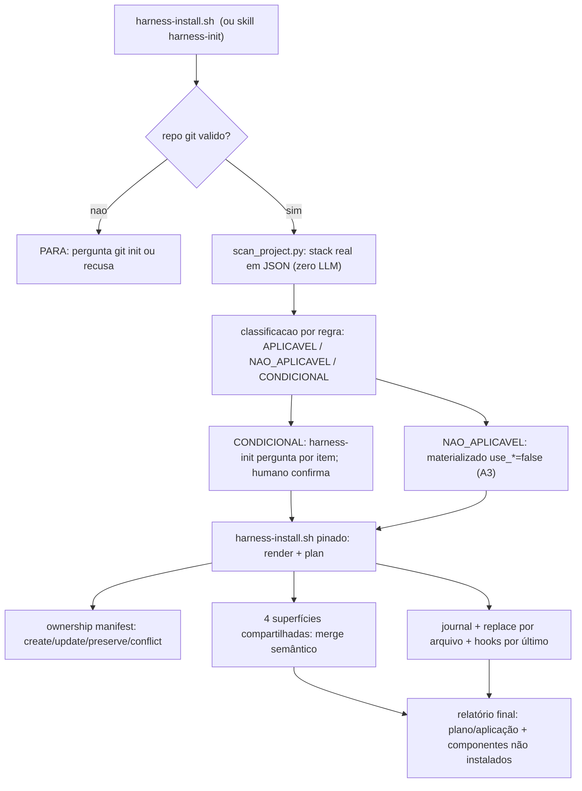
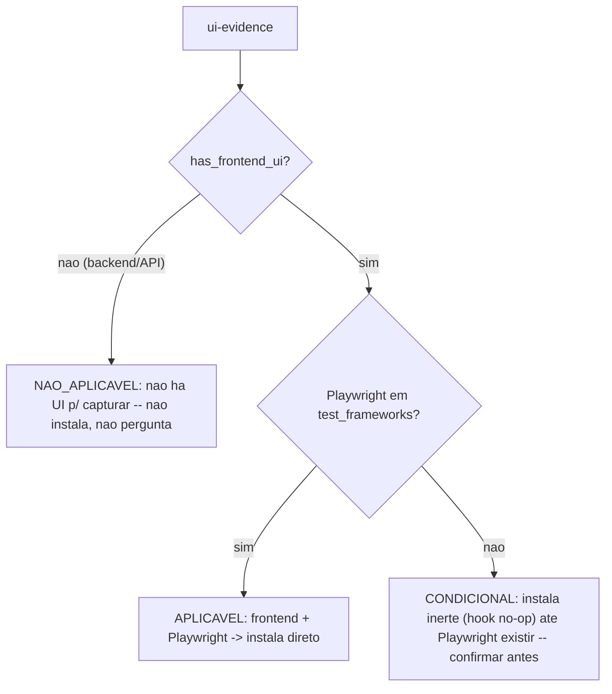
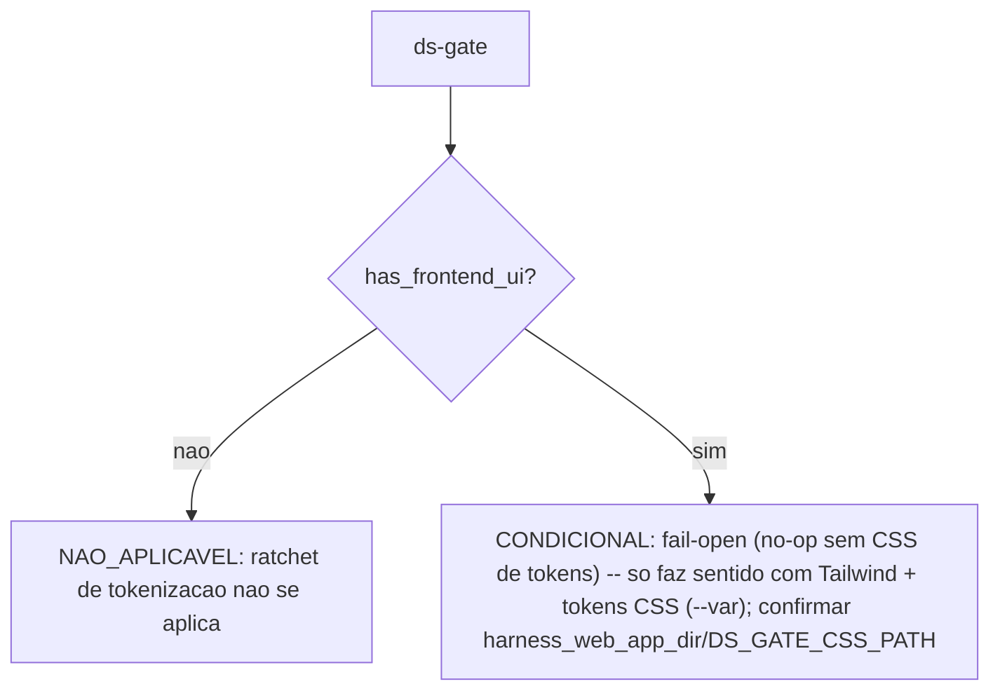
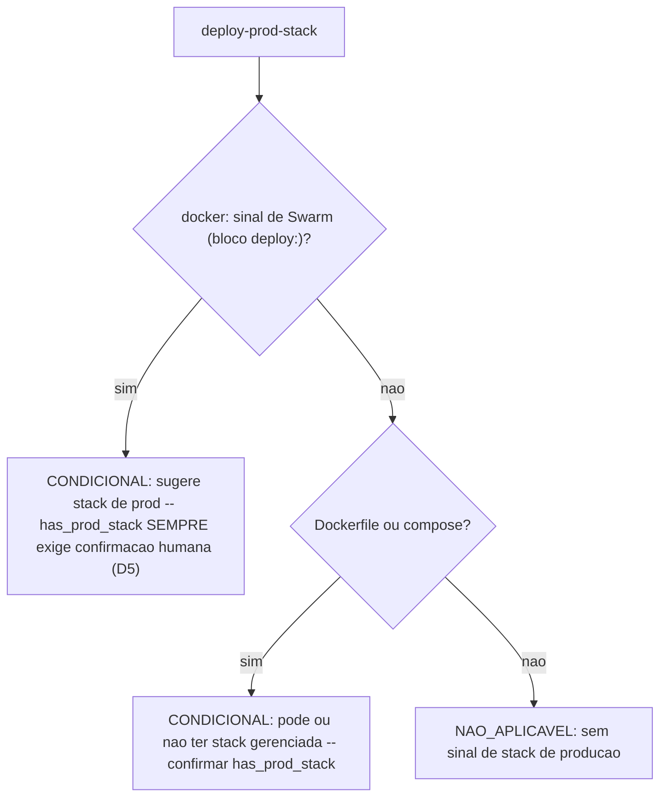
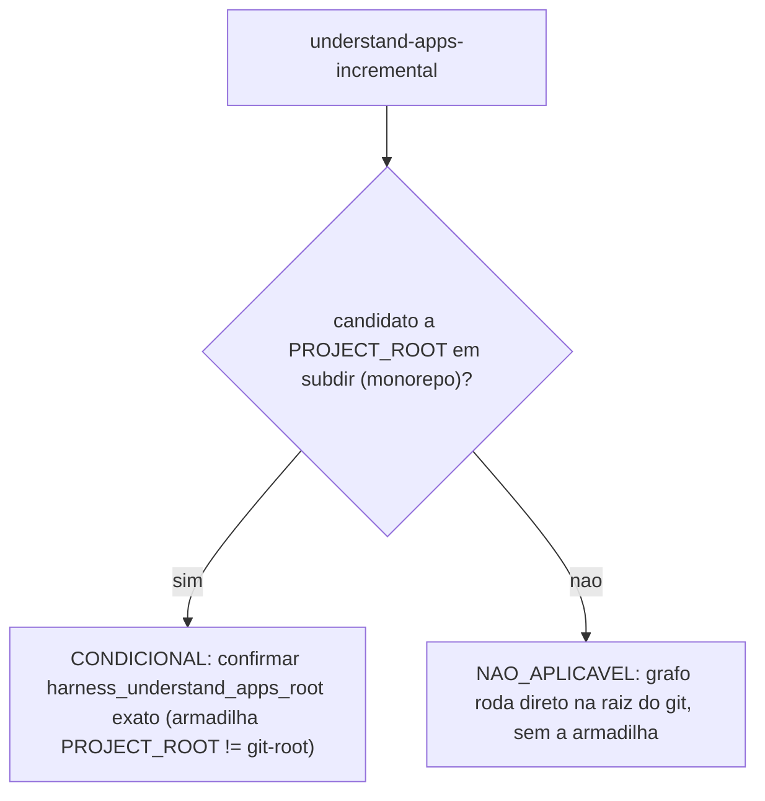

# 14. Instalação e atualização — harness-install.sh, harness-init e copier update

O framework usa [Copier](https://copier.readthedocs.io/) como renderer. Para adoção e update brownfield, `harness-install.sh` usa um reconciliador próprio, independente do índice Git: calcula o plano completo, rejeita conflitos antes de escrever, registra ownership por hash e mantém journal de rollback. O Copier nativo continua válido para projetos que nasceram de `copier copy` e mantêm todos os arquivos gerenciados na baseline Git; ele **não adota retroativamente um brownfield**. `harness-init` é a etapa guiada que escaneia a stack e monta as respostas, mas a aplicação deve passar pelo mesmo instalador stateful.

## Por que não `copier copy` direto no projeto (B3)

A tentação óbvia é rodar `uvx copier copy <origem> <seu-projeto> --trust` direto contra o projeto real. **Isso é circular e destrutivo sempre que o projeto já tem qualquer um dos 4 arquivos que o template também escreve** (`AGENTS.md`, `.claude/CLAUDE.md`, `.claude/settings.json`, `.gitignore` — o caso comum, já que você quase sempre está adotando o harness num projeto vivo, não criando um do zero):

- **sem `--overwrite`**: qualquer colisão de nome faz o Copier abortar com exit 1 — instalação **parcial**.
- **com `--overwrite`**: os 4 arquivos acima são **sobrescritos por inteiro**, destruindo `CLAUDE.md`/`AGENTS.md`/`settings.json` do usuário.
- **com `--skip`**: nada do harness entra nesses 4 arquivos — instalação manca (`settings.json` sem os hooks do harness, por exemplo).

E `copier update` não resolve isso retroativamente: ele precisa de `.harness/answers.yml` já existente e de um histórico de commit coerente com o template — não existe um modo "adote este repo que eu não criei com copier". É por isso que **`harness-install.sh` existe como uma via própria, específica para a primeira adoção** — ver seção seguinte. `copier copy` direto continua correto SÓ quando o destino é um diretório genuinamente vazio (zero arquivo que colide com a árvore do template) — nesse caso não há nada para o bootstrap mesclar, e o comando de uma linha é suficiente.

## Instalar (o caminho canônico): `harness-install.sh`

```bash
./harness-install.sh <seu-projeto> \
  --data project_name=<slug> --data owner_name=<nome> --defaults
```

[`harness-install.sh`](../../harness-install.sh) vive na **raiz** do repositório do framework (ao lado de `copier.yml`) e resolve o gap acima sem depender de `--overwrite`/`--skip`:

1. **Renderiza o framework inteiro num diretório SCRATCH temporário** via `copier copy <origem-do-orions-belt> <scratch>` — nunca escreve no projeto-alvo neste passo.
2. **Planeja sem mutar:** [`.harness/lib/install_apply.py`](../../templates/.harness/lib/install_apply.py) fixa a raiz Linux por descritor (`O_DIRECTORY|O_NOFOLLOW`), enumera o render, faz `lstat` dos destinos/ancestrais e calcula todos os merges. Symlink, troca da raiz, escape, colisão desconhecida, arquivo owned alterado localmente ou edição entre plano e apply abortam.
3. **Aplica por estratégia:** os 4 arquivos compartilhados (`AGENTS.md`, `.claude/CLAUDE.md`, `.claude/settings.json`, `.gitignore`) usam [`.harness/lib/merge_docs.py`](../../templates/.harness/lib/merge_docs.py); os demais só são atualizados quando o hash atual coincide com o último hash aplicado. `--preserve <path>` registra explicitamente uma colisão como externa e nunca a sobrescreve.
4. **Lock + journal + replace:** um lock exclusivo por alvo serializa instaladores concorrentes. Antes das escritas, o journal guarda bytes, modos, diretórios criados e hashes anterior/esperado; cada arquivo usa replace atômico no próprio diretório. Falha controlada restaura o estado anterior sem remover diretório preexistente. Interrupção de processo pode deixar journal; a próxima execução valida todos os destinos antes de recuperar. Se algum arquivo tiver sido editado depois da interrupção, a recuperação para sem sobrescrevê-lo. O journal é removido antes do backup no commit, portanto a janela residual deixa backup órfão seguro, não journal irrecuperável. Isso não promete atomicidade global nem durabilidade contra queda de energia.
5. **Ativa hooks por último:** chama [`.harness/lib/set_hooks_path.sh`](../../templates/.harness/lib/set_hooks_path.sh). Manager existente nunca é substituído; Husky só recebe chaining marcado com `--chain-hooks` explícito.

`<origem-do-orions-belt>` é sempre a **raiz** do repositório do framework (nunca o subdiretório `templates/` direto — mesmo motivo do `_subdirectory: templates` no [copier.yml](../../copier.yml): o versionamento por tag do Copier (`--vcs-ref`) só funciona apontando para a raiz de um repo git). Para instalar a partir de uma tag específica em vez do HEAD do orions-belt, adicione `--vcs-ref <tag>` aos argumentos — eles são repassados verbatim para `copier copy` (`--data`, `--vcs-ref`, `--defaults`, etc.); `--trust` é adicionado automaticamente pelo script.

Três artefatos de estado ficam gravados no projeto:

- **`.harness/answers.yml`** — as respostas dadas (gerado pelo template do answers-file, [templates/{{ _copier_conf.answers_file }}.jinja](<../../templates/{{ _copier_conf.answers_file }}.jinja>)). É a fonte de verdade da configuração e um pré-requisito do update nativo, não uma prova de que um destino brownfield possa ser atualizado com segurança.
- **`.harness/harness.conf`** — a materialização KEY=value que os hooks leem em runtime. Derivado do answers; nunca editar à mão (drifta no próximo update).
- **`.harness/install-manifest.json`** — ownership por path/estratégia/hash/modo e referência do template aplicado. É a fonte usada por reinstall/update mesmo quando `.claude`/`.codex`/`.agents` são local-only e ignorados. Não contém segredo.

Use `--dry-run --plan-json <arquivo>` para inspecionar o plano sem tocar o alvo. O diretório-alvo precisa existir e um journal pendente faz o dry-run falhar, pois recuperá-lo seria mutação. Colisão não-owned exige decisão nominal: preserve com `--preserve <path>` ou renomeie/remova o path no projeto; o path de `--preserve` precisa existir no render atual e não existe `--overwrite-all`.

O comando roda o **questionário** — cada pergunta do copier.yml materializa uma chave da config central (capítulo 01): identidade (`project_name`, `owner_name`, cliente opcional), portas da dev stack, o bloco opcional de produção (`has_prod_stack` + prefixo/registry/URLs — controla os guardas de prod do capítulo 07), os caps do harness (subagents, lessons, evidência, rodadas adversariais), convenções de diretório, as duas chaves de superfície `use_claude`/`use_codex` — que gateiam as árvores `.claude/` e `.codex/`+`AGENTS.md` inteiras — e os 4 módulos stack-específicos (`use_ui_evidence`/`use_ds_gate`/`use_icon_guard`/`use_ui_skills`) que o scanner de `harness-init` (seção seguinte) pode desligar automaticamente quando não fazem sentido para a stack real (A3).

`harness_web_app_dir` é persistido mesmo quando todos os módulos UI estão desligados. Isso permite habilitar uma capability numa rodada futura sem perder a topologia já confirmada (por exemplo, `frontend` não volta a `.`).

### O guard de `core.hooksPath` nunca faz clobber (A2)

Se o projeto-alvo usa Husky, lefthook ou outro manager, `set_hooks_path.sh` **não sobrescreve**. A detecção considera tanto `core.hooksPath` quanto `.husky/pre-commit` — necessário porque Husky pode existir antes do `prepare` preencher o config. Para Husky, `--chain-hooks` adiciona um bloco idempotente que resolve a raiz com `git rev-parse` e chama `.githooks/pre-commit`; sem essa opção o instalador apenas avisa. Outros managers permanecem integração manual explícita.

## Adaptar: a skill `harness-init`

`harness-install.sh` é determinístico e scriptável para respostas já conhecidas (`--data` explícito); ele não executa o scanner. A skill [harness-init](../../templates/.harness/skills-shared/harness-init/SKILL.md.jinja) é a camada guiada: usa `scan_project.py` para detectar componentes multi-root e confirmar itens condicionais, então chama o instalador pinado com as respostas finais. Ela não possui um segundo algoritmo de cópia/merge.

```text
ARGS:
AGENT=claude | codex | both   (default both)
MODE=install | update          (auto-detectado por .harness/answers.yml existir)
```

O fluxo:

1. **Passo 0 — repo git válido (bloqueante):** sem `git rev-parse` funcionando, a skill para e pergunta (hooks, allowlists e commits pressupõem git). Nunca prossegue em silêncio.
2. **Scan determinístico (zero LLM):** [`.harness/lib/scan_project.py`](../../templates/.harness/lib/scan_project.py) — stdlib puro, fail-open — enumera a stack real: linguagem/manifest, package manager, framework web, test frameworks, Docker/orquestrador, portas detectadas em compose/env, candidato a raiz de monorepo, e as superfícies de memória de agente já existentes (CLAUDE.md/AGENTS.md/settings preexistentes; superfícies globais do usuário são DETECTADAS e reportadas, nunca escritas).
3. **Relatório de aplicabilidade:** cada componente do harness sai classificado por REGRA como `APLICAVEL` / `NAO_APLICAVEL` / `CONDICIONAL`. Exemplos: o gate de evidência visual é NÃO-APLICÁVEL num projeto sem frontend; os guardas de produção são CONDICIONAIS à existência de uma stack a proteger; o guard de diff do grafo é CONDICIONAL a monorepo com raiz de grafo em subdiretório. **Só os CONDICIONAIS geram pergunta** — cada um no formato "sinal detectado / se SIM / se NÃO", e nada é ativado contra a stack sem confirmação. NÃO-APLICÁVEL não é perguntado (fricção inútil); APLICÁVEL segue direto.
4. **Aplicação única pelo planner stateful:** a skill chama `harness-install.sh` do checkout pinado, passando as respostas confirmadas. O manifest/reconciliador é a única fonte de verdade de containment, ownership, preserve, merge e rollback; a skill não executa `cp` nem `merge_docs.py` diretamente.



### Árvore de decisão por componente condicional

O fluxograma acima é o pipeline de orquestração. A decisão de **cada** componente stack-específico é uma REGRA determinística em [`scan_project.py`](../../templates/.harness/lib/scan_project.py) (fonte da verdade — estes diagramas espelham as regras, não as substituem). Os quatro módulos mais sensíveis:

**`ui-evidence` (hook `ui-evidence-gate` + skill)** — `_rule_ui_evidence_gate`:



É o caso do exemplo comum: instalar o council num **backend puro** cai no ramo `NAO_APLICAVEL` — o ui-evidence não é instalado nem perguntado, sai no relatório final com o motivo "nenhum framework FRONTEND detectado".

**`ds-gate` (ratchet anti-hardcode de token)** — `_rule_ds_gate_posttool`:



**`deploy-prod-stack` + guardas de produção** — `_rule_prod_guards`:



**`understand-apps-incremental` (guard de diff do grafo)** — `_rule_understand_apps_incremental`:



**Os demais** seguem o mesmo princípio de sinal → status:

| Componente | Regra | Sinal → status |
|---|---|---|
| `has_e2e` | `_rule_e2e` | Playwright/Cypress detectado → **CONDICIONAL** (confirmar credenciais do admin fixo; senha nunca em texto puro) · senão **NAO_APLICAVEL** |
| `ui-skills-bundle` / ícones Lucide / dropdown | React-like (`nextjs`/`remix`/`vite-spa`) → **CONDICIONAL** · senão **NAO_APLICAVEL** |
| `web-dev-port` | `_rule_web_dev_port` | Qualquer framework web → **APLICAVEL** |
| council, grill-me, adversarial-review, marathon, prova-de-conclusao, repo-wiki-curator, ref-integrity, deliverable-contract, e todos os hooks de metodologia | `_rule_generic_always_on` | Sempre **APLICAVEL** (metodologia/guarda genérica, sem dependência de stack) |

Regra invariante (D5): **nada `CONDICIONAL` é ativado sem confirmação humana explícita**; **`NAO_APLICAVEL` nunca gera pergunta** (materializa `use_*=false`, A3); **`APLICAVEL` segue direto**.

## Atualizar brownfield: execute novamente o instalador versionado

O mesmo reconciliador cobre primeira adoção e updates. Faça checkout de uma tag nova,
revise primeiro o plano e depois aplique os mesmos dados usados na instalação:

```bash
ORIONS_BELT_REF=<nova-tag-revisada>
git -C <checkout-do-orions-belt> checkout "$ORIONS_BELT_REF"
bash <checkout-do-orions-belt>/harness-install.sh <seu-projeto> \
  --dry-run --plan-json /tmp/orions-belt-plan.json \
  --defaults --data project_name=<projeto> --data owner_name=<responsavel>
# após revisar o JSON:
bash <checkout-do-orions-belt>/harness-install.sh <seu-projeto> \
  --defaults --data project_name=<projeto> --data owner_name=<responsavel>
```

O estado não depende do índice Git: `.harness/install-manifest.json` registra estratégia,
modo e último hash aplicado de cada arquivo. Um arquivo owned só é atualizado quando seu
hash atual ainda é o último hash aplicado. Colisão desconhecida ou edição local aborta o
plano inteiro antes da primeira escrita. `--preserve caminho/exato` é a exceção explícita,
persistente e sem glob para manter um arquivo do projeto; ele deixa de receber updates do
harness até essa decisão ser removida do manifest.

No reinstall, o script carrega automaticamente `.harness/answers.yml` como `--data-file`
somente quando o hash atual desse arquivo coincide com o ownership manifest. Assim uma
resposta não-default omitida na nova linha de comando não volta silenciosamente ao default;
qualquer `--data chave=valor` explícito continua tendo precedência, conforme o contrato do
Copier. Answers desconhecido, symlink ou editado localmente não é consumido antes do planner:
o update falha fechado. `--data-file <outro.yml>` explícito substitui essa baseline automática.

Arquivos removidos do template ficam `orphaned` no manifest e são preservados: deleção
automática ainda não tem política segura. A aplicação usa lock por alvo, replace atômico
por arquivo, backup e journal recuperável; não promete transação global do filesystem.
O ownership de `.claude/settings.json` usa identidade estrutural (evento + matcher/grupo + comando), não só o texto do comando, para preservar um hook externo igual em outro evento. Ativação de hooks e baseline do DS são pós-tarefas fora do rollback. Falha em chaining
Husky solicitado explicitamente retorna erro; os arquivos já reconciliados permanecem
para diagnóstico e retry.

### `copier update` nativo: somente projetos que nasceram de `copier copy`

Para um projeto criado integralmente pelo Copier, com arquivos gerenciados rastreados e
worktree limpa, o fluxo nativo continua válido:

```bash
cd <seu-projeto> && uvx copier update --trust --answers-file .harness/answers.yml
```

`--answers-file .harness/answers.yml` é obrigatório porque o `_answers_file` custom não é
auto-detectado. Não use esse fluxo após adoção brownfield: ele não conhece o manifest do
reconciliador nem conteúdo local-only/git-ignored.

**Gotcha adicional descoberto em H4 — `--vcs-ref HEAD` (a string literal) funciona em `copy`, mas quebra em `update`:** o Copier grava `_commit` em `.harness/answers.yml` como um `git describe` composto (ex. `v1.0.0-12-g346ea08`) quando a instalação não foi feita a partir de uma tag exata. Rodar `copier update --vcs-ref HEAD` depois disso tenta `git checkout -f` literalmente essa string composta — que NÃO é um revspec válido — e falha com `pathspec 'v1.0.0-12-g346ea08' did not match any file(s) known to git`. Workaround confirmado (2 repros isolados nesta sessão): resolva o SHA antes de passar para `--vcs-ref` (`git rev-parse HEAD`) em vez da string `"HEAD"` — mesmo commit, mas evita o caminho de código que quebra. Para reprodutibilidade real (fora de teste/CI), prefira sempre instalar/atualizar a partir de uma **tag anotada** (`--vcs-ref v1.2.0`), que grava `_commit` como o nome exato da tag (sempre um revspec válido) — `--vcs-ref HEAD`/SHA é aceitável para testes E2E deste repo (`templates/tests/test_copier_update_no_op.sh` usa o SHA resolvido) mas não é o fluxo recomendado para operação real.

O Copier lê `.harness/answers.yml` (qual versão/tag do template gerou o projeto), pergunta só o que MUDOU no questionário desde então, e faz **merge de 3 vias** por arquivo: mudança nova do framework chega; sua customização local sobrevive quando não conflita; conflito REAL gera marcadores de conflito no arquivo (`<<<<<<< before updating` / `>>>>>>> after updating`) em vez de descartar silenciosamente um dos lados — você resolve como num merge git. Esse fluxo NATIVO é provado ponta-a-ponta contra o próprio orions-belt em [templates/tests/test_copier_update_e2e.sh](../../templates/tests/test_copier_update_e2e.sh) (3 tags reais, cobrindo mudança ortogonal, customização preservada e conflito marcado) — mas essa prova cobre um projeto que nasceu 100% de `copier copy`, não um projeto cuja 1ª instalação passou pelo merge de `harness-install.sh`/`harness-init`.

**Corrigido em H4 — `copier update` na MESMA versão não é mais no-op-que-não-é-no-op:** a auditoria adversarial provou que rodar `copier update --vcs-ref <tag-atual>` num projeto já naquela tag (zero mudança de template) ainda assim MUDAVA `.harness/answers.yml`, adicionando 5 chaves `harness_codex_*` que a 1ª `copier copy` tinha deixado de fora. Causa raiz: ordem de declaração no `copier.yml` — `harness_codex_max_threads`/`max_depth`/`project_doc_max_bytes`/`agents_dir`/`config_path` (e `harness_mcp_db_prod_port`) tinham `when` referenciando `use_codex`/`has_prod_stack`, mas essas duas variáveis eram declaradas MAIS ABAIXO no arquivo. O Copier resolve `when` na ordem de declaração (confirmado via Context7 `/copier-org/copier` docs/configuring.md: "the question is skipped and its answer is not recorded" quando `when` é false) — na 1ª `copy`, a variável referenciada ainda não existe no namespace (undefined = falsy), a pergunta é pulada e não é gravada; no `update` seguinte, o answers.yml já carrega a variável desde o início, `when` agora dá true, e a chave aparece como "nova" mesmo sem mudança nenhuma de versão. Fix real (não workaround): `use_claude`/`use_codex` movidos para logo após a seção de identidade e `harness_mcp_db_prod_port` movido para dentro do bloco `prod_*` (depois de `has_prod_stack`) — todo `when` agora referencia uma variável já declarada antes dele. Reproduzido e corrigido nesta sessão contra o repo real (`/tmp`, path neutro); regressão em [templates/tests/test_copier_update_no_op.sh](../../templates/tests/test_copier_update_no_op.sh).

**Brownfield corrigido pelo caminho suportado:** arquivos git-ignored participam da
reconciliação porque o manifest e os merges semânticos leem o filesystem real, não a
baseline Git. O repro destrutivo continua válido como razão para proibir `copier update`
nativo nesse modo; não é mais razão para suspender updates pelo instalador.

Disciplina que o update exige: working tree limpo antes de rodar; instalar sempre a partir de tag (não de HEAD móvel) quando reprodutibilidade importa.

## Codex: os passos extras

Com `use_codex=true`, o render inclui `.codex/hooks.json` (registro dos MESMOS scripts de `.harness/hooks/` — ver [hooks.json.jinja](<../../templates/.codex/hooks.json.jinja>)), `.codex/config.toml` (`project_doc_max_bytes` = `HARNESS_CODEX_PROJECT_DOC_MAX_BYTES`, default 32768 — a cadeia de AGENTS.md trunca nesse teto; `[agents] max_threads/max_depth` do capítulo 11) e `AGENTS.md` (gerado da MESMA fonte que o CLAUDE.md — os dois runtimes leem instruções byte-equivalentes). Bootstrap manual no Codex: confiar no projeto e nos hooks (o Codex exige trust por hash de script — reconfirmado a cada edição de hook) e um smoke-test de spawn de subagent. A regra estrutural anti-double-fire: **por runtime, exatamente UMA fonte de registro de hook** — os scripts são compartilhados, o registro nunca é duplicado.

## Idioma das instruções: `harness_language`

O questionário pergunta `harness_language` (`en` | `pt`, default `en`) — o idioma da PROSA das instruções (AGENTS.md/CLAUDE.md, skills, council, loop). O mecanismo é um selector Jinja: cada `SKILL.md.jinja` (e `AGENTS.md.jinja`, `loop.md.jinja`) é um `` que materializa o variante `.en` ou `.pt` — só o idioma escolhido é renderizado; os variantes-fonte não vão para o projeto (excluídos no `copier.yml`). **Os tokens de contrato determinístico NÃO são traduzidos** (`PROVA-DE-CONCLUSAO`, `PLAN-ADVERSARIAL-VERIFICATION: SATISFEITO | ...`, `GATE-GRILL`, severidades, `HARNESS_*`) — são vocabulário fixo casado por hooks/testes, idêntico nos dois idiomas, então os gates independem do idioma. Um usuário pode operar em qualquer idioma independentemente desta escolha: a regra "responda no idioma do usuário" das instruções cobre a saída (ver capítulo 01). Trocar depois: `copier update` mudando a resposta, ou `harness-init` reconfigurando.

## Como configurar

Tudo deste capítulo compõe a configuração: questionário na instalação e `harness-init` para adaptar/reconfigurar. Em brownfield, atualize repetindo `harness-install.sh` a partir de uma tag revisada. Não edite `.harness/harness.conf`, `.harness/answers.yml` ou o manifest à mão; mudanças de ownership devem entrar por `--preserve` ou por uma futura operação explícita de adoção/prune.

## O que fica de lição

Instalação de kit em projeto vivo tem **três** modos de falha, não dois: sobrescrever o que o usuário tinha, ativar componente contra a stack e reconciliar update sem saber quem possui cada arquivo. O fluxo atual enfrenta os três com plano fail-closed + manifest por hash, capabilities inativas até receberem contrato real e merge semântico das quatro superfícies compartilhadas. `core.hooksPath` só é ativado quando não desloca outro manager; Husky exige `--chain-hooks`. O que permanece deliberadamente manual é deleção de órfãos, resolução de edição local em arquivo owned e adapters de deploy não-Swarm.
