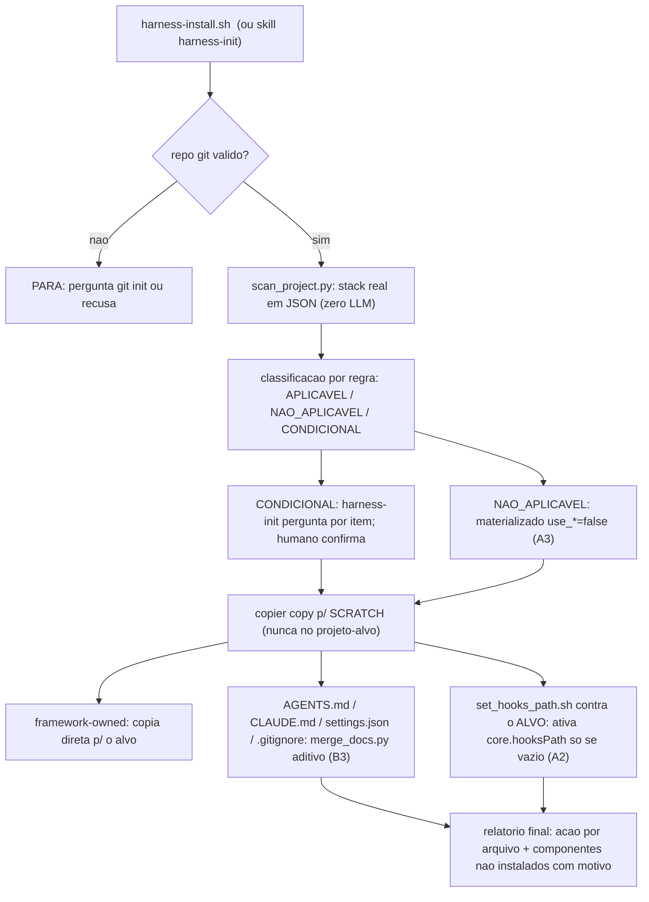

# 14. Instalação e atualização — harness-install.sh, harness-init e copier update

O framework instala via [Copier](https://copier.readthedocs.io/) — a ferramenta de scaffolding escolhida por ser a única madura da categoria com **update que preserva customização local** (merge de 3 vias com answers-file gravado no destino; alternativas populares fazem re-stomp ou não têm update). Mas o Copier **não faz merge nativo em brownfield**: `copier update` assume que o projeto-alvo NASCEU de um `copier copy` anterior do mesmo template — ele não serve para "adotar" um repo que já tinha vida própria antes do harness. Por isso o fluxo tem quatro movimentos: **harness-install.sh** (bootstrap seguro para instalar num projeto real, novo ou existente), **harness-init** (adaptar à stack real, com confirmação humana), **update** (trazer versões novas do framework sem perder suas edições) — e, só no caso raro de destino verdadeiramente vazio, **`copier copy` direto**.

## Por que não `copier copy` direto no projeto (B3)

A tentação óbvia é rodar `uvx copier copy <origem> <seu-projeto> --trust` direto contra o projeto real. **Isso é circular e destrutivo sempre que o projeto já tem qualquer um dos 4 arquivos que o template também escreve** (`AGENTS.md`, `.claude/CLAUDE.md`, `.claude/settings.json`, `.gitignore` — o caso comum, já que você quase sempre está adotando o harness num projeto vivo, não criando um do zero):

- **sem `--overwrite`**: qualquer colisão de nome faz o Copier abortar com exit 1 — instalação **parcial**.
- **com `--overwrite`**: os 4 arquivos acima são **sobrescritos por inteiro**, destruindo `CLAUDE.md`/`AGENTS.md`/`settings.json` do usuário.
- **com `--skip`**: nada do harness entra nesses 4 arquivos — instalação manca (`settings.json` sem os hooks do harness, por exemplo).

E `copier update` não resolve isso retroativamente: ele precisa de `.harness/answers.yml` já existente e de um histórico de commit coerente com o template — não existe um modo "adote este repo que eu não criei com copier". É por isso que **`harness-install.sh` existe como uma via própria, específica para a primeira adoção** — ver seção seguinte. `copier copy` direto continua correto SÓ quando o destino é um diretório genuinamente vazio (zero arquivo que colide com a árvore do template) — nesse caso não há nada para o bootstrap mesclar, e o comando de uma linha é suficiente.

## Instalar (o caminho canônico): `harness-install.sh`

```bash
./harness-install.sh <seu-projeto> \
  --data project_name=<slug> --data owner_name=<nome> --defaults
```

[`harness-install.sh`](../../harness-install.sh) vive na **raiz** do repositório do framework (ao lado de `copier.yml`) e resolve o gap acima sem depender de `--overwrite`/`--skip`:

1. **Renderiza o framework inteiro num diretório SCRATCH temporário** via `copier copy <origem-do-harness-wiki> <scratch>` — nunca escreve no projeto-alvo neste passo.
2. **Aplica no projeto-alvo, arquivo por arquivo**:
   - arquivo que **não existe** no alvo → copia direto.
   - um dos **4 arquivos sensíveis** (`AGENTS.md`, `.claude/CLAUDE.md`, `.claude/settings.json`, `.gitignore`) que **já existe** → merge **aditivo** via [`.harness/lib/merge_docs.py`](../../templates/.harness/lib/merge_docs.py) (a versão do script RENDERIZADA no scratch — a correta para a tag/HEAD sendo instalada).
   - qualquer outro arquivo framework-owned que já existe (reinstalação/update manual) → overwrite direto (é dono do harness, não do usuário).
3. **`.harness/answers.yml`** chega ao projeto-alvo pelo passo 2 (é só mais um arquivo "que não existe" na 1ª instalação) — é o pré-requisito para o `copier update` nativo funcionar depois (seção "Atualizar" abaixo).
4. **Ativa `core.hooksPath`** chamando [`.harness/lib/set_hooks_path.sh`](../../templates/.harness/lib/set_hooks_path.sh) explicitamente contra o projeto-alvo (não contra o scratch — ver A2 na próxima seção).

`<origem-do-harness-wiki>` é sempre a **raiz** do repositório do framework (nunca o subdiretório `templates/` direto — mesmo motivo do `_subdirectory: templates` no [copier.yml](../../copier.yml): o versionamento por tag do Copier (`--vcs-ref`) só funciona apontando para a raiz de um repo git). Para instalar a partir de uma tag específica em vez do HEAD do harness-wiki, adicione `--vcs-ref <tag>` aos argumentos — eles são repassados verbatim para `copier copy` (`--data`, `--vcs-ref`, `--defaults`, etc.); `--trust` é adicionado automaticamente pelo script.

Dois artefatos de estado ficam gravados no projeto e DEVEM ser versionados:

- **`.harness/answers.yml`** — as respostas dadas (gerado pelo template do answers-file, [templates/{{ _copier_conf.answers_file }}.jinja](<../../templates/{{ _copier_conf.answers_file }}.jinja>)). É a fonte de verdade da configuração e o pré-requisito do `copier update` — sem ele, o update falha.
- **`.harness/harness.conf`** — a materialização KEY=value que os hooks leem em runtime. Derivado do answers; nunca editar à mão (drifta no próximo update).

O comando roda o **questionário** — cada pergunta do copier.yml materializa uma chave da config central (capítulo 01): identidade (`project_name`, `owner_name`, cliente opcional), portas da dev stack, o bloco opcional de produção (`has_prod_stack` + prefixo/registry/URLs — controla os guardas de prod do capítulo 07), os caps do harness (subagents, lessons, evidência, rodadas adversariais), convenções de diretório, as duas chaves de superfície `use_claude`/`use_codex` — que gateiam as árvores `.claude/` e `.codex/`+`AGENTS.md` inteiras — e os 4 módulos stack-específicos (`use_ui_evidence`/`use_ds_gate`/`use_icon_guard`/`use_ui_skills`) que o scanner de `harness-init` (seção seguinte) pode desligar automaticamente quando não fazem sentido para a stack real (A3).

### O guard de `core.hooksPath` nunca faz clobber (A2)

Se o projeto-alvo já usa Husky, lefthook, ou qualquer outro hook manager (`git config core.hooksPath` já aponta pra algum lugar diferente de `.githooks`), `set_hooks_path.sh` **não sobrescreve** — ele avisa e ensina o encadeamento compatível (chamar `.githooks/pre-commit` de dentro do hook existente do usuário). `core.hooksPath` só é ativado automaticamente quando estava **vazio**. Isso vale tanto no fluxo `harness-install.sh` quanto no `_task` equivalente que roda ao fim de um `copier copy`/`update` direto (destino genuinamente vazio) — os dois chamam a mesma fonte única.

## Adaptar: a skill `harness-init`

`harness-install.sh` é o bootstrap **determinístico** (sem LLM, scriptável, idempotente) — ideal quando você já sabe as respostas (`--data` explícito) ou está automatizando a instalação. A skill [harness-init](<../../templates/.claude/skills/harness-init/SKILL.md>) é a variante **guiada por agente**: roda DENTRO do projeto (pós-instalação ou standalone) e fecha a lacuna de "instalação crua não sabe o que o SEU projeto tem" com a regra dura do blueprint: **motor determinístico detecta e avalia; LLM só decide/narra em cima do JSON; ação com consequência exige confirmação humana**. As duas camadas compartilham o MESMO motor (`scan_project.py` + `merge_docs.py` + `set_hooks_path.sh`) — a skill escolhe as respostas conversando com o usuário (inclusive os `CONDICIONAL` que `harness-install.sh` sozinho não sabe confirmar), o script aplica.

```text
ARGS:
AGENT=claude | codex | both   (default both)
MODE=install | update          (auto-detectado por .harness/answers.yml existir)
```

O fluxo:

1. **Passo 0 — repo git válido (bloqueante):** sem `git rev-parse` funcionando, a skill para e pergunta (hooks, allowlists e commits pressupõem git). Nunca prossegue em silêncio.
2. **Scan determinístico (zero LLM):** [`.harness/lib/scan_project.py`](../../templates/.harness/lib/scan_project.py) — stdlib puro, fail-open — enumera a stack real: linguagem/manifest, package manager, framework web, test frameworks, Docker/orquestrador, portas detectadas em compose/env, candidato a raiz de monorepo, e as superfícies de memória de agente já existentes (CLAUDE.md/AGENTS.md/settings preexistentes; superfícies globais do usuário são DETECTADAS e reportadas, nunca escritas).
3. **Relatório de aplicabilidade:** cada componente do harness sai classificado por REGRA como `APLICAVEL` / `NAO_APLICAVEL` / `CONDICIONAL`. Exemplos: o gate de evidência visual é NÃO-APLICÁVEL num projeto sem frontend; os guardas de produção são CONDICIONAIS à existência de uma stack a proteger; o guard de diff do grafo é CONDICIONAL a monorepo com raiz de grafo em subdiretório. **Só os CONDICIONAIS geram pergunta** — cada um no formato "sinal detectado / se SIM / se NÃO", e nada é ativado contra a stack sem confirmação. NÃO-APLICÁVEL não é perguntado (fricção inútil); APLICÁVEL segue direto.
4. **Render em scratch + aplicação em dois regimes** (mesma lógica de `harness-install.sh`, § anterior): o template renderiza para um diretório scratch e a skill aplica no projeto: arquivos **framework-owned** (`.harness/`, skills, hooks, regras hookify) copiam direto; os **4 arquivos sensíveis** — `AGENTS.md`, `.claude/CLAUDE.md`, `.claude/settings.json`, `.gitignore` — passam SEMPRE por [`.harness/lib/merge_docs.py`](../../templates/.harness/lib/merge_docs.py): merge **aditivo, nunca overwrite**. Markdown e `.gitignore` ganham um bloco delimitado por marcadores (`<!-- harness-wiki:begin/end -->` em Markdown, `# harness-wiki:begin/end` em `.gitignore`) — primeira instalação ANEXA ao arquivo existente; reinstalação atualiza SÓ o conteúdo do bloco (idempotente); o que o usuário escreveu fora do bloco nunca é tocado. `settings.json` reconcilia por **ownership** (A4): todo hook cujo `command` aponta pra `.harness/hooks/` é OWNED pelo harness e o lado novo do template sempre vence (resolve update/remoção/rename do PRÓPRIO hook, sem duplicar); qualquer hook com `command` fora desse padrão é EXTERNO (do usuário) e nunca é tocado; as demais chaves do JSON (permissions, env, model) são preservadas verbatim. Cada chamada imprime a ação (`created`/`appended`/`updated-block`/`merged`) — a prova por arquivo de que nada foi sobrescrito, e para `settings.json` também `hooks_added`/`hooks_kept`/`hooks_removed_stale_owned`.



## Atualizar: `copier update`

```bash
cd <seu-projeto> && uvx copier update --trust --answers-file .harness/answers.yml
```

`--answers-file .harness/answers.yml` é **obrigatório**: o `_answers_file` custom deste template (relocado de `.copier-answers.yml` — seção anterior) não é auto-detectado por `copier update`, que por padrão procura `.copier-answers.yml` na raiz e falha (`Copier answers file not found or unreadable`) sem essa flag explícita. Ver o comando correto já registrado em [README.md](../../README.md) e usado por [templates/tests/test_copier_update_e2e.sh](../../templates/tests/test_copier_update_e2e.sh).

**Gotcha adicional descoberto em H4 — `--vcs-ref HEAD` (a string literal) funciona em `copy`, mas quebra em `update`:** o Copier grava `_commit` em `.harness/answers.yml` como um `git describe` composto (ex. `v1.0.0-12-g346ea08`) quando a instalação não foi feita a partir de uma tag exata. Rodar `copier update --vcs-ref HEAD` depois disso tenta `git checkout -f` literalmente essa string composta — que NÃO é um revspec válido — e falha com `pathspec 'v1.0.0-12-g346ea08' did not match any file(s) known to git`. Workaround confirmado (2 repros isolados nesta sessão): resolva o SHA antes de passar para `--vcs-ref` (`git rev-parse HEAD`) em vez da string `"HEAD"` — mesmo commit, mas evita o caminho de código que quebra. Para reprodutibilidade real (fora de teste/CI), prefira sempre instalar/atualizar a partir de uma **tag anotada** (`--vcs-ref v1.2.0`), que grava `_commit` como o nome exato da tag (sempre um revspec válido) — `--vcs-ref HEAD`/SHA é aceitável para testes E2E deste repo (`templates/tests/test_copier_update_no_op.sh` usa o SHA resolvido) mas não é o fluxo recomendado para operação real.

O Copier lê `.harness/answers.yml` (qual versão/tag do template gerou o projeto), pergunta só o que MUDOU no questionário desde então, e faz **merge de 3 vias** por arquivo: mudança nova do framework chega; sua customização local sobrevive quando não conflita; conflito REAL gera marcadores de conflito no arquivo (`<<<<<<< before updating` / `>>>>>>> after updating`) em vez de descartar silenciosamente um dos lados — você resolve como num merge git. Esse fluxo NATIVO é provado ponta-a-ponta contra o próprio harness-wiki em [templates/tests/test_copier_update_e2e.sh](../../templates/tests/test_copier_update_e2e.sh) (3 tags reais, cobrindo mudança ortogonal, customização preservada e conflito marcado) — mas essa prova cobre um projeto que nasceu 100% de `copier copy`, não um projeto cuja 1ª instalação passou pelo merge de `harness-install.sh`/`harness-init`.

**Corrigido em H4 — `copier update` na MESMA versão não é mais no-op-que-não-é-no-op:** a auditoria adversarial provou que rodar `copier update --vcs-ref <tag-atual>` num projeto já naquela tag (zero mudança de template) ainda assim MUDAVA `.harness/answers.yml`, adicionando 5 chaves `harness_codex_*` que a 1ª `copier copy` tinha deixado de fora. Causa raiz: ordem de declaração no `copier.yml` — `harness_codex_max_threads`/`max_depth`/`project_doc_max_bytes`/`agents_dir`/`config_path` (e `harness_mcp_db_prod_port`) tinham `when` referenciando `use_codex`/`has_prod_stack`, mas essas duas variáveis eram declaradas MAIS ABAIXO no arquivo. O Copier resolve `when` na ordem de declaração (confirmado via Context7 `/copier-org/copier` docs/configuring.md: "the question is skipped and its answer is not recorded" quando `when` é false) — na 1ª `copy`, a variável referenciada ainda não existe no namespace (undefined = falsy), a pergunta é pulada e não é gravada; no `update` seguinte, o answers.yml já carrega a variável desde o início, `when` agora dá true, e a chave aparece como "nova" mesmo sem mudança nenhuma de versão. Fix real (não workaround): `use_claude`/`use_codex` movidos para logo após a seção de identidade e `harness_mcp_db_prod_port` movido para dentro do bloco `prod_*` (depois de `has_prod_stack`) — todo `when` agora referencia uma variável já declarada antes dele. Reproduzido e corrigido nesta sessão contra o repo real (`/tmp`, path neutro); regressão em [templates/tests/test_copier_update_no_op.sh](../../templates/tests/test_copier_update_no_op.sh).

**Limitação conhecida, não resolvida nesta rodada (pendência declarada para H2):** depois de um `harness-install.sh` brownfield, os 4 arquivos sensíveis têm o bloco `harness-wiki:begin/end` do harness misturado com conteúdo do usuário — uma estrutura DIFERENTE do que `copier copy` teria gerado num destino vazio. O `copier update` nativo ainda deve funcionar na prática (o merge de 3 vias do Copier é por diff de texto, não por comparação estrutural exata), mas isso **não foi provado ponta-a-ponta** nesta rodada (H1 provou só o bootstrap de instalação, não o update subsequente sobre um projeto instalado por ele). Antes de depender disso em produção, rode `test_copier_update_e2e.sh` adaptado para partir de um projeto instalado via `harness-install.sh` (não via `copier copy` direto) como baseline — é o gate que falta para fechar H2.

Disciplina que o update exige: working tree limpo antes de rodar; instalar sempre a partir de tag (não de HEAD móvel) quando reprodutibilidade importa.

## Codex: os passos extras

Com `use_codex=true`, o render inclui `.codex/hooks.json` (registro dos MESMOS scripts de `.harness/hooks/` — ver [hooks.json.jinja](<../../templates/.codex/hooks.json.jinja>)), `.codex/config.toml` (`project_doc_max_bytes` = `HARNESS_CODEX_PROJECT_DOC_MAX_BYTES`, default 32768 — a cadeia de AGENTS.md trunca nesse teto; `[agents] max_threads/max_depth` do capítulo 11) e `AGENTS.md` (gerado da MESMA fonte que o CLAUDE.md — os dois runtimes leem instruções byte-equivalentes). Bootstrap manual no Codex: confiar no projeto e nos hooks (o Codex exige trust por hash de script — reconfirmado a cada edição de hook) e um smoke-test de spawn de subagent. A regra estrutural anti-double-fire: **por runtime, exatamente UMA fonte de registro de hook** — os scripts são compartilhados, o registro nunca é duplicado.

## Como configurar

Tudo deste capítulo É a configuração: o questionário na instalação, `harness-init` para adaptar/reconfigurar, `copier update` para evoluir. A única regra proibitiva: não editar `.harness/harness.conf`/`.harness/answers.yml` à mão — mudanças entram pelo update (ficam registradas e sobrevivem à próxima versão).

## O que fica de lição

Instalação de kit em projeto vivo tem **três** modos de falha, não dois: sobrescrever o que o usuário tinha (destrutivo — B3/A2), ativar componente contra a stack (ruído que ensina a ignorar o harness — A3), e uma reconciliação de update ingênua demais para acompanhar a evolução do próprio framework (hook renomeado/removido upstream fica congelado ou double-fire — A4). O fluxo inteiro é desenhado contra os três: `harness-install.sh` nunca escreve no projeto-alvo via `copier copy` direto (sempre scratch + merge aditivo, com prova por arquivo via `hooks_added`/`hooks_kept`/`hooks_removed_stale_owned`); `core.hooksPath` só é tocado se estiver vazio; aplicabilidade classificada por regra materializa `use_*=false` sozinha quando o sinal é seguro (`NAO_APLICAVEL`), com humano confirmando só o que é `CONDICIONAL`; e a reconciliação de `settings.json` é por ownership de `command` (`.harness/hooks/` = owned, resto = externo), não por igualdade de string.
