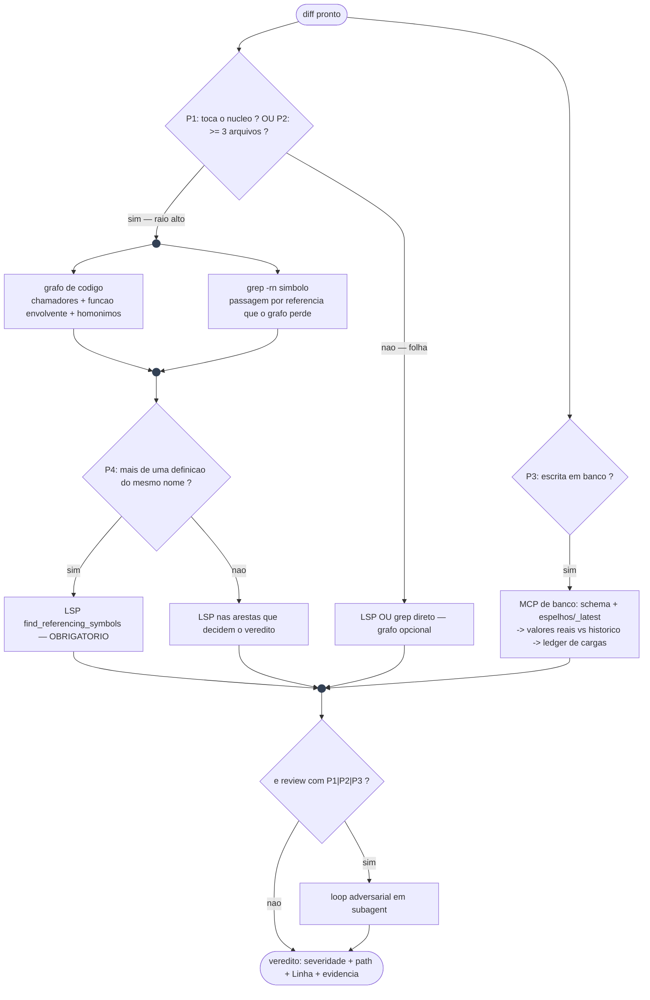

# 16. Grafo de decisão de ferramentas de contexto (blast radius)

Um agente que vai mudar um símbolo compartilhado precisa responder "o que quebra se eu mudar isto". `grep` responde outra pergunta — "onde este texto aparece". A diferença custa regressão: o grep não separa **definições homônimas**, não diz **qual função** contém a chamada e não segue **cadeia indireta**. A tentação é trocar o grep por um grafo de código; a medição diz que isso também erra, só que em outro lugar.

Esta capability (`use_context_graph`, default `false`) instala o **roteamento determinístico** entre as camadas — não instala nenhuma delas.

## O que a medição mostrou

Origem: adoção real num repositório Python de 42k LOC, 2026-07-28, com dois casos de *ground truth* tirados do histórico do próprio repo.

| Caso | Grafo de código | grep |
|---|---|---|
| **Hub** — função de escrita em banco chamada por ~20 extractors, com uma segunda definição homônima num diretório `deprecated/` | Acertou: chamadores **com a função envolvente** e as duas definições **separadas** | Devolveu linhas soltas, sem dizer de qual definição |
| **Folha** — função passada como *fixture* de teste (referência, não chamada) | **Perdeu** a referência; e resolveu os callees para os *stubs* do conftest em vez da API real (resolução por nome do tree-sitter) | Achou |

Conclusão que vira arquitetura: **as duas camadas erram de formas diferentes e complementares.** Nenhuma substitui a outra; o LSP (que resolve símbolo de verdade) é o desempate quando a aresta decide o veredito.

## Os 4 predicados

Determinísticos por construção — cada um é um comando, não um julgamento:

| P | Pergunta | Como decide | Configuração |
|---|---|---|---|
| **P1** | Diff toca o núcleo compartilhado? | `git diff --name-only <base>...HEAD` casa os paths do núcleo | `harness_core_paths` (CSV) |
| **P2** | Diff é multi-arquivo? | ≥ 3 arquivos de código no diff | constante |
| **P3** | Toca escrita em banco? | diff casa a alternação de padrões de escrita | `harness_data_write_patterns` |
| **P4** | Símbolo é ambíguo? | saída do grafo reporta mais de uma definição do mesmo nome | derivado em runtime |

`harness_core_paths` **não é inferível por scan** — um diretório chamado `utils/` não é automaticamente o hub do projeto. Por isso a regra do scanner classifica esta capability como `CONDICIONAL` sempre: exige confirmação humana, nunca é ativada sozinha (D5).

## O roteamento



### Por que fork/join e não uma caixa de agrupamento

Duas razões independentes, e vale registrar porque a primeira versão deste diagrama errou nas duas:

1. **Semântica.** Uma caixa em volta de dois nós comunica *"pertencem ao mesmo assunto"*, não *"executam ao mesmo tempo"*. Concorrência tem notação consagrada: a **barra de fork/join** do UML Activity Diagram e o **gateway paralelo** do BPMN. O idioma equivalente em grafo dirigido — o que Airflow, GitHub Actions e Make renderizam — é o **fan-out/fan-in**.
2. **Técnica.** O `direction LR` que colocaria os dois lado a lado é ignorado: a [documentação do Mermaid](https://mermaid.js.org/syntax/flowchart.html) diz que *"if a subgraph's nodes are linked externally, the subgraph's specified direction is ignored, and it will inherit the direction of the parent graph"*. Com o pai em `TD`, os nós empilham verticalmente e o desenho passa a sugerir **sequência** — o oposto do que se queria dizer.

O `flowchart` do Mermaid não tem primitiva nativa de fork/join (o `stateDiagram-v2` tem, via `<<fork>>`/`<<join>>`), mas fan-out/fan-in com nó circular estilizado como barra entrega a mesma leitura sem abrir mão dos losangos de decisão — que são a essência de um grafo de **roteamento**.

### Por que cada aresta é paralela ou sequencial

- **grafo ∥ grep:** inputs independentes (um consulta índice, outro varre texto) e capturam classes de erro diferentes. Serializar seria latência pura.
- **LSP depois, não junto:** o LSP precisa saber *qual* aresta confirmar — informação que só existe depois do fork. Rodá-lo em paralelo significaria rodá-lo às cegas em todo símbolo.
- **MCP de banco ∥ tudo:** o input dele são os nomes de tabela do diff, disponíveis desde o início. Zero dependência do grafo de código.

## O motor é dependência externa

Mesma regra do capítulo 07 (hookify): **o harness declara e documenta, nunca instala**. O CLI de grafo vive fora da raiz do alvo, e o confinamento POSIX do instalador (capítulo 14) proíbe escrever lá. Consequências operacionais:

- Instale o CLI à parte e **indexe o repositório** antes do primeiro uso.
- **Índice velho mente.** Sincronize antes de confiar — um grafo dessincronizado é pior que nenhum, porque parece autoritativo.
- **Pine a versão** se o upstream do CLI escolhido não rodar CI a cada push; atualização automática importa regressão sem rede de proteção.
- Se o CLI tiver telemetria, desligue explicitamente no ambiente do servidor MCP.

## Guardas instaladas

| Regra hookify | Dispara quando | Condição de geração |
|---|---|---|
| `blast-radius-core` | edit em arquivo que casa `harness_core_paths` | `use_context_graph` **e** `use_hookify` **e** `harness_core_paths` não vazio |
| `data-contract` | edit cujo conteúdo casa `harness_data_write_patterns` | `use_context_graph` **e** `use_hookify` **e** `harness_data_write_patterns` não vazio |

Deixar um parâmetro vazio **não** gera a regra correspondente — regra que dispara sem ter o que checar é ruído, e ruído treina o agente a ignorar guardas. No Codex não há hookify: vale a prosa do bloco ⭐ em `AGENTS.md`.

## Quando NÃO adotar

- Projeto de um arquivo só, ou sem núcleo compartilhado identificável: P1 não tem o que apontar e o grafo não paga o custo.
- Equipe que não vai instalar o CLI: a capability fica inerte, e artefato inerte é o defeito que o `use_hookify` corrigiu — deixe `use_context_graph=false`.
- Linguagem sem parser maduro no CLI escolhido: o grafo vira ruído de baixa confiança; use LSP + grep e pule o fork.

## Configuração

```bash
./harness-install.sh <alvo> --defaults \
  --data use_context_graph=true \
  --data harness_core_paths="src/lib/,packages/core/" \
  --data harness_data_write_patterns="to_sql|INSERT INTO"
```

Materializa `HARNESS_CORE_PATHS` e `HARNESS_DATA_WRITE_PATTERNS` em `.harness/harness.conf` e gera o bloco ⭐ nas instruções dos runtimes ativos.
