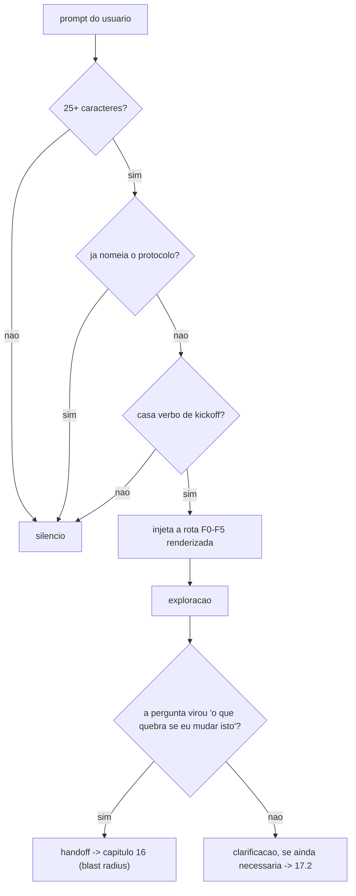

# 17. Protocolo de exploração (task-start), gate de clarificação e gate de push

O capítulo 16 responde *"o que quebra se eu mudar este símbolo"* — uma pergunta de **diff-time**, feita quando já se sabe onde mexer. Este capítulo cobre o que vem **antes** e o que vem **depois** dela: por onde a leitura começa, e o que precisa estar carregado quando o agente decide perguntar algo ao humano.

São três capabilities independentes, entregues juntas porque nasceram do mesmo par de incidentes num projeto adotante.

## 17.1 O protocolo de exploração (`use_exploration_protocol`)

### O problema medido

Um projeto adotante criou, num único commit, **23 páginas de referência viva** — uma por subsistema, com 2.104 citações `path:linha` validadas. Excelente documentação. Depois, `grep` das 16 páginas principais nos **6 pontos de entrada** do repositório (as duas instruções de projeto, os dois arquivos de subagent scout, a skill de exploração e o hook de prompt) retornou **zero em todos os seis**.

O padrão de exploração tinha sido escrito antes das páginas existirem, então apontava só para o `README.md` do diretório — uma indireção que o agente pode não seguir, e que não estava em ordem obrigatória nenhuma. **Doc que existe e ninguém acha é doc que não existe.**

O segundo dado: sem uma ordem declarada, cada sessão inventa a própria rota. O custo não é estético — é que a rota inventada normalmente começa pelo código, e o código não diz qual documento é autoridade sobre ele.

### O que a capability instala

**Roteamento por fases, e só isso.** Nenhuma ferramenta é instalada — a mesma invariante de confinamento do capítulo 07 e do 16.

| Fase | O que é | Gatilho de geração |
|---|---|---|
| **F0** âncora | o pedido ORIGINAL (`.harness/requests/`), nunca a paráfrase pós-compactação | sempre |
| **F1** docs canônicos | lidos NESTA ordem; o primeiro é o roteador | `harness_entry_docs` não vazio |
| **F1-bis** referência viva | a página do subsistema, ANTES do código dele | `harness_reference_index` não vazio |
| **F2** código | grafo **∥** grep, em paralelo obrigatório | sempre (degrada para grep sem `use_context_graph`) |
| **F3** estado vivo | MCP de banco antes de inferir comportamento | `harness_mcp_db_dev_port > 0` |
| **F4** LSP | depois do join de F2 — só ali se sabe qual aresta decide | sempre |
| **F5** lib externa | documentação oficial atual, nunca conhecimento de treinamento | sempre |

Fase cujo parâmetro está vazio **não é emitida**. Rota que aponta para nada ensina o agente a passar o olho pelo bloco — é o mesmo defeito que o `use_hookify` corrigiu para as regras inertes.

### As três regras que a fase F2 carrega

1. **O fork é paralelo, nunca sequencial.** É a mesma medição do capítulo 16, aplicada mais cedo: grafo e grep erram de formas complementares, e serializar é latência pura.
2. **Nenhum grafo de código indexa Markdown.** Medido nos dois grafos do projeto adotante: zero `.md` em ambos os índices. A consequência prática é que um agente conclui *"não existe documentação sobre X"* porque a consulta ao grafo não trouxe nada — e a documentação existe. Documentação se acha pela rota das fases F1/F1-bis, jamais por consulta a grafo.
3. **Documento com banner de histórico é genealogia, não fonte.** No adotante, 22 páginas marcadas assim carregavam 110 divergências medidas contra o HEAD.

### Onde a rota é materializada

Em **quatro** superfícies, porque uma só não basta — a lição do incidente é exatamente que uma indireção não seguida equivale a não existir:

- a skill `exploration-protocol` (o protocolo completo, dual-runtime);
- o bloco ⭐ nas instruções de projeto (`AGENTS.md` e `.claude/CLAUDE.md`);
- o hook `exploration-kickoff.py` (`UserPromptSubmit`), que injeta a rota compacta quando o prompt parece início de tarefa;
- os dois arquivos do subagent `{{ project_name }}-context-scout` (Claude e Codex) — um scout que inventa a própria rota anula o motivo de existir uma.



### Como configurar

```bash
./harness-install.sh <alvo> --defaults \
  --data use_exploration_protocol=true \
  --data harness_entry_docs="docs/index.md,docs/log.md,docs/pending/README.md" \
  --data harness_reference_index="docs/reference/README.md"
```

`harness_entry_docs` é **ordenado** — a ordem é o produto. O scanner classifica esta capability como `CONDICIONAL` sempre: um repositório cheio de Markdown não diz qual arquivo é o **roteador**, e essa é uma decisão editorial que nenhum scan infere.

### Quando NÃO adotar

- Repositório sem documentação de entrada e sem intenção de criar uma: F1 e F1-bis não têm o que apontar, e sobra disciplina genérica que as instruções já carregam.
- Projeto de um único arquivo/serviço trivial: a rota custa mais contexto do que economiza.

## 17.2 O gate de clarificação (`use_clarification_gate`)

### O problema medido

A §6 das instruções geradas proíbe a pergunta seca (*"quer A ou B?"*) e publica o template `D[n]` desde a v1.0.0. Mesmo assim, no mesmo projeto adotante, um agente fechou um diagnóstico com uma seção intitulada *"duas decisões que são suas"*, escrita em prosa: sem comportamento por opção, sem exemplo aplicado a entidade real, sem Opção C. Ele tinha a skill listada no índice de skills do projeto e **nunca a abriu**.

A conclusão que vira arquitetura: **regra que vive só em prosa é obedecida só quando o agente lembra dela.**

### O que o gate faz

É uma **precondição de sessão**, não um linter de texto: o hook `clarification-plan-gate.py` (`PreToolUse`, matcher `AskUserQuestion`) recusa a chamada enquanto a skill `clarification-plan` não tiver sido invocada na sessão, e diz como corrigir. Ele não julga se os blocos `D[n]` ficaram bons — julgar isso continua sendo seguir o contrato. Ele garante a única precondição mecânica que existe: **o contrato estar em contexto no instante em que a pergunta é escrita**.

**Limite declarado, para ninguém ler gate verde como cobertura total:** decisão pedida como PROSA na resposta final nunca chama ferramenta, então este gate nunca a vê. Esse caminho continua coberto só pela §6 — e o incidente que criou a regra foi, ele mesmo, um caso de prosa.

**Escopo de runtime:** `AskUserQuestion` e o evento `PreToolUse` são superfícies do Claude Code. No Codex/Antigravity o mesmo contrato viaja como prosa da §6, que é gerada de qualquer forma. A skill `clarification-plan` é instalada **incondicionalmente** nos dois runtimes; só o gate é Claude-only.

Fail-open por construção: payload ilegível, transcript ausente ou qualquer erro inesperado ⇒ exit 0 em silêncio. Gate que quebra sessão ensina a desligar gate.

### Como configurar

`use_clarification_gate` é **default true** quando `use_claude` — é a única das três capabilities que não precisa de input do projeto, e deixá-la desligada seria abrir mão de uma guarda de graça. Desligue se preferir a §6 como prosa não-executável.

## 17.3 O gate de push (`harness_pre_push_test_command`)

O `pre-commit` do capítulo 10 valida o **diff staged**. O `pre-push` valida o **repositório**: suite rápida → lint documental repo-wide → suite cara opcional.

Gating **por parâmetro, não por flag**: sem `harness_pre_push_test_command`, o githook não é gerado. O framework não tem como adivinhar o entrypoint de teste de um projeto, e um gate que não roda nada é artefato inerte.

### Duas decisões herdadas de incidente, e que ficam

1. **Não checa segredo.** O gate de credencial que existia no projeto de origem foi removido por ordem do dono: o repositório era privado e a regra só travava trabalho sem proteger terceiro. Varredura de segredo é responsabilidade de ferramenta dedicada (gitleaks, trufflehog), não deste gate.
2. **A suite cara nunca bloqueia por AUSÊNCIA de infraestrutura.** Se o `harness_pre_push_slow_probe` falha, a etapa é **pulada com aviso**. Bloquear porque o Postgres local não subiu ensina o time a exportar `PUSH_GATE_ACK` em todo push — e bypass habitual é gate morto.

### O efeito operacional que surpreende

Com o hook ativo, `git push` fica minutos aparentemente **parado**. É a suite rodando, não problema de credencial — no projeto de origem, um push de 2,9 MB foi diagnosticado como falha de chave SSH quando era o gate verde rodando a suite inteira. **Nunca passe `git push` por `tail`/`head`**: o buffer esconde exatamente as linhas `pre-push: ...` que explicam a demora.

### Como configurar

```bash
./harness-install.sh <alvo> --defaults \
  --data harness_pre_push_test_command='pytest -q -m "not slow"' \
  --data harness_pre_push_slow_command='make test-db' \
  --data harness_pre_push_slow_probe='pg_isready -h localhost -p 5432 -q'
```

Os três valores são interpolados **verbatim** no script gerado, e por isso precisam ser de **uma linha só** (há `validator` no questionário barrando quebra de linha). A alternativa — escapar via `| tojson` — foi tentada e reprovada nesta rodada: o `tojson` do Jinja é HTML-safe e converte `'` em `&#39;`, produzindo um comando que `bash -n` **aceita** e que executa errado. Encadeie com `&&` ou aponte para um script.

Ativação: os dois githooks dependem de `core.hooksPath`, configurado pelo `_task` do Copier via `.harness/lib/set_hooks_path.sh` — que é fail-open e é **pulado** quando `use_pre_commit_framework=true`. Se o arquivo existe e não roda: `git config core.hooksPath .githooks`.

## O que fica de lição

As três capabilities atacam o mesmo modo de falha por ângulos diferentes: **uma regra que depende de o agente lembrar dela não é uma regra, é uma esperança.** A rota vira injeção de prompt; o contrato de decisão vira precondição de ferramenta; a suite vira githook. Ao portar isso para uma regra própria, a pergunta de projeto é sempre: *qual é o momento mecânico em que essa regra precisa estar presente, e que evento do runtime corresponde a ele?*
